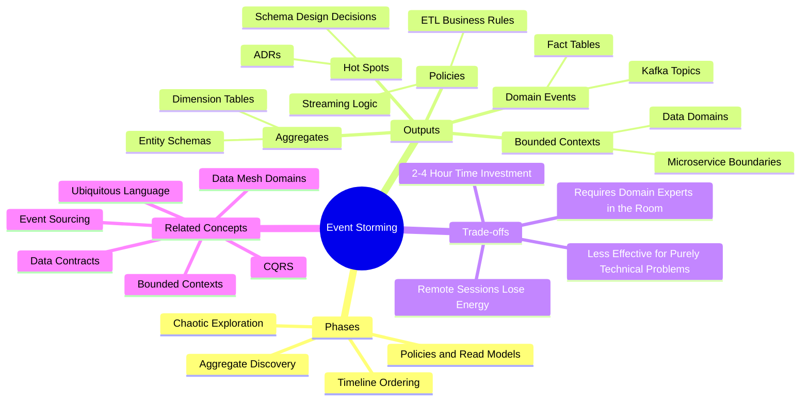
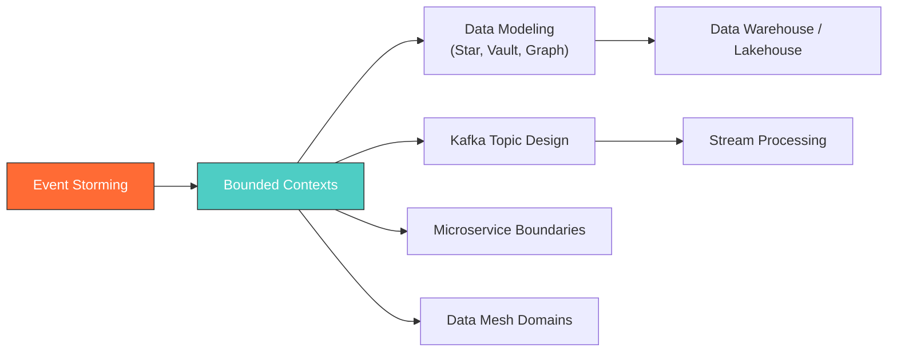

# Event Storming — Concept Overview

> What it is, why it exists, what value it provides, and when to use (or avoid) it.

---

## Why This Exists

**Origin**: Alberto Brandolini invented Event Storming in 2013 after observing that traditional requirements-gathering techniques (use cases, user stories, BRDs) consistently failed to capture the true complexity of business domains. The root cause: these techniques ask stakeholders to *describe* their processes, which introduces cognitive bias. People forget edge cases, simplify branching logic, and omit error paths.

Event Storming flips the approach. Instead of asking "What do you want?", it asks "What *happens*?" — expressed as a time-ordered sequence of past-tense domain events on sticky notes. This surfaces the actual behavior of a system, including the parts nobody thinks to mention.

**The problem it solves**: Data architects design schemas from technical assumptions rather than business reality. The result is a data model that must be reworked 6-12 months later when the actual domain complexity emerges.

## What Value It Provides

| Metric | Impact |
|---|---|
| **Time to domain understanding** | 2-4 hours (vs. weeks of interviews and document reviews) |
| **Schema rework reduction** | 60-80% fewer schema migrations in the first year |
| **Cross-team alignment** | Single shared model eliminates "Marketing calls it X, Finance calls it Y" |
| **Hidden complexity discovery** | Surfaces 20-30% more edge cases than traditional methods |
| **Direct artifact output** | Events → fact tables, Aggregates → dimensions, Bounded Contexts → data domains |

## Mindmap

## Where It Fits

## When To Use / When NOT To Use

| Scenario | Use Event Storming? | Why |
|---|---|---|
| New data platform from scratch | ✅ Yes | Prevents fundamental schema mistakes |
| Migrating monolith to microservices | ✅ Yes | Reveals true domain boundaries |
| Redesigning a data warehouse | ✅ Yes | Discovers missing/conflicting dimensions |
| Optimizing a slow SQL query | ❌ No | This is a performance problem, not a domain problem |
| Adding a column to an existing table | ❌ No | Overhead not justified for tactical changes |
| Purely technical infrastructure decision | ❌ No | Event Storming is for business domain discovery |
| Team of 2 engineers, no domain expert access | ⚠️ Limited | Core value comes from cross-functional collaboration |

## Key Terminology

| Term | Precise Definition |
|---|---|
| **Domain Event** | A fact that happened in the past, expressed as a past-tense verb. Immutable. E.g., `Order Placed` |
| **Command** | An action that triggers a domain event. E.g., `Place Order` |
| **Aggregate** | The entity/cluster of entities that processes a command and emits an event. E.g., `Order` |
| **Bounded Context** | A linguistic and logical boundary within which a specific domain model is consistent |
| **Policy** | An automated business rule that reacts to an event. E.g., "When payment fails 3x, cancel order" |
| **Read Model** | The data a user or system needs to make a decision. Maps to materialized views/reports |
| **Hot Spot** | A point of disagreement or ambiguity. The most valuable output of the workshop |
| **Ubiquitous Language** | The shared vocabulary agreed upon by all participants within a bounded context |
