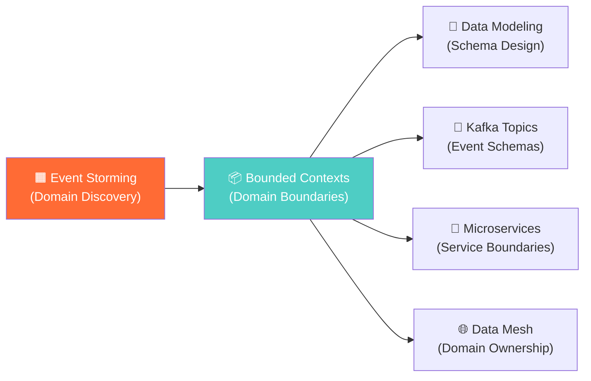

# Event Storming — Concept Overview

> What it is, why a Principal Architect must know it, and where it fits in the bigger picture.

---

## What Is Event Storming?

**Event Storming** is a collaborative workshop technique invented by Alberto Brandolini in 2013 for rapid domain discovery. It brings together engineers, product managers, domain experts, and stakeholders around a physical wall (or digital board like Miro) to map out *everything that happens* in a business process using color-coded sticky notes.

The result is a shared mental model of the business domain — expressed as a time-ordered sequence of **Domain Events** — that directly feeds into data modeling, schema design, Kafka topic definitions, and microservice boundary decisions.

## Why a Principal Data Architect Must Know This

| Reason | Impact |
|---|---|
| **Prevents the #1 data modeling mistake** | Designing schemas from technical assumptions instead of actual business behavior |
| **Drives Data Mesh domain boundaries** | Bounded Contexts discovered in Event Storming map 1:1 to Data Mesh domains |
| **Defines event schemas for streaming** | Each Domain Event becomes a Kafka topic schema candidate |
| **Creates shared vocabulary** | Eliminates "but marketing calls it X and finance calls it Y" problems |
| **Surfaces hidden complexity early** | Hot spots reveal where your data model will have edge cases |

## Where It Fits in the Bigger Picture

Event Storming is **Step 0** — it happens before any ERD, any DDL, any Kafka topic. Without it, you're guessing.

## The 3 Levels of Event Storming

| Level | Duration | Goal | Participants |
|---|---|---|---|
| **Big Picture** | 2-4 hours | Map the entire business domain at high level | Everyone (30+ people) |
| **Process Modeling** | 4-8 hours | Detail one specific process (e.g., Order → Delivery) | Domain experts + architects (8-12 people) |
| **Design Level** | 1-2 days | Produce implementation-ready aggregates and events | Architects + senior engineers (4-6 people) |

A Principal Architect typically facilitates the Big Picture session and actively participates in the Design Level session.
