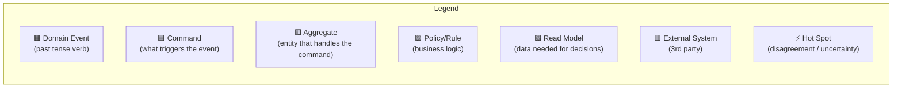

# Event Storming

## 1. Concept Overview

**Event Storming** is a collaborative domain discovery workshop technique invented by Alberto Brandolini in 2013. It is the most effective method a Principal Data Architect has for understanding a complex business domain *before* writing a single line of DDL or drawing a single ER diagram.

**Why a Principal Must Know This**: At FAANG scale, the biggest data modeling disasters come from misunderstanding the business domain, not from incorrect SQL syntax. Event Storming forces cross-functional alignment between engineers, product managers, and domain experts *before* you design schemas that are impossible to change later.

**Where It Fits**: This is the very first step in the data modeling lifecycle. Before you choose between Star Schema, Data Vault, or Graph — you must understand what actually *happens* in the business. Event Storming produces the raw material from which all downstream models are derived.

---

## 2. How It Works (Deep Internals)

### The Workshop Format

Event Storming uses a physical wall (or a digital Miro board) covered with color-coded sticky notes:



### The 4 Phases

**Phase 1 — Chaotic Exploration (30 min)**
Every participant writes Domain Events on orange sticky notes. Past tense verbs only:

- `Order Placed`, `Payment Captured`, `Shipment Dispatched`, `Refund Issued`
- No filtering. No ordering. Pure brain dump. 200+ events is normal.

**Phase 2 — Timeline Ordering (30 min)**
Place events on the wall in chronological order, left to right. This exposes:

- Parallel processes (two streams of events happening simultaneously)
- Missing events ("Wait, what happens *between* `Order Placed` and `Payment Captured`?")
- Loops and cycles (return → restock → resell)

**Phase 3 — Identify Aggregates and Bounded Contexts (45 min)**
Group related events around the *entity* that owns them:

- `Order Aggregate`: Order Placed → Order Confirmed → Order Shipped → Order Delivered
- `Payment Aggregate`: Payment Initiated → Payment Captured → Payment Failed → Refund Issued
- `Inventory Aggregate`: Stock Reserved → Stock Decremented → Stock Replenished

Each cluster of aggregates becomes a **Bounded Context** — the foundation for microservice boundaries and data domain ownership.

**Phase 4 — Identify Policies, External Systems, and Read Models (30 min)**

- **Policies**: "When `Payment Failed`, then automatically `Cancel Order`" (purple sticky)
- **External Systems**: "Stripe processes payments" (red sticky)
- **Read Models**: "The pricing screen needs product price, stock level, and shipping estimate" (green sticky)
- **Hot Spots**: "We disagree on when an order is 'confirmed' — before or after payment?" (⚡ mark)

### How This Maps to Data Architecture

| Event Storming Output | Data Architecture Input |
|---|---|
| Domain Events | Fact table candidates, event schemas, Kafka topics |
| Aggregates | Entity tables, dimension candidates |
| Bounded Contexts | Data domain boundaries, Data Mesh domains |
| Policies | Business rules for ETL transformations |
| Read Models | Materialized views, reporting tables, BI requirements |
| Hot Spots | Schema design decisions requiring stakeholder alignment |

---

## 3. Hands-On Examples

### Example: E-Commerce Order Flow

After a 2-hour Event Storming session, the team produces this event flow:

```
Customer Browsed → Product Viewed → Cart Updated → Checkout Started →
Address Validated → Payment Initiated → Payment Captured → 
Order Confirmed → Inventory Reserved → Shipment Created → 
Shipment Dispatched → Shipment Delivered → Review Solicited
```

**Translating to a data model**:

```sql
-- Fact Table: derived from the domain events timeline
CREATE TABLE fact_order_events (
    event_id         BIGINT PRIMARY KEY,
    order_id         BIGINT NOT NULL,
    customer_id      BIGINT NOT NULL,
    event_type       VARCHAR(50) NOT NULL,  -- 'ORDER_PLACED', 'PAYMENT_CAPTURED', etc.
    event_timestamp  TIMESTAMP NOT NULL,
    event_payload    JSONB,                 -- flexible schema for event-specific data
    
    -- SCD Type 2 tracking
    previous_event_id BIGINT REFERENCES fact_order_events(event_id)
);

-- Aggregate → Dimension: discovered during Phase 3
CREATE TABLE dim_order (
    order_sk         BIGINT PRIMARY KEY,    -- surrogate key
    order_id         BIGINT NOT NULL,       -- natural key
    customer_id      BIGINT NOT NULL,
    order_status     VARCHAR(30),           -- current state derived from latest event
    total_amount     DECIMAL(12,2),
    currency_code    CHAR(3),
    created_at       TIMESTAMP,
    last_updated_at  TIMESTAMP,
    is_current        BOOLEAN DEFAULT TRUE   -- SCD Type 2
);
```

**Translating to Kafka Topics** (for streaming architecture):

```yaml
topics:
  - name: ecommerce.orders.events
    partitions: 12
    partition_key: order_id    # All events for same order go to same partition
    schema: OrderEvent.avsc
    retention: 30d
    
  - name: ecommerce.payments.events
    partitions: 6
    partition_key: payment_id
    schema: PaymentEvent.avsc
```

### Exercise: Run Your Own Event Storming

1. Pick a domain you know (e.g., your company's data pipeline)
2. Set a 15-minute timer
3. Write down every "thing that happens" as a past-tense event on sticky notes
4. Order them chronologically
5. Circle clusters → these are your aggregates (future tables/topics)

---

## 4. FAANG War Stories & Real-World Scenarios

### Netflix: Content Lifecycle Event Storming

Netflix used collaborative domain discovery workshops to map their content lifecycle:

```
Content Licensed → Master Received → Encoding Started → 
QC Passed → Metadata Enriched → Localization Completed →
Rights Window Opened → Content Published → Content Surfaced →
Content Watched → Engagement Scored → Rights Window Closed → Content Removed
```

This event flow directly drove the design of their **Keystone** real-time event pipeline, where each event type became a distinct Kafka topic with its own schema and consumer group.

**Scale**: 200M+ subscribers, 190 countries, 50+ languages — every content event must be tracked for licensing compliance, personalization, and royalty calculations.

### Amazon: The "Order" Bounded Context Discovery

Amazon's retail team discovered through event storming that "Order" was actually **5 different bounded contexts**:

1. **Cart Context** (browsing → cart management)
2. **Fulfillment Context** (warehouse → shipping)
3. **Payment Context** (charge → refund)
4. **Customer Context** (address → preferences)
5. **Returns Context** (return initiated → refund processed)

Each context had its own definition of "order status" — which is why Amazon's DW team needed **5 different fact tables** instead of one monolithic `fact_orders`.

---

## 5. Common Pitfalls & Anti-Patterns

### ❌ Pitfall 1: Skipping Event Storming and Going Straight to ERDs

**Why it's dangerous**: You'll model the data structure you *assume* exists, not the one the business actually needs. Result: 6 months of rework.

### ❌ Pitfall 2: Only Technical People in the Room

**Why it's dangerous**: Engineers model what they think the business does. Domain experts know what actually happens. The gap between these two produces schemas that don't match reality.

### ❌ Pitfall 3: Treating Events as CRUD Operations

**Wrong**: `Customer Created`, `Customer Updated`, `Customer Deleted`
**Right**: `Customer Registered`, `Customer Verified Email`, `Customer Upgraded Plan`, `Customer Churned`
Events should capture *business meaning*, not database operations.

### ❌ Pitfall 4: Not Capturing Hot Spots

Hot spots (disagreements) are the *most valuable* output. They reveal where the business has ambiguous rules, which translates directly to "this is where your data model will have edge cases and bugs."

### ❌ Pitfall 5: One Giant Bounded Context

If everything is in one context ("the Order context"), you haven't decomposed enough. A single aggregate with 50 events is a warning sign.

---

## 6. Interview Angle

### How This Topic Appears in Principal Interviews

**Question**: *"You're joining a new company as Principal Data Architect. The existing data warehouse is a mess — 500 tables, no documentation, conflicting definitions. How do you start?"*

**Strong Answer Framework**:

1. "I would NOT start by looking at the existing schema. I'd start by running Event Storming workshops with each business domain team."
2. "Domain events reveal what the business actually does, not what the old schema assumes."
3. "The bounded contexts from Event Storming become my data domain boundaries — this directly maps to Data Mesh domain ownership."
4. "Hot spots from the workshop become my priority list for schema redesign."
5. "Only after understanding the domain would I assess the existing 500 tables against the discovered model."

**What Interviewers Are Really Testing**:

- Can you start from *business understanding* rather than jumping to technical implementation?
- Do you know how to facilitate cross-functional collaboration?
- Can you derive a data architecture from business processes, not just from existing schemas?

### Follow-Up Questions to Expect

- "How do you handle it when domain experts disagree?"  
  → Use hot spots. Document both interpretations. Let the data model support both until the business resolves the ambiguity.
- "How long does an Event Storming session take?"  
  → Big Picture: 2-4 hours. Design Level: 4-8 hours. Process Modeling: 1-2 days. Start with Big Picture.

---

## 7. Further Reading & References

### Essential Reading

- **Book**: *"Introducing EventStorming"* by Alberto Brandolini (the inventor)
- **Book**: *"Domain-Driven Design"* by Eric Evans (the theoretical foundation)
- **Talk**: Alberto Brandolini — "50,000 Orange Stickies Later" (DDD Europe)

### Online Resources

- [eventstorming.com](https://www.eventstorming.com/) — Official site with free resources
- [Miro Event Storming Template](https://miro.com/templates/event-storming/) — For remote workshops

### Related Concepts in This Curriculum

- [02_Bounded_Contexts](../02_Bounded_Contexts/) — The output of Event Storming drives bounded context design
- [01_Event_Sourcing](../../../../06_Streaming_And_RealTime/03_Event_Driven_Architecture_Patterns/01_Event_Sourcing/) — Events discovered here become the events stored in event sourcing
- [01_Domain_Ownership](../../../../09_Data_Governance_Metadata/04_Data_Mesh_Architecture/01_Domain_Ownership/) — Bounded contexts map to Data Mesh domain boundaries
