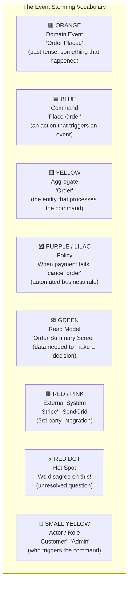
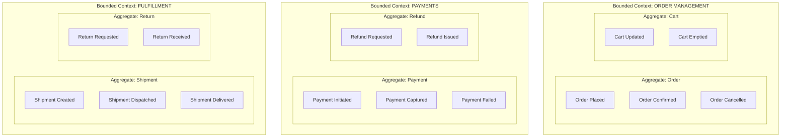

# Event Storming — How It Works (Deep Internals)

> Technical mechanics, algorithms, data structures, Mermaid diagrams, step-by-step walkthroughs.

---

## The Sticky Note Color System

Every Event Storming session uses a strict color-coded language:



## The 4 Phases — Step by Step

### Phase 1: Chaotic Exploration (30 minutes)

**Rules:**

- Everyone writes Domain Events on orange sticky notes simultaneously
- Past tense ONLY: "Order **Placed**", "Payment **Captured**", not "Place Order"
- No filtering, no judging, no ordering — pure brain dump
- Duplicates are welcome (they reveal which events are most important)

**Expected output:** 100-300 sticky notes on the wall in no particular order.

**Why this works:** It bypasses the hierarchy. A junior customer service rep may write down an event ("Customer Complained About Late Delivery") that the VP of Engineering has never heard of — and that event may reveal a critical gap in the data model.

### Phase 2: Timeline Ordering (30 minutes)

**Process:**

1. Move all events into a rough left-to-right timeline
2. Identify **pivotal events** — moments where the process fundamentally changes state
3. Mark **parallel tracks** — streams of events that happen simultaneously

**Example timeline for e-commerce:**

```
┌─────────────────────────────────────────────────────────────────────────────┐
│  TIMELINE (left = earliest, right = latest)                                 │
│                                                                             │
│  Customer    Product     Cart        Checkout     Payment      Fulfillment  │
│  Registered  Viewed      Updated     Started      Initiated    Dispatched   │
│              Product     Cart        Address      Payment      Shipment     │
│              Searched    Emptied     Validated    Captured     Delivered    │
│                                      Coupon       Payment      Return       │
│                                      Applied      Failed       Requested    │
│                                                   Refund                    │
│                                                   Issued                    │
│                                                                             │
│  ──────────────────────── TIME ──────────────────────────────►              │
└─────────────────────────────────────────────────────────────────────────────┘
```

**Key discoveries at this phase:**

- **Missing events**: "What happens between `Payment Failed` and `Order Cancelled`? Is there a retry?"
- **Branching**: After `Shipment Delivered`, both `Review Solicited` and `Loyalty Points Awarded` happen in parallel
- **Loops**: `Return Requested` → `Return Received` → `Refund Issued` → possibly `Reorder Placed`

### Phase 3: Identify Aggregates and Bounded Contexts (45 minutes)

**Process:**

1. Draw yellow stickies around clusters of related events
2. Name the entity that "owns" these events
3. Draw boundaries around groups of aggregates that form a **Bounded Context**



**Critical insight:** Each Bounded Context will likely become:

- A separate **database/schema** in your data platform
- A separate **Kafka topic namespace** (e.g., `order-mgmt.*`, `payments.*`, `fulfillment.*`)
- A separate **Data Mesh domain** with its own data product team

### Phase 4: Policies, External Systems, Read Models (30 minutes)

**Policies (purple stickies):**

```
WHEN Payment Failed (3 times) → THEN Cancel Order
WHEN Shipment Delivered → THEN Send Review Request (after 24 hours)
WHEN Return Received AND Inspection Passed → THEN Issue Refund
```

These policies map directly to:

- **dbt transformation logic** (business rules encoded as SQL)
- **Flink/Spark streaming rules** (real-time event processing)
- **Airflow DAG triggers** (scheduled pipeline logic)

**External systems (red stickies):**

- Stripe (payment processing)
- SendGrid (email notifications)
- FedEx API (shipping tracking)
- Elastic (search indexing)

These map to **CDC sources** or **API integration points** in your data platform.

**Read Models (green stickies):**

- "Order Status Page" needs: order details + payment status + shipping tracking
- "Admin Dashboard" needs: daily revenue + order count + return rate
- "Recommendation Engine" needs: browsing history + purchase history + item features

These map directly to **materialized views**, **BI reports**, and **feature store inputs**.

---

## How Event Storming Output Maps to Data Architecture Artifacts

| Event Storming Output | Data Architecture Artifact |
|---|---|
| Domain Events | Fact tables, event schemas, Kafka topics |
| Aggregates | Entity/dimension tables |
| Bounded Contexts | Database schemas, Data Mesh domains, microservice boundaries |
| Policies | ETL/ELT business rules, streaming logic |
| External Systems | CDC sources, API integrations |
| Read Models | Materialized views, BI reports, feature store inputs |
| Hot Spots | Schema design decisions requiring ADRs |
| Actors | Row-level security policies, access control |
