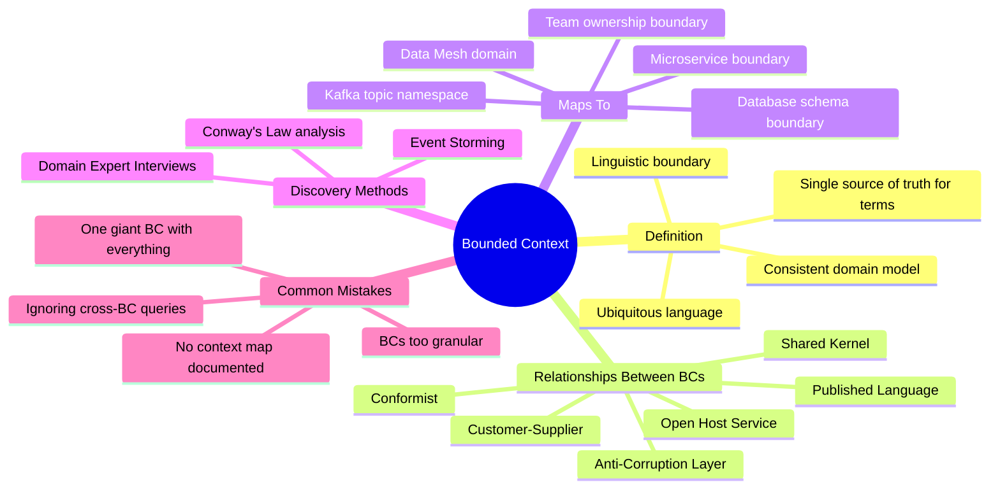
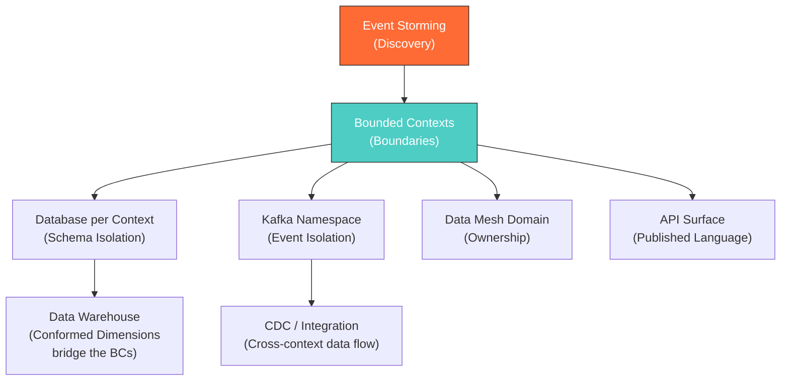

# Bounded Contexts — Concept Overview

> What it is, why it exists, what value it provides, and when to use (or avoid) it.

---

## Why This Exists

**Origin**: Eric Evans introduced Bounded Contexts in his 2003 book *Domain-Driven Design*. The core observation: in any sufficiently complex organization, the same word means different things to different teams. "Customer" in Marketing is anyone who signed up. "Customer" in Finance is anyone who completed a purchase. "Customer" in Support is anyone who filed a ticket. When you build one unified data model that tries to satisfy all three definitions, you get a schema that satisfies none.

A Bounded Context draws an explicit boundary around a specific domain model within which all terms have a single, unambiguous definition.

**The data architecture problem it solves**: The monolithic data warehouse with 500 tables and 30 columns named `status` — each meaning something different. Bounded Contexts prevent this by establishing *where* a model applies and *where* it does not.

## What Value It Provides

| Metric | Impact |
|---|---|
| **Eliminates semantic ambiguity** | No more "revenue" meaning 3 different things in 3 dashboards |
| **Maps directly to Data Mesh domains** | Each BC = one domain team, one data product ownership boundary |
| **Defines Kafka topic namespaces** | `payments.*`, `fulfillment.*`, `catalog.*` — clean separation |
| **Reduces schema coupling** | Changes in one BC don't cascade to other BCs |
| **Enables independent team velocity** | Each BC team can evolve their schema independently |

## Mindmap

## Where It Fits

## When To Use / When NOT To Use

| Scenario | Use Bounded Contexts? | Why |
|---|---|---|
| Multiple teams own different parts of a data platform | ✅ Yes | Establishes clear ownership |
| Same entity (e.g., "Customer") defined differently by 3 teams | ✅ Yes | Resolves semantic conflicts |
| Designing a Data Mesh | ✅ Yes | Each BC becomes a domain |
| Migrating monolith DW to microservices | ✅ Yes | Defines service boundaries |
| Single-team, single-database, simple domain | ❌ No | Overhead not justified |
| Quick POC or prototype | ❌ No | Premature abstraction |

## Key Terminology

| Term | Precise Definition |
|---|---|
| **Bounded Context** | A boundary within which a particular domain model is defined and applicable |
| **Ubiquitous Language** | The shared vocabulary within a BC, used by both engineers and domain experts |
| **Context Map** | A diagram showing all BCs and the relationships/integration patterns between them |
| **Anti-Corruption Layer (ACL)** | A translation layer that prevents one BC's model from leaking into another |
| **Shared Kernel** | A small, shared piece of model/code/schema that two BCs agree to maintain jointly |
| **Published Language** | A well-documented, versioned data format (e.g., Avro schema) for inter-BC communication |
| **Conformist** | A BC that accepts another BC's model as-is, without translation |
