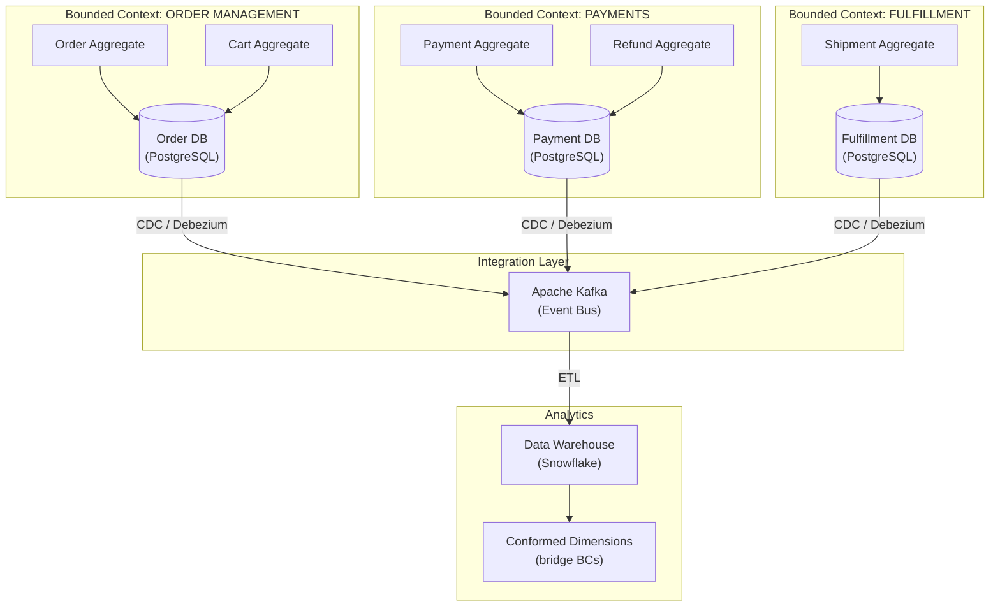
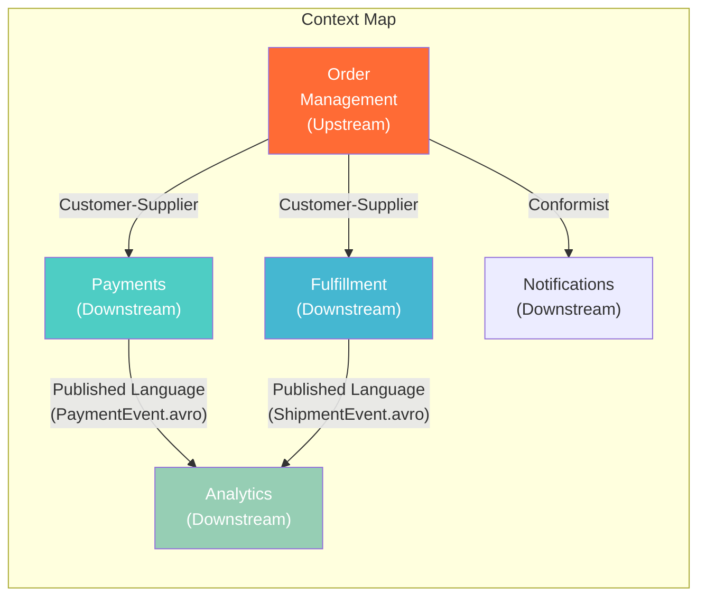
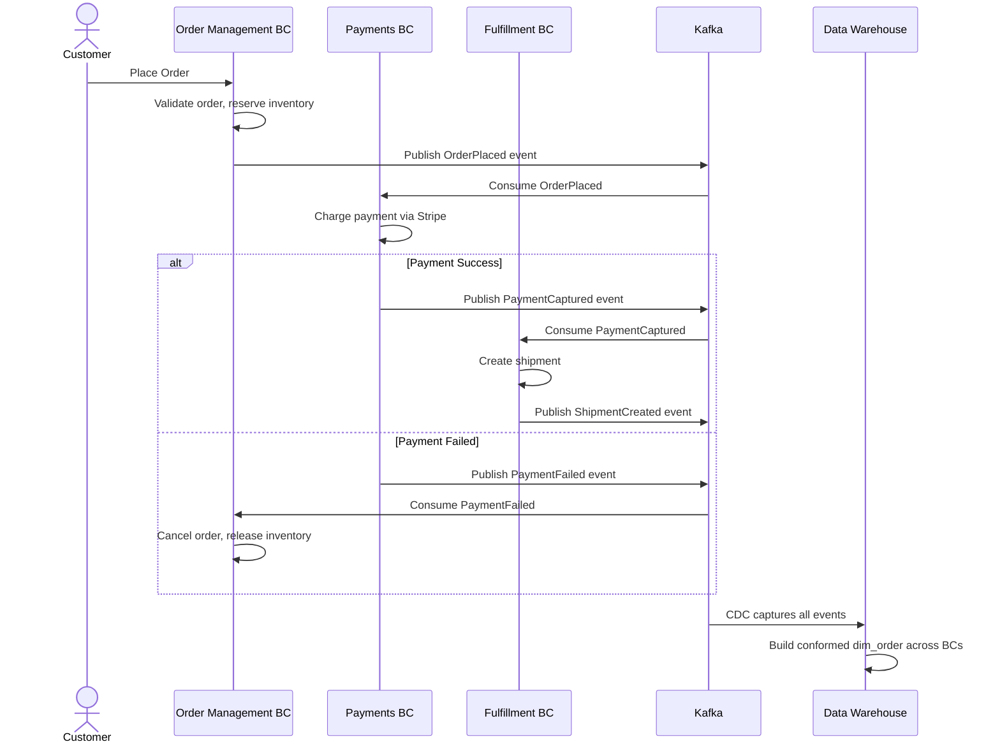
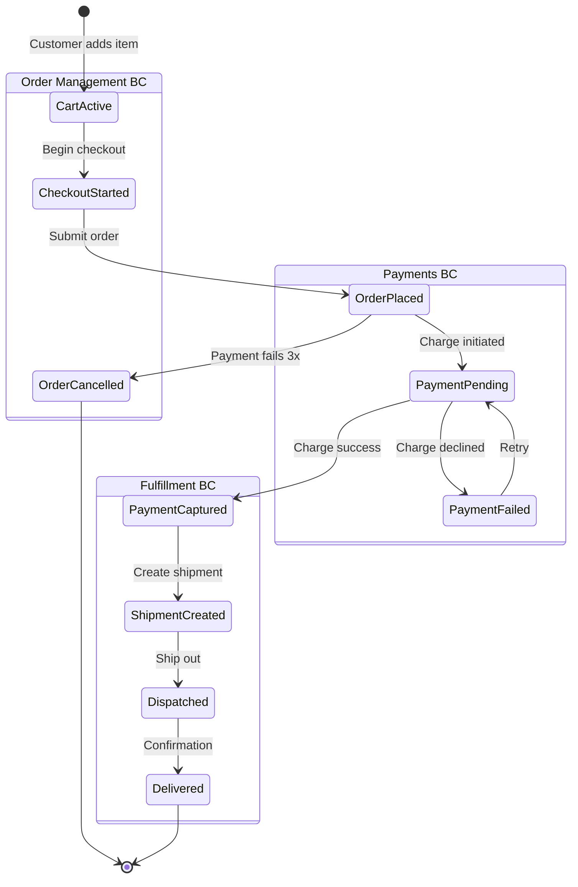
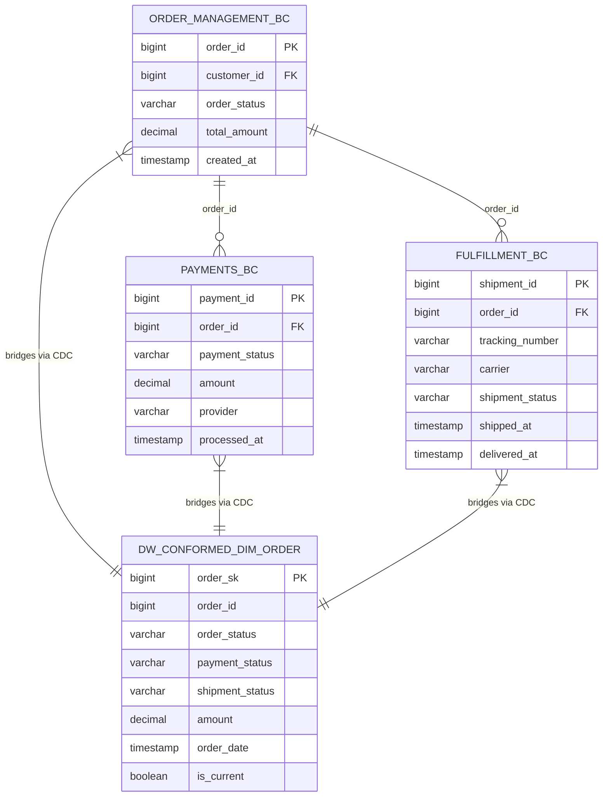
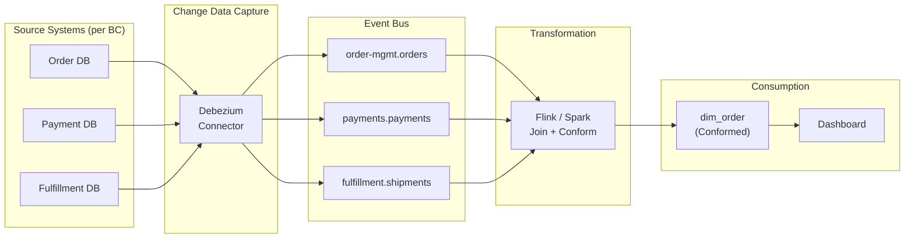

# Bounded Contexts — How It Works (Deep Internals)

> Architecture, HLD, sequence diagrams, state machine, DFD, ER diagrams, and table structures.

---

## High-Level Design



## Context Map — Relationships Between Bounded Contexts



### Context Map Relationship Patterns

| Pattern | Description | When To Use |
|---|---|---|
| **Shared Kernel** | Two BCs share a small model (e.g., `Money` value object). Both must agree on changes | When two BCs are tightly coupled and owned by the same team |
| **Customer-Supplier** | Upstream BC serves downstream BC. Downstream can request changes, upstream prioritizes | When one team produces data another team consumes |
| **Conformist** | Downstream BC accepts upstream's model as-is, zero translation | When you have no leverage over the upstream team |
| **Anti-Corruption Layer** | Downstream BC translates upstream's model into its own language | When upstream model is messy, legacy, or from a 3rd party |
| **Open Host Service** | Upstream exposes a clean, versioned API/event schema for any consumer | When multiple downstream BCs consume from the same upstream |
| **Published Language** | A shared, versioned schema (Avro, Protobuf) used for inter-BC events | Kafka topic schemas between BCs |

## Sequence Diagram — Cross-BC Order Flow



## State Machine — Order Entity Across Bounded Contexts



**Key insight**: Notice how `Order` transitions through **three different BCs** during its lifecycle. Each BC only knows its own states. The `Order Management BC` does not know about `Dispatched` — that state only exists in the `Fulfillment BC`. This is why a single `order_status` column in a monolithic table always becomes a mess.

## ER Diagram — Schema Per Bounded Context



**Critical pattern**: Each BC has its own `order_id` column, but they are **not foreign keys to each other**. They are independent. The Data Warehouse is the only place where all three are joined together via a **conformed dimension** (`dim_order`).

## Table Structures

```sql
-- ============================================================
-- ORDER MANAGEMENT BOUNDED CONTEXT — owns order lifecycle
-- ============================================================
CREATE TABLE order_mgmt.orders (
    order_id        BIGINT GENERATED ALWAYS AS IDENTITY PRIMARY KEY,
    customer_id     BIGINT        NOT NULL,
    order_status    VARCHAR(30)   NOT NULL DEFAULT 'PENDING',
    total_amount    DECIMAL(12,2) NOT NULL,
    currency        CHAR(3)       DEFAULT 'USD',
    created_at      TIMESTAMPTZ   DEFAULT NOW(),
    updated_at      TIMESTAMPTZ   DEFAULT NOW(),
    
    CONSTRAINT chk_order_status CHECK (order_status IN 
        ('PENDING', 'CONFIRMED', 'CANCELLED'))
);

-- ============================================================
-- PAYMENTS BOUNDED CONTEXT — owns payment lifecycle
-- ============================================================
CREATE TABLE payments.payments (
    payment_id      BIGINT GENERATED ALWAYS AS IDENTITY PRIMARY KEY,
    order_id        BIGINT        NOT NULL,  -- NOT a FK to order_mgmt.orders!
    payment_status  VARCHAR(30)   NOT NULL DEFAULT 'INITIATED',
    amount          DECIMAL(12,2) NOT NULL,
    provider        VARCHAR(30)   NOT NULL DEFAULT 'STRIPE',
    stripe_charge_id VARCHAR(100),
    processed_at    TIMESTAMPTZ,
    
    CONSTRAINT chk_payment_status CHECK (payment_status IN 
        ('INITIATED', 'CAPTURED', 'FAILED', 'REFUNDED'))
);

-- ============================================================
-- DATA WAREHOUSE — Conformed dimension bridging all BCs
-- ============================================================
CREATE TABLE analytics.dim_order (
    order_sk         BIGINT GENERATED ALWAYS AS IDENTITY PRIMARY KEY,
    
    -- Natural key
    order_id         BIGINT NOT NULL,
    
    -- From Order Management BC
    order_status     VARCHAR(30),
    total_amount     DECIMAL(12,2),
    
    -- From Payments BC
    payment_status   VARCHAR(30),
    payment_provider VARCHAR(30),
    
    -- From Fulfillment BC
    shipment_status  VARCHAR(30),
    tracking_number  VARCHAR(100),
    
    -- SCD Type 2
    effective_from   TIMESTAMPTZ NOT NULL,
    effective_to     TIMESTAMPTZ DEFAULT '9999-12-31',
    is_current       BOOLEAN DEFAULT TRUE
);
```

## Data Flow Diagram


