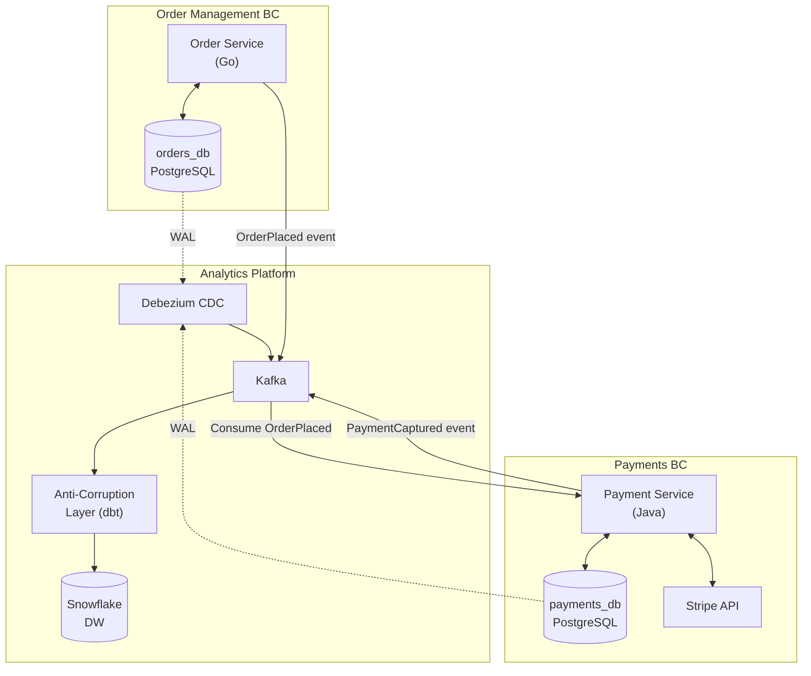

# Bounded Contexts — Hands-On Examples

> Real SQL/Python/Spark code, configuration examples, integration diagrams, and exercises.

---

## Example 1: Defining BCs via Kafka Topic Namespaces

Each Bounded Context gets its own Kafka topic namespace. Events never cross namespaces directly — they flow through explicit integration contracts.

```yaml
# ============================================================
# Kafka Topic Naming Convention: {bounded-context}.{aggregate}.{event-type}
# ============================================================

topics:
  # ORDER MANAGEMENT BC
  - name: order-mgmt.orders.order-placed
    partitions: 12
    partition_key: order_id
    value_schema: schemas/order-mgmt/OrderPlaced.avsc
    retention_ms: 2592000000  # 30 days

  - name: order-mgmt.orders.order-cancelled
    partitions: 12
    partition_key: order_id
    value_schema: schemas/order-mgmt/OrderCancelled.avsc

  # PAYMENTS BC
  - name: payments.charges.payment-captured
    partitions: 12
    partition_key: payment_id
    value_schema: schemas/payments/PaymentCaptured.avsc
    retention_ms: 7776000000  # 90 days (compliance)

  - name: payments.charges.payment-failed
    partitions: 6
    partition_key: payment_id
    value_schema: schemas/payments/PaymentFailed.avsc

  # FULFILLMENT BC
  - name: fulfillment.shipments.shipment-dispatched
    partitions: 6
    partition_key: shipment_id
    value_schema: schemas/fulfillment/ShipmentDispatched.avsc
```

## Example 2: Anti-Corruption Layer in dbt

When consuming data from another BC, don't expose their raw schema. Build a translation layer.

```sql
-- ============================================================
-- models/staging/payments/stg_payments__from_payment_bc.sql
-- 
-- ANTI-CORRUPTION LAYER: Translates the Payments BC schema
-- into our Order Management domain's language
-- ============================================================

WITH raw_payments AS (
    SELECT * FROM {{ source('payments_cdc', 'payments') }}
),

-- ACL: translate Payments BC terminology to our domain
translated AS (
    SELECT
        payment_id,
        order_id,
        
        -- Payments BC calls it 'CAPTURED', we call it 'PAID'
        CASE payment_status
            WHEN 'CAPTURED' THEN 'PAID'
            WHEN 'FAILED'   THEN 'PAYMENT_FAILED'
            WHEN 'REFUNDED' THEN 'REFUNDED'
            ELSE 'UNKNOWN'
        END AS order_payment_status,
        
        -- Payments BC stores amount in cents, we use dollars
        amount / 100.0 AS payment_amount_usd,
        
        processed_at AS payment_completed_at
        
    FROM raw_payments
)

SELECT * FROM translated
```

## Example 3: Cross-BC Query via Conformed Dimension

```sql
-- ============================================================
-- The value of Bounded Contexts: clean, performant analytics
-- This query joins data from 3 BCs through the conformed dimension
-- ============================================================

SELECT
    d.order_id,
    d.order_status,            -- From Order Management BC
    d.payment_status,          -- From Payments BC
    d.shipment_status,         -- From Fulfillment BC
    d.total_amount,
    
    -- Business metric: time from order to delivery
    DATEDIFF('hour', 
        f_order.event_timestamp,     -- Order Placed event
        f_ship.event_timestamp       -- Shipment Delivered event
    ) AS hours_to_delivery

FROM analytics.dim_order d
JOIN analytics.fact_order_events f_order 
    ON d.order_id = f_order.order_id 
    AND f_order.event_type = 'ORDER_PLACED'
JOIN analytics.fact_order_events f_ship 
    ON d.order_id = f_ship.order_id 
    AND f_ship.event_type = 'SHIPMENT_DELIVERED'
WHERE d.is_current = TRUE
  AND d.order_status = 'DELIVERED'
ORDER BY hours_to_delivery DESC
LIMIT 100;
```

## Integration Diagram



## Exercise: Map Your Company's Bounded Contexts

1. **List 5 core entities** in your company (Customer, Order, Product, etc.)
2. **For each entity**, ask 3 different teams how they define it
3. **Document the differences** — where definitions diverge = BC boundary
4. **Draw a context map** showing which BCs are upstream/downstream
5. **Identify integration patterns** — ACL, Conformist, or Published Language?
