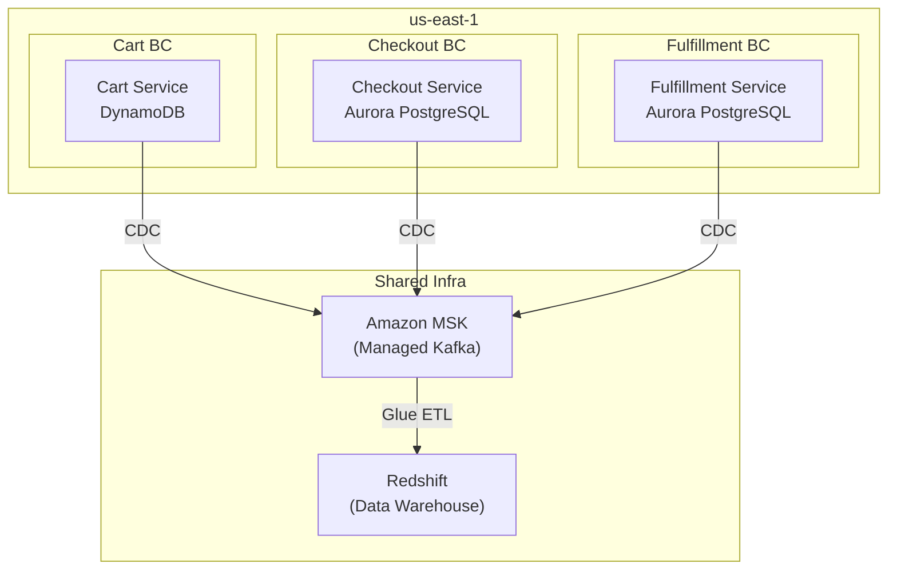

# Bounded Contexts — FAANG War Stories & Real-World Scenarios

> How Netflix, Amazon, LinkedIn, Uber use this. Scale numbers, architectural decisions, production incidents.

---

## Amazon: The "Order" That Was Five Things

### The Problem

Amazon Retail's data warehouse had a monolithic `orders` table with 300+ columns. Eight teams contributed to it. Query performance degraded quarterly. Column naming conflicts were constant (`status` vs `order_status` vs `fulfillment_status`).

### The Root Cause

"Order" was not one bounded context. It was five:

| BC | Owner | Key Entity | Scale |
|---|---|---|---|
| Cart | Storefront team | `shopping_cart` | 500M carts/day |
| Checkout | Payments team | `transaction` | 50M orders/day |
| Fulfillment | Logistics team | `shipment` | 40M shipments/day |
| Returns | Customer Service | `return_request` | 2M returns/day |
| Seller | Marketplace team | `seller_order` | 30M seller orders/day |

### The Fix

Each BC got its own database, its own Kafka topic namespace, and its own DW schema. A `dim_order` conformed dimension bridged all five in the analytics layer.

### Deployment Topology

---

## Netflix: Content vs. Subscriber vs. Engagement BCs

### The Three Bounded Contexts

Netflix discovered through domain modeling that their data platform had three fundamentally different bounded contexts:

| BC | Domain | Data Characteristics |
|---|---|---|
| **Content** | Licensing, encoding, localization | Slowly changing, high regulatory requirements, 17K+ titles |
| **Subscriber** | Signups, billing, plan changes | Customer PII, GDPR/CCPA, 230M+ members |
| **Engagement** | Views, searches, ratings | High volume (100B+ events/day), time-series, ML features |

### Why They Couldn't Share a Schema

- **Content BC** needed bi-temporal modeling (licensing rights have valid-from/valid-to dates that differ from when they were recorded).
- **Subscriber BC** needed GDPR compliance — right-to-erasure required knowing exactly which tables hold PII.
- **Engagement BC** needed partitioning by date and user_id for streaming feature computation.

A single schema would have made each BC compromise on its core requirements.

---

## LinkedIn: 47 Event Types Across 12 Bounded Contexts

LinkedIn's activity feed team identified **12 bounded contexts** producing **47 distinct event types**:

| BC | Examples of Events | Events/Day |
|---|---|---|
| Network | Connection Requested, Accepted, Removed | ~500M |
| Content | Post Created, Liked, Commented, Shared | ~2B |
| Career | Position Updated, Company Changed, Skill Added | ~100M |
| Jobs | Job Posted, Applied, Interview Scheduled | ~200M |
| Messaging | Message Sent, Read, Group Created | ~1B |
| Learning | Course Started, Completed, Certificate Earned | ~50M |

Each BC publishes events to its own Kafka namespace. The feed service consumes from all 12 and materializes a per-user timeline (CQRS pattern).

---

## Key Takeaway

Every FAANG company has learned this lesson independently: what looks like one entity ("order", "content", "user activity") is actually 3-10 bounded contexts with different owners, different lifecycles, different data models, and different query patterns. Bounded Contexts are not optional theory — they are operational necessity at scale.
