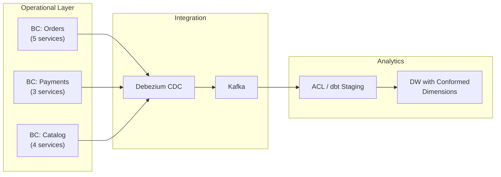

# Bounded Contexts — Interview Angle

> How this appears in Principal interviews, sample questions, strong answers, and what they're really testing.

---

## How This Topic Appears

Bounded Contexts rarely appear as a direct question. Instead, they surface when you answer system design and data modeling questions. Mentioning them signals Principal-level thinking.

---

## Question 1: The Semantic Conflict

> "Marketing says we have 500K customers. Finance says 350K. Sales says 420K. You're hired as Principal Data Architect. How do you fix this?"

### Strong Answer

"This is a textbook bounded context problem. Each team has a legitimate definition of 'customer' within their domain:

- Marketing: anyone who registered (500K)
- Sales: anyone who talked to a sales rep (420K)  
- Finance: anyone who completed a purchase (350K)

I would NOT create one universal 'customer' table. Instead, I'd:

1. Map each team's domain via Event Storming to understand their specific entity lifecycles
2. Formalize each definition within its own Bounded Context
3. Create a conformed dimension `dim_customer` in the DW that contains ALL customers with flags: `is_registered`, `has_sales_contact`, `has_purchased`
4. Publish a data contract specifying each definition, so any dashboard user knows which filter to apply

The conformed dimension bridges the BCs without forcing any team to change their definition."

### What They're Testing

- ✅ You recognize this as a domain problem, not a data quality problem
- ✅ You don't default to "one table to rule them all"
- ✅ You propose conformed dimensions as the DW integration pattern

---

## Question 2: The Microservices Data Problem

> "We have 50 microservices. Each has its own database. We need analytics across all of them. Design the data architecture."

### Strong Answer

"50 microservices likely map to 8-12 bounded contexts (not 50 — many services share a BC). Here's my approach:

1. **Identify the bounded contexts** — group the 50 services into logical domains
2. **CDC from each BC** — Debezium reads the WAL from each database, publishes events to Kafka with namespaced topics
3. **Anti-Corruption Layers** — dbt staging models translate each BC's schema into a common analytical model
4. **Conformed dimensions** — `dim_customer`, `dim_product`, `dim_date` bridge across BCs
5. **Context Map** — document upstream/downstream relationships and integration patterns"

### Whiteboard Diagram to Draw

---

## Question 3: The Schema Change Impact

> "A team wants to rename a column in their service's database. How do you assess the impact on the data platform?"

### Strong Answer

"If we have properly defined bounded contexts with:

- **CDC via Debezium** (not direct DB access): the column rename in the source DB only affects the CDC connector config — downstream Kafka topics use their own schema
- **Anti-Corruption Layer in dbt**: the `stg_` model translates the source schema, so only the one staging model needs updating
- **Data Contracts**: the contract specifies the published schema, not the internal schema. Internal changes don't break the contract

If we DON'T have BCs: this single column rename could break 15 downstream pipelines and dashboards. The blast radius is unbounded."

---

## Follow-Up Questions to Prepare For

| Question | Key Points |
|---|---|
| "What's the difference between a BC and a microservice?" | A BC is a business concept (domain boundary). A microservice is a technical implementation. One BC may contain 1-5 microservices |
| "When do you use Shared Kernel vs ACL?" | Shared Kernel: same team, tightly coupled, shared value objects. ACL: different teams, messy upstream, translation needed |
| "How do you handle cross-BC transactions?" | Saga pattern (choreography or orchestration). Never distributed transactions across BCs |
| "How many BCs should a company have?" | Rough heuristic: one per team (±1), typically 5-15 for a mid-size company |
