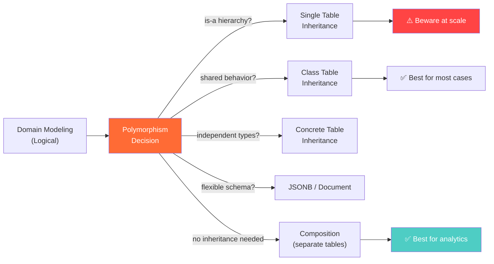

# Polymorphism Trap — Concept Overview

> What it is, why it exists, what value it provides, and when to use (or avoid) it.

---

## Why This Exists

**Origin**: The polymorphism trap emerged in the late 1990s-early 2000s as ORM frameworks (Hibernate, ActiveRecord, Entity Framework) popularized mapping object-oriented inheritance hierarchies directly to relational databases. Engineers who were comfortable with `class Dog extends Animal` assumed the database should mirror this hierarchy. The relational model disagrees.

**The problem it exposes**: Relational databases have no native concept of inheritance. Every attempt to simulate it creates trade-offs in query performance, data integrity, or schema flexibility. The "trap" is that the approach that seems most natural (Single Table Inheritance — one big table with a `type` column) is usually the worst for analytical workloads.

**Why a Principal must know this**: At FAANG scale, polymorphic tables are performance landmines. A single `events` table with 50 event types and a `type` discriminator column causes: (1) massive NULL waste, (2) impossible partition pruning, (3) misleading statistics for the query optimizer. The Principal Data Architect must know when to use each inheritance mapping strategy and when to avoid inheritance entirely.

## What Value It Provides

Understanding the polymorphism trap lets you:

| Value | Impact |
|---|---|
| **Avoid the #1 schema bloat source** | Prevents wide tables with 80% NULL columns |
| **Choose the right inheritance strategy** | STI vs CTI vs CCI vs no-inheritance — each has a sweet spot |
| **Prevent query optimizer failures** | Discriminator columns with skewed distributions break cost-based optimization |
| **Design for analytics, not just OLTP** | What works for a web app ORM is often catastrophic for a data warehouse |

## Mindmap

```mermaid
mindmap
  root((Polymorphism Trap))
    Inheritance Strategies
      Single Table Inheritance STI
        One table, type column
        NULL-heavy sparse data
        Simple queries
      Class Table Inheritance CTI
        Base table + subtables
        JOINs required
        Clean normalization
      Concrete Table Inheritance CCI
        Separate tables per type
        No JOINs needed
        Code duplication
    Anti-Patterns
      Polymorphic Associations
        morphable_type + morphable_id
        No FK constraints
        No referential integrity
      Entity Attribute Value EAV
        Flexible but unqueryable
        All values are strings
        Impossible to index
    Alternatives
      Composition over Inheritance
        has-a instead of is-a
        JSONB for flexible attributes
      Discriminated Unions
        Separate tables with shared key
      NoSQL Document Model
        Schema-per-document
    Data Architecture Impact
      DW Fact Tables
        Avoid STI for facts
      Partition Strategy
        Type column kills pruning
      Query Optimizer
        Skewed type distributions
```

## Where It Fits

## When To Use / When NOT To Use

| Strategy | Use When | Avoid When |
|---|---|---|
| **STI** | < 5 types, minimal type-specific columns, OLTP only | Analytical workloads, > 10 types, many type-specific columns |
| **CTI** | Clean normalization needed, moderate type-specific attributes | Read-heavy workloads requiring speed over correctness |
| **CCI** | Types are truly independent, rarely queried together | Shared behavior is the norm, not the exception |
| **JSONB / Document** | Schema varies wildly per instance, analytics not the primary use | Need to JOIN on nested attributes, strict type safety required |
| **Composition** | No true "is-a" relationship, shared key is sufficient | Genuine specialization hierarchy with shared behavior |

## Key Terminology

| Term | Precise Definition |
|---|---|
| **Polymorphism** | Multiple entities sharing a common interface but with type-specific behavior/attributes |
| **Discriminator Column** | The `type` column that identifies which subtype a row represents |
| **Single Table Inheritance (STI)** | All types in one table, differentiated by a discriminator. NULLs for non-applicable columns |
| **Class Table Inheritance (CTI)** | Base table for shared columns, child tables for type-specific columns, linked by PK/FK |
| **Concrete Table Inheritance (CCI)** | Separate independent tables per type, no base table |
| **Polymorphic Association** | Using `morphable_type` + `morphable_id` to reference multiple tables from one column |
| **EAV (Entity-Attribute-Value)** | Schema-free pattern using three tables: entity, attribute name, attribute value |
