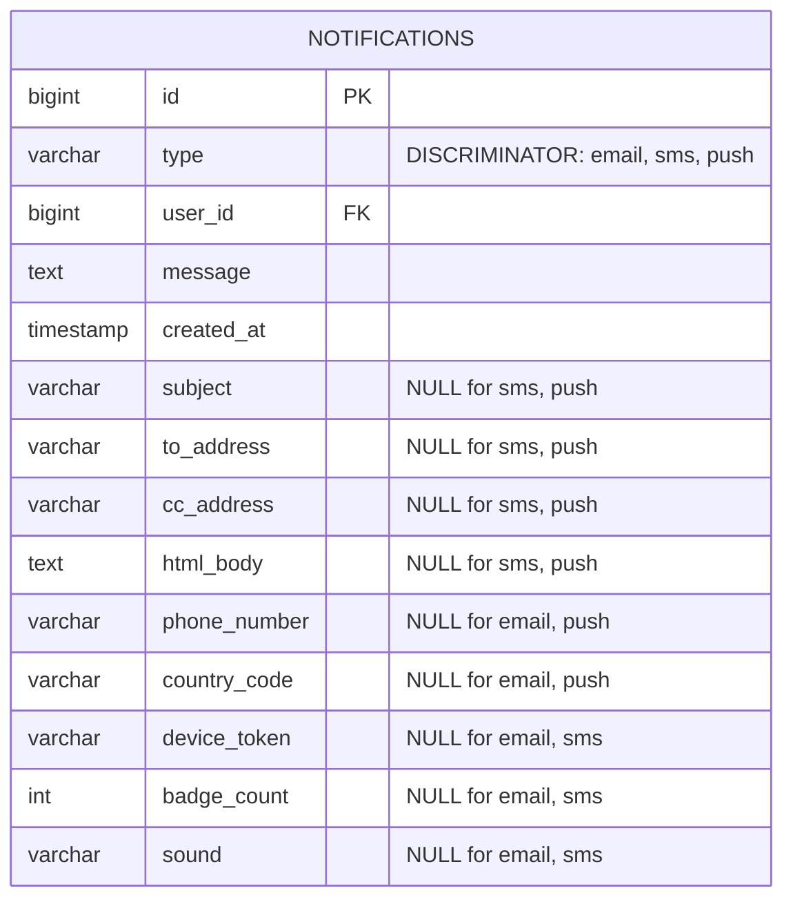
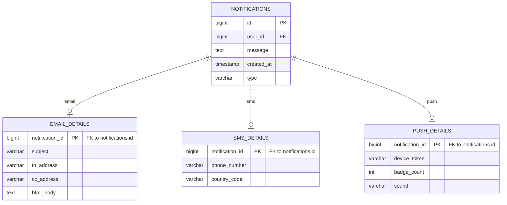
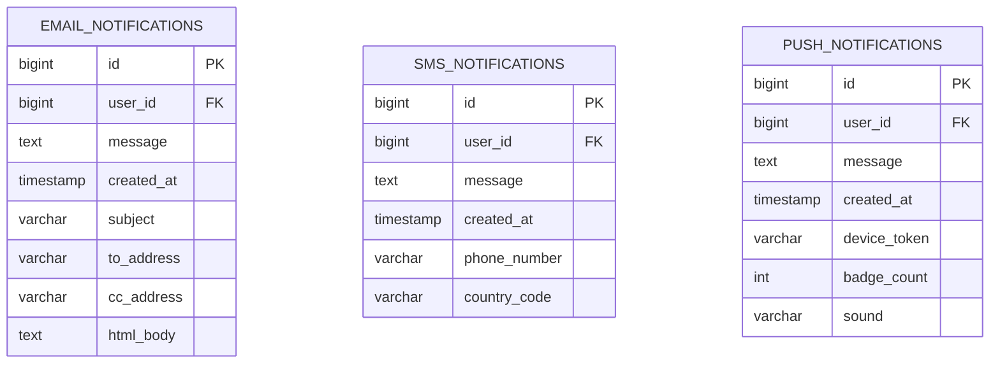
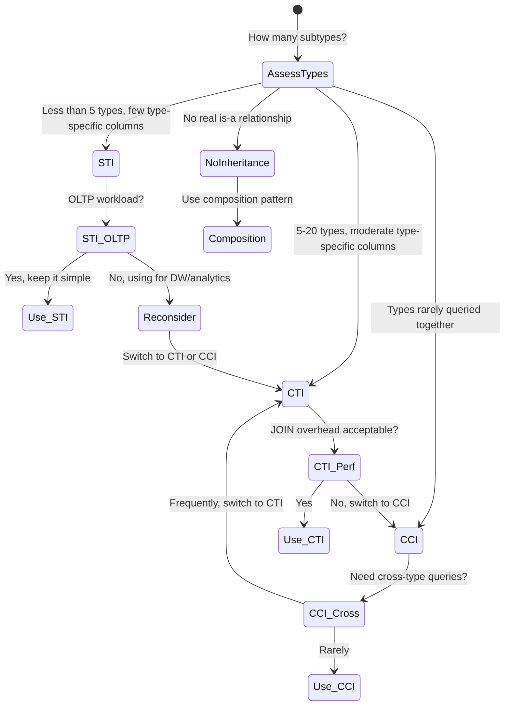

# Polymorphism Trap — How It Works (Deep Internals)

> Architecture, table structures, ER diagrams, comparison of all strategies with DDL.

---

## The Three Inheritance Mapping Strategies — Side by Side

### Problem Setup

You have a `Notification` entity with three subtypes:

| Type | Shared Columns | Type-Specific Columns |
|---|---|---|
| Email | id, user_id, created_at, message | subject, to_address, cc_address, html_body |
| SMS | id, user_id, created_at, message | phone_number, country_code |
| Push | id, user_id, created_at, message | device_token, badge_count, sound |

---

## Strategy 1: Single Table Inheritance (STI)

### ER Diagram



### DDL

```sql
CREATE TABLE notifications (
    id              BIGINT GENERATED ALWAYS AS IDENTITY PRIMARY KEY,
    type            VARCHAR(20)   NOT NULL,  -- 'email', 'sms', 'push'
    user_id         BIGINT        NOT NULL,
    message         TEXT          NOT NULL,
    created_at      TIMESTAMPTZ   DEFAULT NOW(),
    
    -- Email-specific (NULL for sms, push)
    subject         VARCHAR(500),
    to_address      VARCHAR(255),
    cc_address      VARCHAR(255),
    html_body       TEXT,
    
    -- SMS-specific (NULL for email, push)
    phone_number    VARCHAR(20),
    country_code    CHAR(2),
    
    -- Push-specific (NULL for email, sms)
    device_token    VARCHAR(255),
    badge_count     INTEGER,
    sound           VARCHAR(50)
);

CREATE INDEX idx_notifications_type ON notifications(type);
CREATE INDEX idx_notifications_user ON notifications(user_id);
```

### Analysis at Scale

| Metric | Value at 1B rows |
|---|---|
| NULL waste | ~60% of cells are NULL (8 of 13 columns are NULL per row) |
| Table width | 15 columns (bloated) |
| Index on `type` | Low cardinality (3 values) → useless for B-tree, optimizer ignores it |
| Partition pruning | Cannot partition by type efficiently |

---

## Strategy 2: Class Table Inheritance (CTI)

### ER Diagram



### DDL

```sql
-- Base table: shared columns only
CREATE TABLE notifications (
    id              BIGINT GENERATED ALWAYS AS IDENTITY PRIMARY KEY,
    type            VARCHAR(20)   NOT NULL,
    user_id         BIGINT        NOT NULL,
    message         TEXT          NOT NULL,
    created_at      TIMESTAMPTZ   DEFAULT NOW()
);

-- Child table: email-specific
CREATE TABLE email_details (
    notification_id BIGINT PRIMARY KEY REFERENCES notifications(id),
    subject         VARCHAR(500)  NOT NULL,
    to_address      VARCHAR(255)  NOT NULL,
    cc_address      VARCHAR(255),
    html_body       TEXT
);

-- Child table: sms-specific
CREATE TABLE sms_details (
    notification_id BIGINT PRIMARY KEY REFERENCES notifications(id),
    phone_number    VARCHAR(20)   NOT NULL,
    country_code    CHAR(2)       NOT NULL
);

-- Child table: push-specific
CREATE TABLE push_details (
    notification_id BIGINT PRIMARY KEY REFERENCES notifications(id),
    device_token    VARCHAR(255)  NOT NULL,
    badge_count     INTEGER       DEFAULT 0,
    sound           VARCHAR(50)   DEFAULT 'default'
);
```

### Analysis at Scale

| Metric | Value at 1B rows |
|---|---|
| NULL waste | Zero. Every column is populated |
| JOINs required | 1 JOIN per query (base + child) |
| Referential integrity | ✅ Enforced by FK constraints |
| Query: "Get all emails" | `JOIN email_details` — clean and fast with PK join |
| Query: "Get recent notifications" | Base table only — no JOIN needed |

---

## Strategy 3: Concrete Table Inheritance (CCI)

### ER Diagram



### DDL

```sql
CREATE TABLE email_notifications (
    id              BIGINT GENERATED ALWAYS AS IDENTITY PRIMARY KEY,
    user_id         BIGINT        NOT NULL,
    message         TEXT          NOT NULL,
    created_at      TIMESTAMPTZ   DEFAULT NOW(),
    subject         VARCHAR(500)  NOT NULL,
    to_address      VARCHAR(255)  NOT NULL,
    cc_address      VARCHAR(255),
    html_body       TEXT
);

CREATE TABLE sms_notifications (
    id              BIGINT GENERATED ALWAYS AS IDENTITY PRIMARY KEY,
    user_id         BIGINT        NOT NULL,
    message         TEXT          NOT NULL,
    created_at      TIMESTAMPTZ   DEFAULT NOW(),
    phone_number    VARCHAR(20)   NOT NULL,
    country_code    CHAR(2)       NOT NULL
);

CREATE TABLE push_notifications (
    id              BIGINT GENERATED ALWAYS AS IDENTITY PRIMARY KEY,
    user_id         BIGINT        NOT NULL,
    message         TEXT          NOT NULL,
    created_at      TIMESTAMPTZ   DEFAULT NOW(),
    device_token    VARCHAR(255)  NOT NULL,
    badge_count     INTEGER       DEFAULT 0,
    sound           VARCHAR(50)   DEFAULT 'default'
);
```

### Analysis at Scale

| Metric | Value at 1B rows |
|---|---|
| NULL waste | Zero |
| JOINs required | Zero (for type-specific queries) |
| Referential integrity | ✅ Each table is fully self-contained |
| Query: "Get all notifications" | UNION ALL across 3 tables — moderately expensive |
| Schema evolution | Can add columns to one type without touching others |

---

## State Machine Diagram — When Each Strategy Becomes the Right Choice



## Comparison Summary Table

| Criteria | STI | CTI | CCI | Composition |
|---|---|---|---|---|
| **NULLs** | Many | None | None | None |
| **JOINs** | None | 1 per query | None | Depends |
| **FK integrity** | Partial | Full | Full | Full |
| **Schema evolution** | Hard (all types affected) | Easy (per child table) | Easy (per table) | Easy |
| **Cross-type queries** | Easy | Easy (base table) | UNION ALL | Depends |
| **Analytical queries** | ❌ Poor | ✅ Good | ✅ Good | ✅ Best |
| **Query optimizer** | ⚠️ Skewed stats | ✅ Clean stats | ✅ Clean stats | ✅ Clean stats |
| **Storage efficiency** | ❌ Worst | ✅ Best | ✅ Good | ✅ Good |
