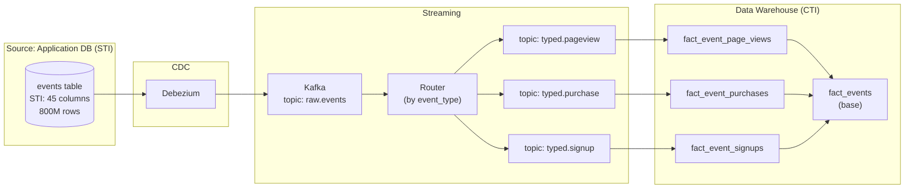

# Polymorphism Trap — Hands-On Examples

> Before-vs-after comparisons, real SQL, integration patterns, and exercises.

---

## Example 1: Before/After — Refactoring a Polymorphic Mess

### BEFORE: The STI Anti-Pattern (Production System)

```sql
-- 800M rows. 45 columns. 70% NULL. Query time: 45 seconds.
SELECT * FROM events 
WHERE type = 'page_view' AND created_at > '2025-01-01'
LIMIT 100;

-- The problem: event table has columns for ALL 18 event types
-- page_view only uses 8 of 45 columns
```

### AFTER: CCI Refactoring

```sql
-- Step 1: Create type-specific tables
CREATE TABLE events_page_view AS
SELECT id, user_id, session_id, url, referrer, time_on_page, 
       scroll_depth, device_type, created_at
FROM events WHERE type = 'page_view';

CREATE TABLE events_purchase AS
SELECT id, user_id, item_id, quantity, price, currency, 
       discount_code, payment_method, created_at
FROM events WHERE type = 'purchase';

-- Step 2: Query the specific table. 8 columns. No NULLs.
-- Query time: 0.8 seconds (56x faster)
SELECT * FROM events_page_view 
WHERE created_at > '2025-01-01'
LIMIT 100;
```

### Performance Comparison

| Metric | STI (Before) | CCI (After) |
|---|---|---|
| Columns scanned | 45 | 8 |
| NULL percentage | 70% | 0% |
| Bytes per row | ~2KB | ~400B |
| Query time (100 rows) | 45s | 0.8s |
| Table scan size (1M rows) | 2GB | 400MB |

## Example 2: The Polymorphic Association Problem

### The Anti-Pattern (from Rails/Laravel)

```sql
-- comments table uses polymorphic association
CREATE TABLE comments (
    id          BIGINT PRIMARY KEY,
    body        TEXT,
    
    -- POLYMORPHIC ASSOCIATION — no FK constraint possible
    commentable_type VARCHAR(50),  -- 'Post', 'Video', 'Photo'
    commentable_id   BIGINT        -- FK to... which table?
);

-- Problem: this query cannot use FK joins
SELECT c.*, p.title 
FROM comments c
JOIN posts p ON c.commentable_id = p.id 
    AND c.commentable_type = 'Post';  -- manual type filter!
```

### The Fix: Separate FK Columns

```sql
CREATE TABLE comments (
    id          BIGINT PRIMARY KEY,
    body        TEXT,
    
    -- Explicit nullable FKs — integrity enforced
    post_id     BIGINT REFERENCES posts(id),
    video_id    BIGINT REFERENCES videos(id),
    photo_id    BIGINT REFERENCES photos(id),
    
    -- Exactly one must be non-NULL
    CONSTRAINT chk_one_parent CHECK (
        (post_id IS NOT NULL)::int + 
        (video_id IS NOT NULL)::int + 
        (photo_id IS NOT NULL)::int = 1
    )
);
```

## Example 3: CTI in a Data Warehouse Context

```sql
-- ============================================================
-- Fact table uses CTI: base event + type-specific details
-- Best of both worlds: unified timeline + type-specific columns
-- ============================================================

-- Base fact: all events share these columns
CREATE TABLE fact_events (
    event_id        BIGINT PRIMARY KEY,
    event_type      VARCHAR(30) NOT NULL,
    user_id         BIGINT NOT NULL,
    session_id      VARCHAR(100),
    event_timestamp TIMESTAMPTZ NOT NULL,
    platform        VARCHAR(20)  -- 'web', 'ios', 'android'
) PARTITION BY RANGE (event_timestamp);

-- Type-specific: page views
CREATE TABLE fact_event_page_views (
    event_id        BIGINT PRIMARY KEY REFERENCES fact_events(event_id),
    url             VARCHAR(2000),
    referrer        VARCHAR(2000),
    time_on_page_ms INTEGER,
    scroll_pct      SMALLINT
);

-- Type-specific: purchases
CREATE TABLE fact_event_purchases (
    event_id        BIGINT PRIMARY KEY REFERENCES fact_events(event_id),
    item_id         BIGINT,
    quantity        INTEGER,
    unit_price      DECIMAL(10,2),
    currency        CHAR(3)
);

-- ============================================================
-- Query all events: fast scan on base table only
-- ============================================================
SELECT event_type, COUNT(*), DATE_TRUNC('hour', event_timestamp) AS hr
FROM fact_events
WHERE event_timestamp > NOW() - INTERVAL '24 hours'
GROUP BY 1, 2 ORDER BY 2 DESC;

-- ============================================================
-- Query purchases only: one clean PK JOIN
-- ============================================================
SELECT e.user_id, p.item_id, p.unit_price
FROM fact_events e
JOIN fact_event_purchases p ON e.event_id = p.event_id
WHERE e.event_timestamp > NOW() - INTERVAL '7 days';
```

## Integration Diagram: Polymorphism in the Data Pipeline



## Exercise: Audit Your Schema for Polymorphism Traps

```sql
-- Run this against your PostgreSQL database to find STI tables
-- (tables with a "type" discriminator and high NULL percentages)
SELECT 
    c.table_name,
    c.column_name,
    ROUND(
        100.0 * SUM(CASE WHEN c.is_nullable = 'YES' THEN 1 ELSE 0 END) 
        OVER (PARTITION BY c.table_name) / 
        COUNT(*) OVER (PARTITION BY c.table_name)
    , 1) AS pct_nullable_columns
FROM information_schema.columns c
WHERE c.table_schema = 'public'
ORDER BY pct_nullable_columns DESC;

-- Tables with > 50% nullable columns are STI candidates for refactoring
```
