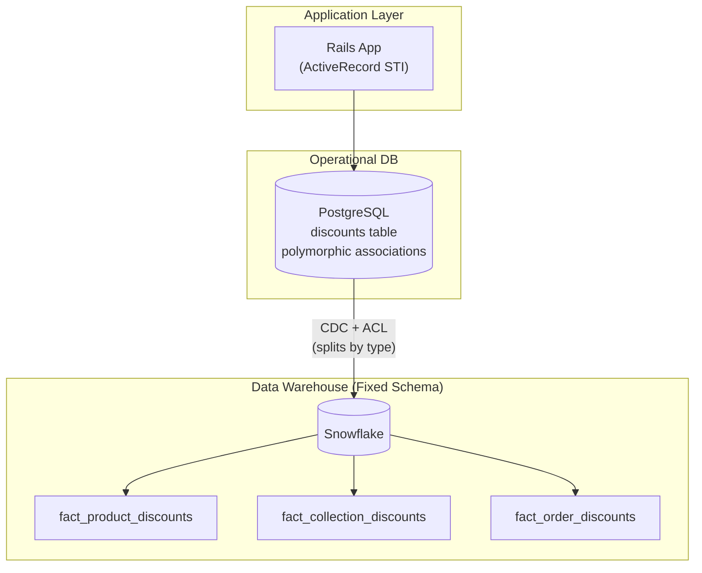

# Polymorphism Trap — FAANG War Stories & Real-World Scenarios

> How large-scale companies deal with polymorphic data. Scale numbers, production incidents.

---

## Uber: The Single `trips` Table That Collapsed

### The Problem

Uber's early data model used a single `trips` table with a `trip_type` discriminator: `RIDE`, `EATS_DELIVERY`, `FREIGHT`. As the company expanded to 3 business lines, the table grew to 200+ columns. Type-specific columns for Eats (restaurant_id, delivery_fee, preparation_time) were NULL for 80% of rows. Type-specific columns for Freight (trailer_type, weight_class, bill_of_lading) were NULL for 98% of rows.

### The Incident

A query to calculate Eats delivery time percentiles ran for 6 hours because it scanned ALL 200 columns for ALL trip types. The query optimizer couldn't push down the `trip_type = 'EATS_DELIVERY'` predicate before the column scan because the statistics on the `trip_type` column showed 85% `RIDE`, making the optimizer choose a full table scan.

### The Fix

Uber moved to CCI: separate `rides`, `eats_deliveries`, and `freight_shipments` tables. Each table had only the columns relevant to its domain. The same query dropped from 6 hours to 3 minutes.

### Scale

- 28M rides/day + 12M deliveries/day + 500K freight loads/day
- Original table: 200 columns × 40M rows/day = massive I/O waste
- After CCI: each table had 15-25 columns × its own volume

---

## Shopify: The Polymorphic Association Incident

### The Problem

Shopify's early data model used polymorphic associations for `discounts`:

```sql
-- The problematic polymorphic association
discounts.discountable_type = 'Product' | 'Collection' | 'Order'
discounts.discountable_id = <id from one of those tables>
```

No foreign key constraints were possible. Over time, `discountable_id` values pointed to deleted products (orphaned references). The analytics team reported discount amounts that exceeded total revenue for certain merchants — because discounts were being counted for products that no longer existed.

### The Fix

Separate FK columns with CHECK constraints:

```sql
product_discount_id  BIGINT REFERENCES products(id),
collection_discount_id BIGINT REFERENCES collections(id),
order_discount_id    BIGINT REFERENCES orders(id)
```

### Deployment Diagram



---

## Netflix: Event Schema Evolution

### The Scenario

Netflix's `playback_events` table used STI with a `device_type` discriminator. When they added new device types (PlayStation, Xbox, Smart Fridge), each required new device-specific columns. The ALTER TABLE operations on a 500B-row table took hours and blocked writes.

### The Solution

Instead of STI, Netflix moved to a `base_event` table + JSONB `device_payload` column. Common fields stayed as typed columns. Device-specific data went into the JSON payload. This is a variant of CTI where the child table is embedded as JSON.

```sql
CREATE TABLE playback_events (
    event_id        BIGINT PRIMARY KEY,
    user_id         BIGINT NOT NULL,
    title_id        BIGINT NOT NULL,
    event_type      VARCHAR(30) NOT NULL,
    device_class    VARCHAR(30) NOT NULL,  -- 'mobile', 'tv', 'web', 'console'
    playback_time   TIMESTAMPTZ NOT NULL,
    
    -- Typed common columns (fast to query)
    duration_ms     INTEGER,
    quality         VARCHAR(10),   -- '4K', 'HD', 'SD'
    
    -- Type-specific payload (flexible)
    device_payload  JSONB          -- {"device_model": "PS5", "controller_type": "DualSense", ...}
);

-- Functional index on JSONB for frequent queries
CREATE INDEX idx_device_model 
    ON playback_events ((device_payload->>'device_model'));
```

---

## Key Lessons

| Lesson | From |
|---|---|
| STI with 3+ types at >100M rows will cause performance problems | Uber |
| Polymorphic associations without FK constraints lead to data integrity issues | Shopify |
| JSONB as "flexible child table" works well for high-cardinality type hierarchies | Netflix |
| The DW should NEVER mirror the application's STI — always split by type | All three |
