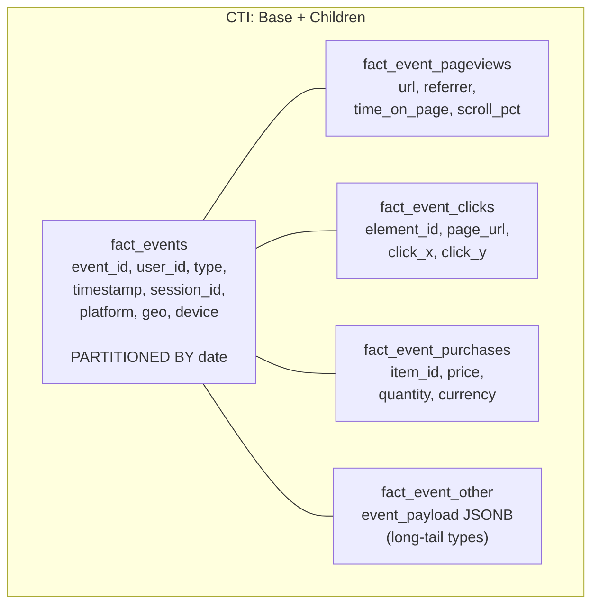

# Polymorphism Trap — Interview Angle

> How this appears in Principal interviews, sample questions, and whiteboard exercises.

---

## How This Topic Appears

Polymorphism questions appear in **data modeling** and **system design** rounds. They test whether you default to the ORM-driven approach or think about the downstream impact on analytics, query performance, and schema evolution. Principals are expected to identify the trap unprompted.

---

## Question 1: The Events Table Design

> "Design the schema for an analytics events system. We have 50 event types (page_view, click, purchase, signup, etc.). Each has 3-5 type-specific fields plus 8 shared fields."

### Weak Answer (Senior)

"One `events` table with a `type` column and all 250 columns."

### Strong Answer (Principal)

"50 event types with 3-5 type-specific fields means 150-250 type-specific columns. STI would create a table that is 85%+ NULL. That's a non-starter for an analytical system.

My design:

1. **Base fact table** (`fact_events`) with the 8 shared columns + `event_type` discriminator, partitioned by date
2. **Type-specific child tables** for the top 10-15 high-volume event types (CTI pattern)
3. **JSONB payload column** for the remaining 35-40 low-volume event types
4. This gives us fast scans on common queries, clean JOINs for deep-dive analysis, and flexibility for long-tail event types without schema migration"

### Whiteboard Diagram



### What They're Testing

- ✅ You immediately identify the polymorphism trap (STI won't work)
- ✅ You propose a hybrid approach (CTI + JSONB fallback)
- ✅ You consider the analytical query patterns, not just the write path
- ✅ You mention partitioning as part of the physical design

---

## Question 2: The Notifications Table Debate

> "The app team wants one `notifications` table (STI) for email, SMS, and push. The analytics team says split them. Who's right?"

### Strong Answer

"Both are right — for their context. The app team optimizes for write simplicity (one table, one ORM model). The analytics team optimizes for read performance (separate tables, no NULLs).

The solution: let the app team keep their STI in the operational database. In the CDC pipeline, split by `type` before loading into the Data Warehouse. The dbt staging layer handles the translation:

```sql
-- App DB: STI (one table)
-- DW: CCI (split by type in staging)
-- models/staging/stg_notifications_email.sql
SELECT id, user_id, message, subject, to_address, html_body
FROM {{ source('app', 'notifications') }}
WHERE type = 'email'
```

This way each team gets the schema pattern that optimizes for their workload."

---

## Question 3: The Schema Evolution Problem

> "We need to add a new event type (video_watch) with 6 unique fields. Current STI table has 200 columns and 500M rows. How?"

### Strong Answer

"Adding 6 columns to a 200-column STI table means ALTER TABLE on 500M rows. In PostgreSQL, this requires a table rewrite. In Redshift, it's a metadata-only operation but now we have 206 columns to scan. Neither is great.

This is the moment to refactor. I'd:

1. Create `fact_event_video_watch` as a new child table (CTI)
2. Route new `video_watch` events to this table
3. Keep existing events in the old STI table (don't migrate retroactively — it's too expensive)
4. Over the next 3-6 months, migrate the top 5 event types out of the STI table into their own child tables
5. End state: base + children (CTI), with the STI table shrinking over time"

---

## Follow-Up Questions

| Question | Key Points |
|---|---|
| "Why not just use JSONB for everything?" | JSONB loses type safety, makes column-level statistics impossible, and prevents partition pruning. Use it for long-tail types, not high-volume ones |
| "How does this work with Spark/Databricks?" | Same principle. STI DataFrames have wide, sparse schemas. Split into type-specific Delta tables for better predicate pushdown |
| "What about schema-on-read vs schema-on-write?" | Schema-on-read (JSONB, Parquet) defers the polymorphism problem to query time. Schema-on-write (CTI, CCI) solves it at ingest time. For analytics, schema-on-write wins |
