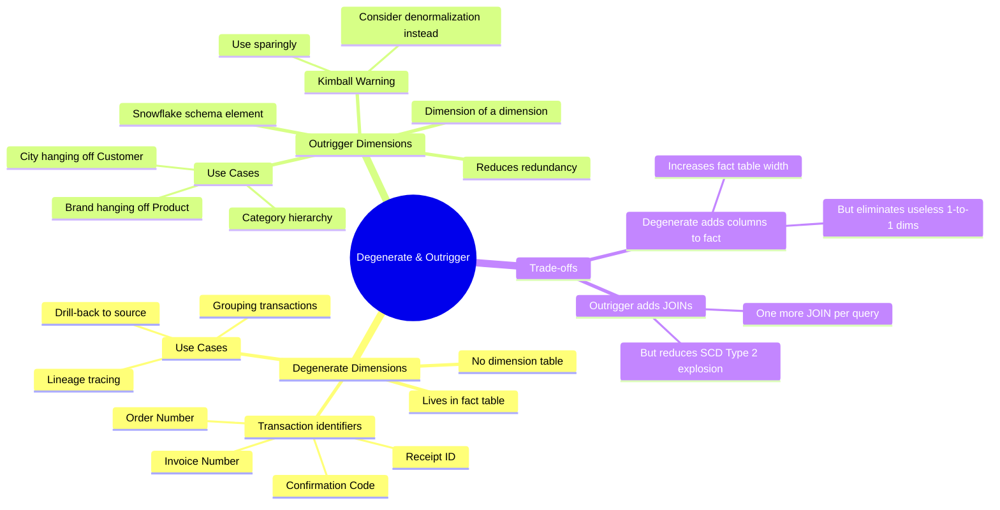
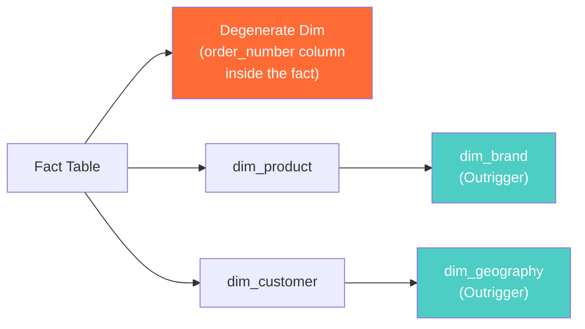

# Degenerate & Outrigger Dimensions — Concept Overview

> What they are, why they exist, what value they provide, and when to use (or avoid) them.

---

## Why These Exist

### Degenerate Dimensions

**Origin**: Ralph Kimball formalized degenerate dimensions in *The Data Warehouse Toolkit* (1996). The observation: transaction identifiers like `order_number`, `invoice_number`, or `receipt_id` are dimensional attributes — you filter and group by them — but they carry no additional descriptive data worth putting into a separate dimension table.

**The problem it solves**: Without degenerate dimensions, you'd either (a) create a dimension table with one column per row (1:1 with the fact — pointless), or (b) lose the ability to trace a fact row back to its source transaction.

### Outrigger Dimensions

**Origin**: Also Kimball. An outrigger is a dimension table that hangs off another dimension table rather than the fact table. It's a "dimension of a dimension." Example: `dim_product` has a `brand_id` FK that points to `dim_brand`. The brand attributes (brand_name, brand_country, parent_company) live in the outrigger.

**The problem it solves**: Reduces redundancy in wide dimension tables. Without outriggers, you'd repeat brand attributes for every product row — manageable at 1K products, catastrophic at 10M with SCD Type 2.

## Mindmap

## Where It Fits

## When To Use / When NOT To Use

| Scenario | Degenerate? | Outrigger? |
|---|---|---|
| Transaction ID that identifies a source record | ✅ Yes | N/A |
| Attribute with its own rich descriptive data (brand, geography) | N/A | ✅ Maybe |
| Attribute queried independently of parent dimension | N/A | ✅ Yes |
| Attribute rarely queried, just for display | N/A | ❌ Denormalize instead |
| High-cardinality identifier (session_id, trace_id) | ⚠️ Consider — may bloat fact | N/A |
| Kimball purist environment (star schema only) | ✅ | ❌ Kimball discourages outriggers |

## Key Terminology

| Term | Precise Definition |
|---|---|
| **Degenerate Dimension** | A dimension attribute stored directly in the fact table with no corresponding dimension table |
| **Outrigger Dimension** | A dimension table that references another dimension table rather than the fact table directly |
| **Snowflake Schema** | A normalized extension of star schema where dimensions have sub-dimensions (outriggers are a form of this) |
| **Drill-back** | The ability to trace a fact row back to its source transaction using the degenerate dimension |
| **Junk Dimension** | A dimension that collects miscellaneous low-cardinality flags/indicators (often confused with degenerate) |
