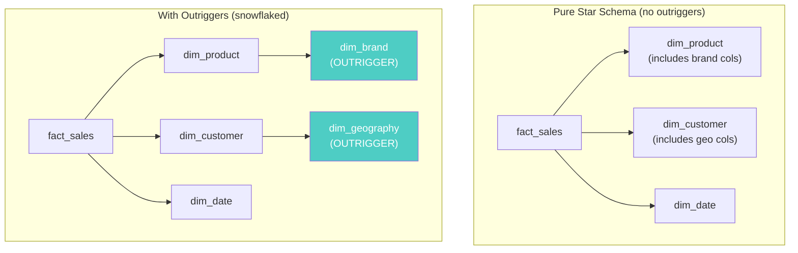
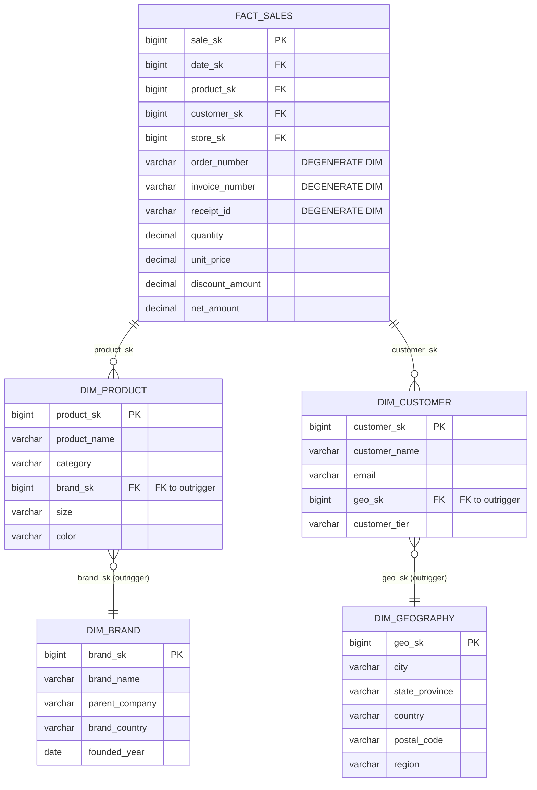
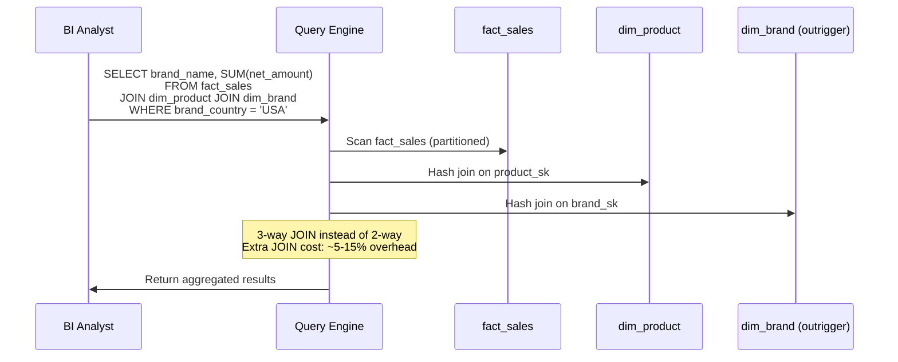
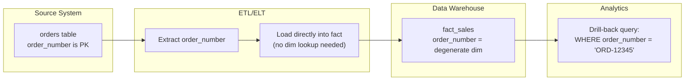

# Degenerate & Outrigger Dimensions — How It Works (Deep Internals)

> HLD, ER diagrams, DDL table structures, sequence diagrams, and data flow.

---

## High-Level Design — Star vs Snowflake with Outriggers



## ER Diagram — Degenerate Dimensions in a Transaction Fact



## Table Structures

### Degenerate Dimensions in the Fact Table

```sql
-- ============================================================
-- Fact table with degenerate dimensions (order_number, invoice_number)
-- These are dimensional — you filter/group by them — but have no separate dim
-- ============================================================

CREATE TABLE fact_sales (
    sale_sk             BIGINT GENERATED ALWAYS AS IDENTITY PRIMARY KEY,
    
    -- Foreign keys to dimensions
    date_sk             INT           NOT NULL REFERENCES dim_date(date_sk),
    product_sk          BIGINT        NOT NULL REFERENCES dim_product(product_sk),
    customer_sk         BIGINT        NOT NULL REFERENCES dim_customer(customer_sk),
    store_sk            BIGINT        NOT NULL REFERENCES dim_store(store_sk),
    
    -- DEGENERATE DIMENSIONS: no separate dim table
    order_number        VARCHAR(30)   NOT NULL,   -- drill-back to source
    invoice_number      VARCHAR(30),              -- source system reference
    receipt_id          VARCHAR(50),              -- POS receipt identifier
    
    -- Measures
    quantity            INTEGER       NOT NULL,
    unit_price          DECIMAL(10,2) NOT NULL,
    discount_amount     DECIMAL(10,2) DEFAULT 0,
    net_amount          DECIMAL(12,2) NOT NULL,
    tax_amount          DECIMAL(10,2) DEFAULT 0,
    
    -- Partition key
    sale_date           DATE          NOT NULL
) PARTITION BY RANGE (sale_date);

-- Index on degenerate dims for drill-back queries
CREATE INDEX idx_fact_sales_order ON fact_sales(order_number);
CREATE INDEX idx_fact_sales_invoice ON fact_sales(invoice_number);
```

### Outrigger Dimension Tables

```sql
-- ============================================================
-- OUTRIGGER: dim_brand hangs off dim_product
-- ============================================================

CREATE TABLE dim_brand (
    brand_sk            BIGINT GENERATED ALWAYS AS IDENTITY PRIMARY KEY,
    brand_id            INT           NOT NULL,   -- natural key
    brand_name          VARCHAR(200)  NOT NULL,
    parent_company      VARCHAR(200),
    brand_country       VARCHAR(100),
    founded_year        INT,
    
    -- SCD Type 2
    effective_from      DATE          NOT NULL,
    effective_to        DATE          DEFAULT '9999-12-31',
    is_current          BOOLEAN       DEFAULT TRUE
);

CREATE TABLE dim_product (
    product_sk          BIGINT GENERATED ALWAYS AS IDENTITY PRIMARY KEY,
    product_id          INT           NOT NULL,   -- natural key
    product_name        VARCHAR(500)  NOT NULL,
    category            VARCHAR(100),
    subcategory         VARCHAR(100),
    
    -- FK to outrigger
    brand_sk            BIGINT        REFERENCES dim_brand(brand_sk),
    
    size                VARCHAR(20),
    color               VARCHAR(50),
    weight_kg           DECIMAL(8,2),
    
    -- SCD Type 2
    effective_from      DATE          NOT NULL,
    effective_to        DATE          DEFAULT '9999-12-31',
    is_current          BOOLEAN       DEFAULT TRUE
);

-- ============================================================
-- OUTRIGGER: dim_geography hangs off dim_customer
-- ============================================================

CREATE TABLE dim_geography (
    geo_sk              BIGINT GENERATED ALWAYS AS IDENTITY PRIMARY KEY,
    city                VARCHAR(200)  NOT NULL,
    state_province      VARCHAR(200),
    country             VARCHAR(100)  NOT NULL,
    postal_code         VARCHAR(20),
    region              VARCHAR(100),
    latitude            DECIMAL(9,6),
    longitude           DECIMAL(9,6)
);

CREATE TABLE dim_customer (
    customer_sk         BIGINT GENERATED ALWAYS AS IDENTITY PRIMARY KEY,
    customer_id         INT           NOT NULL,
    customer_name       VARCHAR(300),
    email               VARCHAR(255),
    
    -- FK to outrigger
    geo_sk              BIGINT        REFERENCES dim_geography(geo_sk),
    
    customer_tier       VARCHAR(20),
    registration_date   DATE,
    
    -- SCD Type 2
    effective_from      DATE          NOT NULL,
    effective_to        DATE          DEFAULT '9999-12-31',
    is_current          BOOLEAN       DEFAULT TRUE
);
```

## Sequence Diagram — Query Execution with Outrigger JOIN



## Data Flow Diagram — Degenerate Dim Lifecycle



## When Outriggers Cause Problems

The Kimball Group's official guidance: **use outriggers sparingly**. The extra JOIN has two costs:

1. **Query performance**: Each outrigger adds one more hash/merge join to every query touching that dimension path
2. **SCD complexity**: If `dim_brand` is SCD Type 2, the surrogate key in `dim_product.brand_sk` must be point-in-time correct — the ETL must look up the brand_sk that was current when the product record was created

**Kimball's preferred alternative**: Denormalize brand attributes directly into `dim_product`. Accept the data duplication. Star schemas prioritize query speed over storage efficiency.
