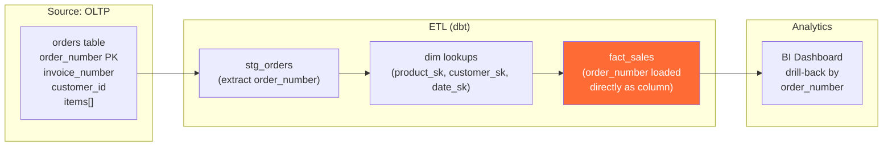

# Degenerate & Outrigger Dimensions — Hands-On Examples

> Production SQL, integration patterns, before/after comparisons, exercises.

---

## Example 1: Using Degenerate Dimensions for Drill-Back

```sql
-- ============================================================
-- Typical BI query: Summarize sales by product category
-- ============================================================
SELECT 
    p.category,
    SUM(f.net_amount)       AS total_revenue,
    COUNT(DISTINCT f.order_number) AS unique_orders  -- degenerate dim!
FROM fact_sales f
JOIN dim_product p ON f.product_sk = p.product_sk
WHERE f.sale_date BETWEEN '2025-01-01' AND '2025-03-31'
GROUP BY p.category
ORDER BY total_revenue DESC;

-- ============================================================
-- Drill-back: User clicks on a row, wants to see individual orders
-- The degenerate dim enables this without a separate dim table
-- ============================================================
SELECT 
    f.order_number,           -- degenerate dim
    f.invoice_number,         -- degenerate dim
    p.product_name,
    f.quantity,
    f.net_amount,
    f.sale_date
FROM fact_sales f
JOIN dim_product p ON f.product_sk = p.product_sk
WHERE p.category = 'Electronics'
  AND f.sale_date BETWEEN '2025-01-01' AND '2025-03-31'
ORDER BY f.net_amount DESC
LIMIT 50;
```

## Example 2: Before/After — Outrigger Dimension Refactoring

### BEFORE: Denormalized dim_product (Wide Table)

```sql
-- 50M rows with SCD Type 2 — brand attributes repeated for every product version
CREATE TABLE dim_product_denormalized (
    product_sk       BIGINT PRIMARY KEY,
    product_name     VARCHAR(500),
    category         VARCHAR(100),
    
    -- Brand attributes DENORMALIZED (repeated for every product)
    brand_name       VARCHAR(200),    -- repeated 500x per brand
    parent_company   VARCHAR(200),    -- repeated 500x per brand
    brand_country    VARCHAR(100),    -- repeated 500x per brand
    brand_founded    INT,             -- repeated 500x per brand
    brand_logo_url   VARCHAR(500),    -- repeated 500x per brand
    
    -- ... 20 more product attributes
    effective_from   DATE,
    effective_to     DATE,
    is_current       BOOLEAN
);
-- Problem: when Nike changes parent_company, we must create SCD2 rows
-- for ALL 3,000 Nike products × history = exponential growth
```

### AFTER: Outrigger Dimension (Normalized)

```sql
-- dim_brand: 5K rows, SCD Type 2 on brand attributes only
-- dim_product: 50M rows, but brand changes DON'T trigger product SCD2 rows
-- Net effect: 90% reduction in SCD2 row explosion

SELECT 
    p.product_name,
    b.brand_name,
    b.parent_company,
    SUM(f.net_amount) AS revenue
FROM fact_sales f
JOIN dim_product p ON f.product_sk = p.product_sk
JOIN dim_brand b ON p.brand_sk = b.brand_sk    -- outrigger JOIN
WHERE b.is_current = TRUE
  AND p.is_current = TRUE
GROUP BY 1, 2, 3
ORDER BY revenue DESC;
```

### Impact

| Metric | Denormalized | With Outrigger |
|---|---|---|
| dim_product rows (1 year, SCD2) | 50M → 80M (brand changes inflate) | 50M → 52M (brand changes don't inflate) |
| dim_brand rows | N/A | 5K → 6K |
| Storage | 120 GB | 65 GB |
| Brand-change ETL | Update 3K product rows per brand | Update 1 brand row |

## Example 3: Junk Dimension vs Degenerate Dimension

People confuse these. Here's the difference:

```sql
-- ============================================================
-- DEGENERATE DIMENSION: high-cardinality identifier, lives in fact
-- ============================================================
-- order_number: unique per transaction, used for drill-back
fact_sales.order_number = 'ORD-2025-00412789'

-- ============================================================
-- JUNK DIMENSION: low-cardinality flags rolled into a small dim
-- ============================================================
CREATE TABLE dim_transaction_flags (
    flag_sk        INT PRIMARY KEY,               -- small: ~100 rows total
    is_online      BOOLEAN,                       -- 2 values
    payment_type   VARCHAR(20),                   -- 5 values: cash, credit, debit, wallet, crypto
    is_gift        BOOLEAN,                       -- 2 values
    is_returned    BOOLEAN                        -- 2 values
);
-- Cartesian product: 2 × 5 × 2 × 2 = 40 possible combinations
-- Much better than 4 separate flag columns in the fact table

-- Fact table references junk dim via FK
fact_sales.flag_sk = 17  -- represents: online=true, credit, not_gift, not_returned
```

## Integration Diagram — Degenerate Dims in the ETL Pipeline



## Exercise: Identify Degenerate vs Regular Dimensions

For each column, decide: Degenerate Dimension, Regular Dimension, or Measure?

| Column | Your Answer | Correct |
|---|---|---|
| `order_number` | ? | Degenerate Dim (unique transaction ID, no descriptive data) |
| `product_category` | ? | Regular Dim (descriptive, has hierarchy, goes in dim_product) |
| `invoice_total` | ? | Measure (numeric, additive) |
| `confirmation_code` | ? | Degenerate Dim (identifier, no separate dim needed) |
| `shipping_method` | ? | Regular Dim or Junk Dim (low cardinality, descriptive) |
| `quantity_sold` | ? | Measure (numeric, additive) |
| `receipt_barcode` | ? | Degenerate Dim (unique identifier per transaction) |
