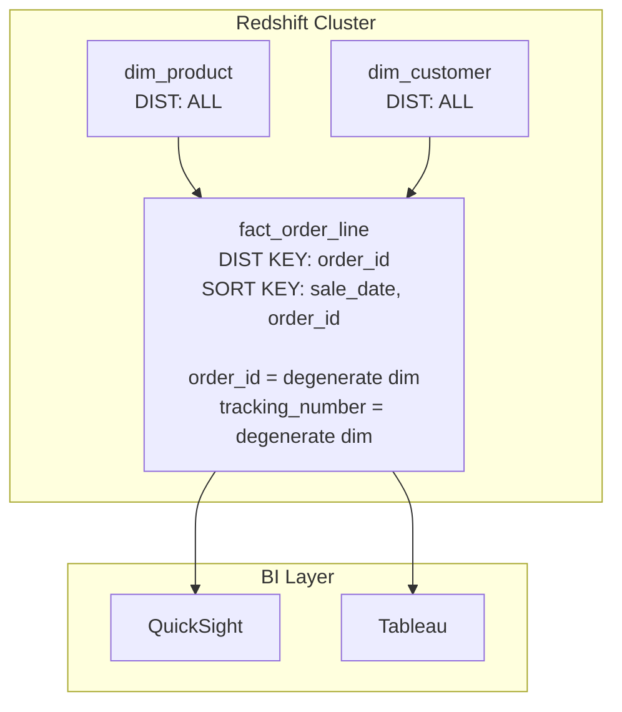

# Degenerate & Outrigger Dimensions — FAANG War Stories

> How large-scale companies use degenerate and outrigger dimensions in practice.

---

## Amazon: Degenerate Dimensions at Scale

### The Setup

Amazon's retail data warehouse tracks billions of orders. The `fact_order_line` table uses `order_id` and `shipment_tracking_number` as degenerate dimensions.

### Why Degenerate

- `order_id` has 50M+ unique values per day. A dimension table with 50M rows and one column would be absurd.
- But `order_id` is the #1 filter in analyst queries: "Show me all line items for order ORD-123456789"
- It's also the linkage key for drill-back to the operational system.

### Scale

- ~5B degenerate dim values (order_ids) per year
- Indexed with a composite: `(order_id, sale_date)` — the date partition prunes first, then the index seeks
- Storage overhead: ~40 bytes per fact row for 2 degenerate dims vs. ~80 bytes if they were FK + dim table lookups

### Deployment Diagram



**Key decision**: `order_id` is the DIST KEY because most analytical queries group by order. This co-locates all line items for the same order on the same Redshift node, eliminating redistribution during aggregation.

---

## Netflix: Outrigger for Content Hierarchies

### The Setup

Netflix's content dimension (`dim_title`) has an outrigger dimension `dim_genre` because:

- A title belongs to one primary genre
- Genres have their own SCD Type 2 lifecycle (genre definitions change: "Sci-Fi" was split into "Hard Sci-Fi" and "Space Opera" in 2023)
- Without outrigger: every genre rename creates SCD2 rows for ALL 17K titles in that genre

### Impact

| Without Outrigger | With Outrigger |
|---|---|
| Genre rename → 17K new dim_title SCD2 rows | Genre rename → 1 new dim_genre SCD2 row |
| dim_title growth: 200K rows/year | dim_title growth: 20K rows/year |
| ETL time for genre change: 45 minutes | ETL time for genre change: 2 seconds |

---

## LinkedIn: Junk Dimensions for Activity Flags

LinkedIn's `fact_user_activity` uses junk dimensions (not degenerate) for combinations of boolean flags:

```sql
-- Junk dimension: all combinations of activity flags
dim_activity_flags (
    flag_sk,         -- 256 rows total (2^8 combinations)
    is_organic,      -- true/false
    is_mobile,       -- true/false
    is_authenticated,-- true/false  
    is_premium_member,-- true/false
    is_first_visit,  -- true/false
    has_profile_photo,-- true/false
    is_influencer,   -- true/false
    is_job_seeker    -- true/false
)
```

This keeps 8 boolean columns out of the fact table, replacing them with a single `flag_sk` INT — saving ~7 bytes per row × 2B rows/day = 14 GB/day of storage.

---

## Key Takeaways

| Lesson | Company |
|---|---|
| Degenerate dims with composite indexes on (degenerate_col, partition_key) are the standard at scale | Amazon |
| Outriggers prevent SCD2 explosion when parent attributes change frequently | Netflix |
| Junk dimensions are often the right choice over both degenerate and regular dims for boolean flags | LinkedIn |
