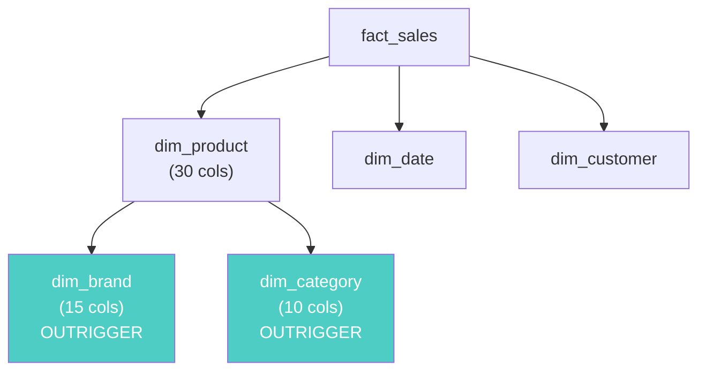

# Degenerate & Outrigger Dimensions — Interview Angle

> How this appears in Principal interviews, sample questions, and whiteboard exercises.

---

## How This Topic Appears

Degenerate and outrigger dimensions surface in **data modeling** rounds when the interviewer presents a business scenario and expects you to design a star/snowflake schema. Knowing the difference between degenerate, junk, outrigger, and regular dimensions signals Kimball-level fluency.

---

## Question 1: The Order Schema Design

> "Design a fact table for an e-commerce order system. What dimensions do you need?"

### Strong Answer

"I'd design a `fact_order_line` table (grain = one line item per order). Key dimensions:

- `dim_product` — product attributes
- `dim_customer` — customer attributes  
- `dim_date` — order date
- `dim_store` — channel/store

For transaction identifiers like `order_number` and `invoice_number`, I'd use **degenerate dimensions** — store them directly in the fact table as columns, not as FK references to separate dim tables. They have no descriptive attributes worth a separate table, but analysts need them for drill-back to the source system.

For boolean flags like `is_online`, `is_gift`, `is_promotion`, I'd create a **junk dimension** with all ~32 combinations rather than adding 5 flag columns directly to the fact table."

### What They're Testing

- ✅ You know degenerate dims without being asked
- ✅ You distinguish between degenerate, junk, and regular dimensions
- ✅ You think about fact table width and storage at scale

---

## Question 2: When to Snowflake

> "You have a dim_product table that's getting very wide — 80 columns. Some columns are product-specific, some are brand-specific, some are category-specific. How do you handle this?"

### Strong Answer

"This is a classic outrigger candidate. I'd split:

- `dim_product` (30 cols) — product-specific attributes
- `dim_brand` (15 cols, outrigger) — brand-level attributes with their own SCD lifecycle
- `dim_category` (10 cols, outrigger) — category hierarchy

But I'd apply Kimball's guidance: only create outriggers when the sub-entity has its own SCD lifecycle or is queried independently. If brand attributes rarely change and are never queried without a product context, denormalize them.

The decision comes down to: **is the extra JOIN cheaper than the SCD2 explosion from denormalization?** At 10M products and frequent brand changes, the outrigger wins."

### Whiteboard Diagram

---

## Question 3: The Drill-Back Requirement

> "The finance team needs to trace any revenue number back to the source order in the ERP. How do you support this?"

### Strong Answer

"Degenerate dimensions. The `erp_order_number` and `erp_invoice_number` are stored directly as columns in the fact table. I'd index them for fast lookup. When the finance team clicks on a revenue row, the BI tool can query `WHERE erp_order_number = 'INV-2025-00789'` and return the individual line items.

This is faster and simpler than a separate `dim_order` table, which would be a 1:1 relationship with the fact — providing zero analytical value while adding an unnecessary JOIN."

---

## Follow-Up Questions

| Question | Key Points |
|---|---|
| "What's the difference between a degenerate dim and a junk dim?" | Degenerate = high cardinality ID in the fact. Junk = low cardinality flags rolled into a small dim table |
| "Can a degenerate dim be a foreign key?" | No — by definition it has no corresponding dim table. If it has a dim table, it's a regular dim |
| "When would you use a snowflake schema over a star?" | When outrigger dims have their own SCD lifecycle and the storage/SCD2 savings outweigh the JOIN cost |
