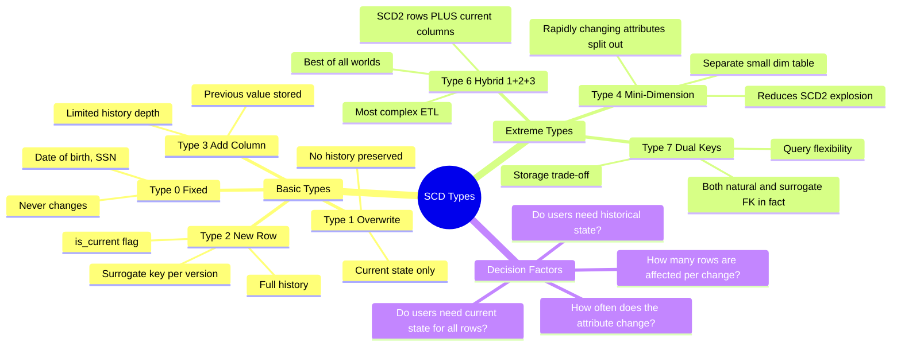

# SCD Extreme Cases — Concept Overview

> What they are, why they exist, what value they provide, and when to use (or avoid) them.

---

## Why This Exists

**Origin**: Ralph Kimball defined SCD Types 0, 1, 2, and 3 in the 1990s. Types 4, 6, and 7 emerged from practitioners who hit the walls of the original three types at enterprise scale. These "extreme" types exist because reality is messier than textbooks.

**The problem they solve**: SCD Type 2 tracks history but loses "current" state for fast lookups. SCD Type 1 preserves current state but loses history. Types 4, 6, and 7 are hybrid approaches that give you both — at the cost of complexity.

## Mindmap

## When To Use Each Type

| Type | Use When | Avoid When |
|---|---|---|
| **Type 0** | Attribute is immutable (date_of_birth, country_of_origin) | Attribute might ever change |
| **Type 1** | Only current state matters, no audit requirement | Regulatory/compliance requires history |
| **Type 2** | Full history needed, attribute changes infrequently | Attribute changes daily (SCD2 explosion) |
| **Type 3** | Only "previous" value needed, not full history | More than one version back is needed |
| **Type 4** | Rapidly changing attributes (customer_score, risk_tier) | Attribute changes are infrequent |
| **Type 6** | Both current AND historical values needed simultaneously | Simple requirements that Type 2 handles fine |
| **Type 7** | Users need to query by both surrogate key (historical) AND natural key (current) | Only one access pattern is needed |

## Key Terminology

| Term | Precise Definition |
|---|---|
| **Surrogate Key** | System-generated key (identity/sequence) that is unique per version of a dimension row |
| **Natural Key** | Business key from the source system (customer_id, product_id) |
| **Effective Date Range** | `effective_from` / `effective_to` timestamps that define when a version was valid |
| **is_current Flag** | Boolean that marks the latest version of a dimension row |
| **Mini-Dimension** | A small, separate dimension table holding rapidly changing attributes (Type 4) |
| **Hybrid SCD** | Combining multiple SCD types on different attributes within the same dimension |
