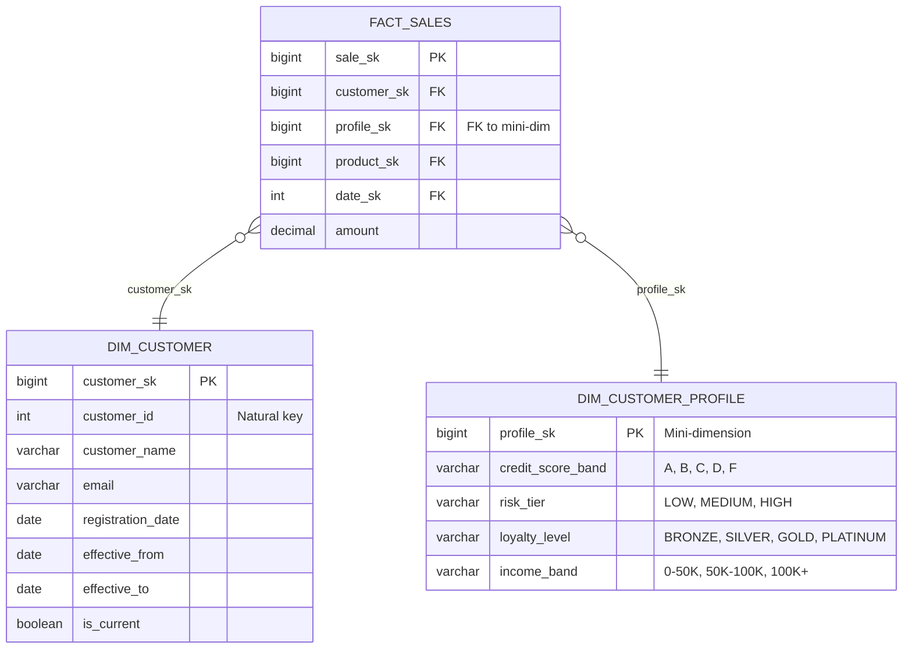
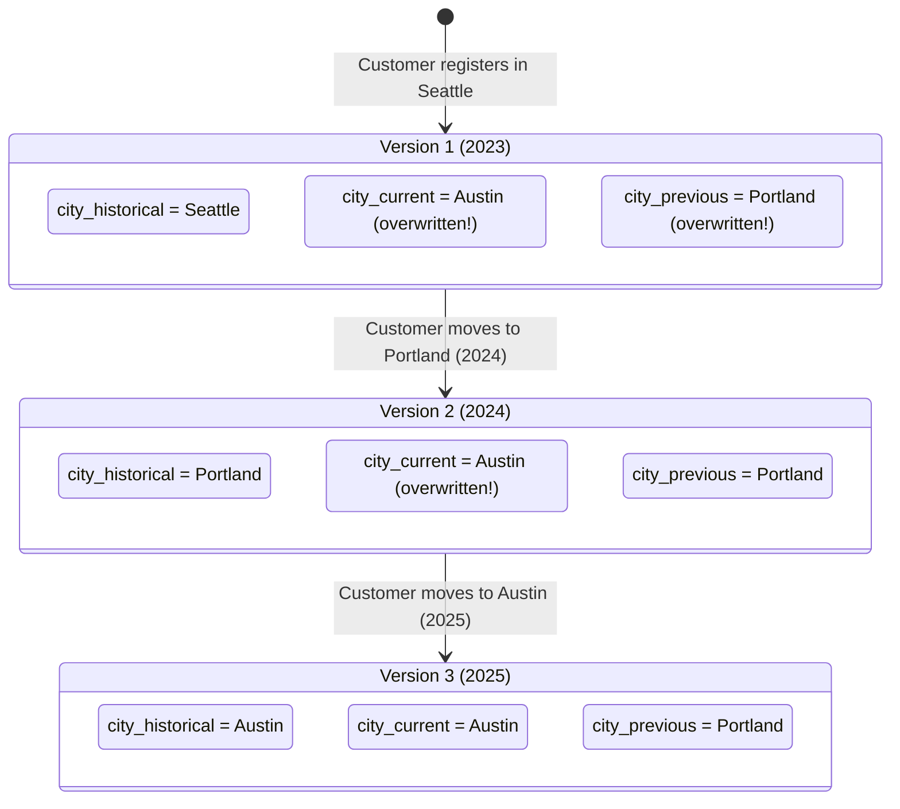

# SCD Extreme Cases — How It Works (Deep Internals)

> ER diagrams, DDL, state machines, and data flow for Types 4, 6, and 7.

---

## Type 4: Mini-Dimension

### Problem It Solves

Customer attributes like `credit_score`, `risk_tier`, `loyalty_level` change monthly. With SCD Type 2, a customer with 5 years of history gets 60+ dim rows (12 changes/year × 5 years). Multiply by 100M customers = 6B dim rows. Unmanageable.

### ER Diagram



### DDL

```sql
-- Mini-dimension: small, contains all COMBINATIONS of rapidly changing attributes
-- Example: 5 credit bands × 3 risk tiers × 4 loyalty levels × 3 income bands = 180 rows total
CREATE TABLE dim_customer_profile (
    profile_sk          INT GENERATED ALWAYS AS IDENTITY PRIMARY KEY,
    credit_score_band   VARCHAR(5)    NOT NULL,  -- A, B, C, D, F
    risk_tier           VARCHAR(10)   NOT NULL,  -- LOW, MEDIUM, HIGH
    loyalty_level       VARCHAR(10)   NOT NULL,  -- BRONZE, SILVER, GOLD, PLATINUM
    income_band         VARCHAR(20)   NOT NULL   -- '0-50K', '50K-100K', '100K+'
);
-- Only 180 rows! This NEVER grows with SCD2.

-- Fact table has TWO FK columns: one to stable customer dim, one to mini-dim
CREATE TABLE fact_sales (
    sale_sk             BIGINT PRIMARY KEY,
    customer_sk         BIGINT NOT NULL REFERENCES dim_customer(customer_sk),
    profile_sk          INT    NOT NULL REFERENCES dim_customer_profile(profile_sk),
    product_sk          BIGINT NOT NULL,
    date_sk             INT    NOT NULL,
    amount              DECIMAL(12,2) NOT NULL
);
```

---

## Type 6: Hybrid (1 + 2 + 3)

Type 6 = Type 1 (overwrite) + Type 2 (new row) + Type 3 (previous column). Named "6" because 1+2+3=6.

### How It Works

```sql
-- Type 6: each SCD2 row ALSO carries the current value
CREATE TABLE dim_customer_type6 (
    customer_sk         BIGINT GENERATED ALWAYS AS IDENTITY PRIMARY KEY,
    customer_id         INT           NOT NULL,
    customer_name       VARCHAR(300),
    
    -- TYPE 2: historical value at time of this version
    city_historical     VARCHAR(200),
    
    -- TYPE 1: current value (overwritten on ALL rows when city changes)  
    city_current        VARCHAR(200),
    
    -- TYPE 3: previous value
    city_previous       VARCHAR(200),
    
    -- SCD2 metadata
    effective_from      DATE NOT NULL,
    effective_to        DATE DEFAULT '9999-12-31',
    is_current          BOOLEAN DEFAULT TRUE
);
```

### State Machine: Customer City Change



### ETL Logic for Type 6

```sql
-- When customer moves from Portland to Austin:

-- Step 1: Close current row (Type 2)
UPDATE dim_customer_type6
SET effective_to = CURRENT_DATE - 1, is_current = FALSE
WHERE customer_id = 12345 AND is_current = TRUE;

-- Step 2: Insert new row with historical = Austin (Type 2)
INSERT INTO dim_customer_type6 (customer_id, customer_name, 
    city_historical, city_current, city_previous,
    effective_from, effective_to, is_current)
VALUES (12345, 'John Doe', 
    'Austin',     -- historical = value at this point in time
    'Austin',     -- current = latest value
    'Portland',   -- previous = the value before this one
    CURRENT_DATE, '9999-12-31', TRUE);

-- Step 3: Update ALL historical rows with current value (Type 1 overwrite)
UPDATE dim_customer_type6
SET city_current = 'Austin',
    city_previous = 'Portland'
WHERE customer_id = 12345;
```

---

## Type 7: Dual Key Fact Table

### How It Works

The fact table has **two FK columns** to the same dimension:

1. `customer_sk` (surrogate) — points to the specific historical version
2. `customer_id` (natural key) — always joins to the current version via `WHERE is_current = TRUE`

```sql
CREATE TABLE fact_sales_type7 (
    sale_sk         BIGINT PRIMARY KEY,
    
    -- DUAL KEYS to dim_customer
    customer_sk     BIGINT NOT NULL,  -- FK to specific historical version
    customer_id     INT    NOT NULL,  -- natural key, join to current with is_current=TRUE
    
    product_sk      BIGINT NOT NULL,
    date_sk         INT    NOT NULL,
    amount          DECIMAL(12,2)
);

-- Query with HISTORICAL state (what city was the customer in when they bought?)
SELECT c.city, SUM(f.amount)
FROM fact_sales_type7 f
JOIN dim_customer c ON f.customer_sk = c.customer_sk  -- point-in-time
GROUP BY 1;

-- Query with CURRENT state (where does the customer live NOW?)
SELECT c.city, SUM(f.amount)
FROM fact_sales_type7 f
JOIN dim_customer c ON f.customer_id = c.customer_id 
    AND c.is_current = TRUE  -- current
GROUP BY 1;
```

## Comparison Table

| Type | History? | Current? | ETL Complexity | Storage | Use Case |
|---|---|---|---|---|---|
| **Type 2** | ✅ Full | ❌ Requires filter | Medium | High | Default for most attributes |
| **Type 4** | ✅ Via fact FK | ✅ Via mini-dim | Medium | Low (mini-dim is tiny) | Rapidly changing attributes |
| **Type 6** | ✅ `_historical` col | ✅ `_current` col | High (update all rows) | Very High | Both views needed simultaneously |
| **Type 7** | ✅ Via surrogate FK | ✅ Via natural FK | Medium | Medium (extra FK in fact) | Flexible query patterns |
