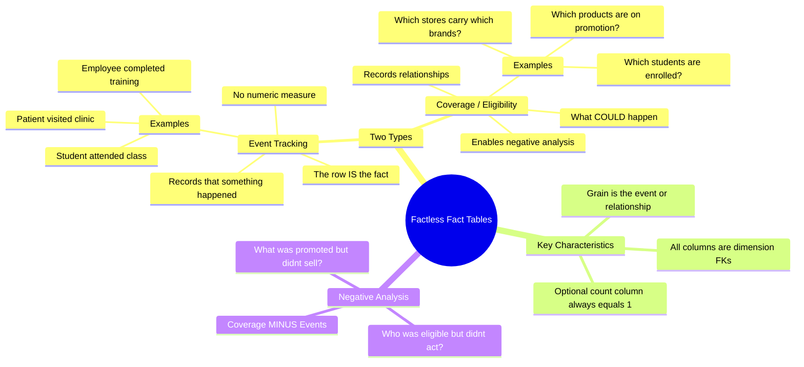

# Factless Fact Tables — Concept Overview

> What they are, why they exist, what value they provide.

---

## Why This Exists

**Origin**: Kimball identified factless fact tables in *The Data Warehouse Toolkit* to handle two patterns that don't fit regular fact tables: (1) **event tracking** where the event itself is the fact, and (2) **coverage/eligibility** relationships where you need to know what *could* have happened.

**The problem it solves**: You need to answer "which students attended class on Tuesday?" (event) and "which students were eligible to attend but didn't?" (coverage minus event = negative analysis).

## Mindmap

## When To Use / When NOT To Use

| Scenario | Use Factless? | Why |
|---|---|---|
| Track attendance/participation | ✅ Yes (event type) | The participation itself is the fact |
| Track product-promotion coverage | ✅ Yes (coverage type) | Enables "what was promoted but didn't sell?" |
| Track sales transactions | ❌ No | Sales have measures (revenue, quantity) — regular fact table |
| Track which warehouses stock which products | ✅ Yes (coverage type) | The relationship is the fact |

## Key Terminology

| Term | Definition |
|---|---|
| **Factless Fact Table** | A fact table with no numeric/additive measures — only dimension FKs |
| **Event Factless** | Records that an event occurred (attendance, login, completion) |
| **Coverage Factless** | Records a relationship/eligibility (enrollment, assignment, stocking) |
| **Negative Analysis** | Finding what DIDN'T happen by subtracting events from coverage |
