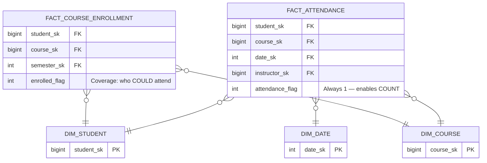
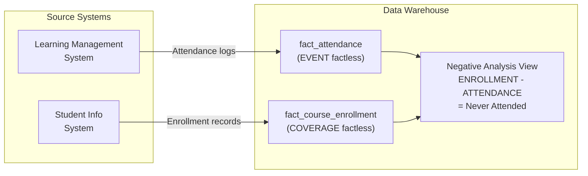

# Factless Fact Tables — How It Works, Examples, War Stories, Pitfalls, Interview, References

---

## ER Diagram



## DDL

```sql
-- EVENT factless: who attended what
CREATE TABLE fact_attendance (
    student_sk      BIGINT    NOT NULL REFERENCES dim_student(student_sk),
    course_sk       BIGINT    NOT NULL REFERENCES dim_course(course_sk),
    date_sk         INT       NOT NULL REFERENCES dim_date(date_sk),
    instructor_sk   BIGINT    NOT NULL REFERENCES dim_instructor(instructor_sk),
    attendance_flag  SMALLINT  DEFAULT 1,  -- always 1; enables SUM/COUNT
    
    PRIMARY KEY (student_sk, course_sk, date_sk)
);

-- COVERAGE factless: who was enrolled (eligible to attend)
CREATE TABLE fact_course_enrollment (
    student_sk      BIGINT    NOT NULL REFERENCES dim_student(student_sk),
    course_sk       BIGINT    NOT NULL REFERENCES dim_course(course_sk),
    semester_sk     INT       NOT NULL,
    
    PRIMARY KEY (student_sk, course_sk, semester_sk)
);
```

## Negative Analysis Query

```sql
-- Who was enrolled but NEVER attended?
SELECT 
    s.student_name,
    c.course_name,
    e.semester_sk
FROM fact_course_enrollment e
JOIN dim_student s ON e.student_sk = s.student_sk
JOIN dim_course c ON e.course_sk = c.course_sk
LEFT JOIN fact_attendance a 
    ON e.student_sk = a.student_sk 
    AND e.course_sk = a.course_sk
WHERE a.student_sk IS NULL;  -- enrolled but no attendance record
```

## Integration Diagram



## War Story: Amazon Product-Promotion Coverage

Amazon uses a coverage factless fact table to track which products are on which promotions. When a promotion ends, analytics compares `fact_product_promotion` (coverage) with `fact_sales` (events) to find: "which promoted products had ZERO sales during the promotion?" — enabling promotion effectiveness analysis. At 500M product-promotion combinations per quarter, this is feasible only because the factless table is narrow (4 FK columns, no measures).

## Pitfalls

| Pitfall | Fix |
|---|---|
| Forgetting the `attendance_flag = 1` column | Add it — without it, you can't SUM/COUNT in BI tools that expect a measure |
| Not creating the coverage table | Without coverage, you can't do negative analysis — you only know who DID attend |
| Using a regular fact table with amount = 0 | Misleading — zero-amount facts are different from "no fact at all" |

## Interview: "How do you find customers who were targeted but didn't convert?"

**Strong Answer**: "Two factless fact tables: `fact_campaign_targeting` (coverage: who was targeted) and `fact_conversions` (event: who converted). LEFT JOIN targeting onto conversions WHERE conversion IS NULL = targeted but didn't convert. This is the coverage-minus-event pattern."

## References

| Resource | Link |
|---|---|
| *The Data Warehouse Toolkit* 3rd Ed. | Ch. 3: Factless Fact Tables |
| Kimball Group Design Tip #14 | [Handling Events](https://www.kimballgroup.com/) |
| Cross-reference | [../04_Conformed_Dimensions](../04_Conformed_Dimensions/) — factless facts often share conformed dims |
