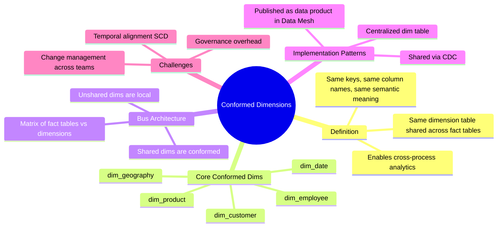

# Conformed Dimensions — Concept Overview

> What they are, why they exist, what value they provide.

---

## Why This Exists

**Origin**: Kimball's "Data Warehouse Bus Architecture" (1998). The observation: if the Marketing team's `dim_customer` has different surrogate keys, different column names, and different grain than Finance's `dim_customer`, you cannot join facts across business processes. The entire data warehouse becomes a collection of isolated data marts.

**The problem it solves**: Without conformed dimensions, every cross-functional query requires ad-hoc ETL. "Show me revenue by product category where the customer is in California" becomes impossible if Sales and Marketing use different `dim_product` tables with different category hierarchies.

## Mindmap

## When To Use / When NOT To Use

| Scenario | Conform? | Why |
|---|---|---|
| Multiple fact tables reference the same entity (e.g., Customer) | ✅ Yes | Enables cross-functional analysis |
| dim_date — used by every fact table | ✅ Always | The most universally conformed dimension |
| Department-specific dimension (e.g., dim_clinical_trial) | ❌ No | Only used by one business process |
| Two teams define "Customer" differently | ✅ Yes — but requires governance to agree on one definition | |

## Key Terminology

| Term | Definition |
|---|---|
| **Conformed Dimension** | A dimension shared across multiple fact tables with identical keys, columns, and semantics |
| **Bus Architecture** | Kimball's framework where fact tables connect via shared (conformed) dimensions |
| **Bus Matrix** | A grid showing which dimensions are used by which fact tables |
| **Drill-across** | Joining two fact tables through a shared conformed dimension |
| **Subset Conformed** | A conformed dim where one fact table uses a subset of rows (e.g., only US customers) |
