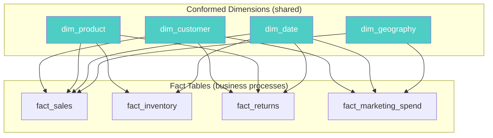

# Conformed Dimensions — How It Works, Examples, War Stories, Pitfalls, Interview, References

---

## HLD — Bus Architecture



## Bus Matrix

| Dimension | fact_sales | fact_inventory | fact_returns | fact_marketing |
|---|---|---|---|---|
| **dim_date** | ✅ | ✅ | ✅ | ✅ |
| **dim_product** | ✅ | ✅ | ✅ | |
| **dim_customer** | ✅ | | ✅ | ✅ |
| **dim_store** | ✅ | ✅ | ✅ | |
| **dim_geography** | ✅ | | | ✅ |
| **dim_campaign** | | | | ✅ |

## DDL — dim_date (The Universal Conformed Dimension)

```sql
CREATE TABLE dim_date (
    date_sk                 INT           PRIMARY KEY,  -- YYYYMMDD format
    full_date               DATE          NOT NULL UNIQUE,
    day_of_week             VARCHAR(10),  -- Monday, Tuesday, ...
    day_of_week_num         SMALLINT,     -- 1=Monday, 7=Sunday
    day_of_month            SMALLINT,
    day_of_year             SMALLINT,
    week_of_year            SMALLINT,
    month_num               SMALLINT,
    month_name              VARCHAR(10),
    quarter_num             SMALLINT,
    quarter_name            VARCHAR(5),   -- Q1, Q2, Q3, Q4
    year_num                INT,
    fiscal_year             INT,
    fiscal_quarter          SMALLINT,
    is_weekend              BOOLEAN,
    is_holiday              BOOLEAN,
    holiday_name            VARCHAR(100),
    is_business_day         BOOLEAN
);

-- Pre-populate 30 years: 2000-01-01 to 2029-12-31
-- ~11K rows. Tiny. Referenced by EVERY fact table.
```

## Drill-Across Query

```sql
-- The power of conformed dimensions: JOIN two fact tables through shared dims
-- "Revenue vs Marketing Spend by Customer Segment and Quarter"
SELECT 
    d.quarter_name,
    c.customer_tier,
    SUM(s.net_amount)         AS total_revenue,      -- from fact_sales
    SUM(m.spend_amount)       AS total_marketing,    -- from fact_marketing
    SUM(s.net_amount) / NULLIF(SUM(m.spend_amount), 0) AS roas
FROM fact_sales s
JOIN dim_date d ON s.date_sk = d.date_sk
JOIN dim_customer c ON s.customer_sk = c.customer_sk
-- Drill-across: join second fact through SAME conformed dims
JOIN fact_marketing_spend m 
    ON s.date_sk = m.date_sk 
    AND s.customer_sk = m.customer_sk  -- same conformed customer!
WHERE d.year_num = 2025
GROUP BY 1, 2
ORDER BY roas DESC;
```

## War Story: Amazon's Conformed dim_product

Amazon has a single `dim_product` that serves 20+ fact tables across retail, advertising, fulfillment, and marketplace. When a product category reclassification happens, it changes in ONE place — and all 20 fact tables see the update immediately. Without conforming, they'd have 20 different product dimensions with inconsistent categories, making cross-functional reporting impossible.

## Pitfalls

| Pitfall | Why Dangerous | Fix |
|---|---|---|
| Two teams building their own dim_customer | Reports disagree on customer counts | Enforce single conformed dim via governance |
| Conformed dim with inconsistent SCD strategy | fact_sales uses Type 2, fact_returns uses Type 1 → temporal mismatch | Standardize SCD type in conformed dim specification |
| Not conforming dim_date | Each fact has different fiscal year definitions | Build ONE dim_date with both calendar and fiscal columns |
| Over-conforming (forcing a dim to serve incompatible processes) | dim_employee forced to serve HR and Sales | Allow local dims where processes are truly independent |

## Interview: "How do you enable cross-functional analytics?"

**Strong Answer**: "Conformed dimensions via Kimball's Bus Architecture. I'd build a Bus Matrix mapping which dimensions are shared across which fact tables. The conformed dims (dim_date, dim_customer, dim_product) are built once, owned by a central data team, versioned with SCD Type 2. Each fact table references the same dim via FK. This enables drill-across queries — joining two fact tables through the shared dimension."

## References

| Resource | Link |
|---|---|
| *The Data Warehouse Toolkit* 3rd Ed. | Ch. 16: The Kimball Lifecycle and Bus Architecture |
| Kimball Group | [Conformed Dimensions](https://www.kimballgroup.com/data-warehouse-business-intelligence-resources/kimball-techniques/dimensional-modeling-techniques/conformed-dimension/) |
| [dbt-labs/jaffle-shop](https://github.com/dbt-labs/jaffle-shop) | Reference dimensional model in dbt |
| Cross-ref: Bounded Contexts | [../../01_Logical_Domain_Modeling/02_Bounded_Contexts](../../01_Logical_Domain_Modeling/02_Bounded_Contexts/) — conformed dims bridge across BCs |
| Cross-ref: SCD Extreme Cases | [../02_SCD_Extreme_Cases](../02_SCD_Extreme_Cases/) — SCD strategy must be consistent for conformed dims |
