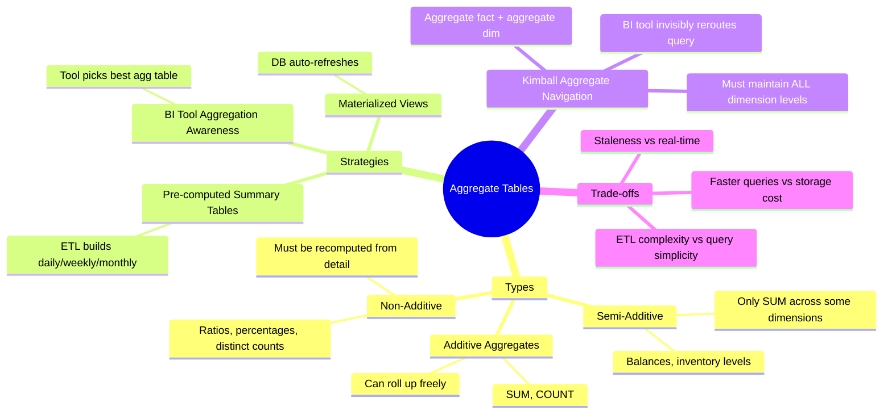

# Aggregate Tables — Concept Overview

> What they are, why they exist, what value they provide.

---

## Why This Exists

**Origin**: Aggregate tables are the oldest performance optimization in data warehousing. Before columnar engines, MPP databases, and query caches existed, the only way to make a dashboard load in 3 seconds instead of 3 minutes was to pre-compute the answer.

**The problem they solve**: A `fact_sales` table with 10B rows cannot be aggregated in real-time for a daily executive dashboard. Pre-aggregate to `fact_sales_daily` (10M rows) or `fact_sales_monthly` (500K rows) and the same query runs 1000x faster.

## Mindmap

## When To Use / When NOT To Use

| Scenario | Pre-aggregate? | Why |
|---|---|---|
| Executive dashboard refreshed 100x/day | ✅ Yes | Pre-compute daily rollups vs scanning 10B rows each time |
| Ad-hoc analyst exploration | ❌ No | Analysts need detail-level flexibility |
| Columnar engine (Snowflake, BigQuery) | ⚠️ Maybe not | These engines aggregate on-the-fly efficiently |
| Distinct count metrics | ✅ Often | CountDistinct cannot be rolled up, must be pre-computed at each grain |
| Operational real-time dashboard | ❌ Use materialized views instead | Aggregate tables may be stale |

## Key Terminology

| Term | Definition |
|---|---|
| **Aggregate Fact Table** | A summary table at a higher grain than the base fact |
| **Aggregate Dimension** | A shrunken version of a dimension at the aggregate grain (e.g., category level instead of product level) |
| **Aggregate Navigation** | BI tool's ability to automatically route queries to the best aggregate table |
| **Additive Measure** | A measure that can be summed across all dimensions (revenue, quantity) |
| **Semi-Additive Measure** | A measure that can be summed across some but not all dimensions (account balance — don't sum across time) |
| **Non-Additive Measure** | A measure that cannot be summed at all (ratios, percentages, distinct counts) |
