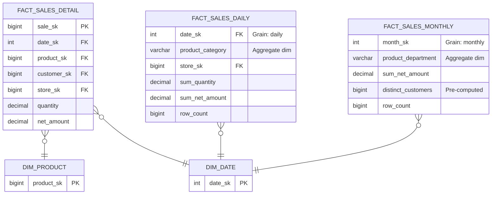

# Aggregate Tables — How It Works, Examples, War Stories, Pitfalls, Interview, References

---

## ER Diagram — Base vs Aggregate



## DDL

```sql
-- Base fact: 10B rows, grain = one line item
CREATE TABLE fact_sales (
    sale_sk         BIGINT PRIMARY KEY,
    date_sk         INT    NOT NULL,
    product_sk      BIGINT NOT NULL,
    customer_sk     BIGINT NOT NULL,
    store_sk        BIGINT NOT NULL,
    quantity        INTEGER,
    net_amount      DECIMAL(12,2)
) PARTITION BY RANGE (date_sk);

-- Aggregate: daily by category × store = 10M rows
CREATE TABLE agg_sales_daily_category (
    date_sk             INT         NOT NULL,
    product_category    VARCHAR(100) NOT NULL,
    store_sk            BIGINT      NOT NULL,
    sum_quantity        BIGINT      NOT NULL,
    sum_net_amount      DECIMAL(15,2) NOT NULL,
    row_count           BIGINT      NOT NULL,
    
    PRIMARY KEY (date_sk, product_category, store_sk)
);

-- Aggregate: monthly by department = 100K rows
CREATE TABLE agg_sales_monthly_dept (
    year_month          INT         NOT NULL,  -- YYYYMM
    product_department  VARCHAR(100) NOT NULL,
    sum_net_amount      DECIMAL(15,2) NOT NULL,
    distinct_customers  BIGINT      NOT NULL,  -- pre-computed distinct count
    avg_order_value     DECIMAL(10,2) NOT NULL,
    row_count           BIGINT      NOT NULL,
    
    PRIMARY KEY (year_month, product_department)
);
```

## dbt Model for Aggregate Table

```sql
-- models/marts/agg_sales_daily_category.sql
{{ config(
    materialized='incremental',
    unique_key=['date_sk', 'product_category', 'store_sk'],
    partition_by={'field': 'date_sk', 'data_type': 'int', 'granularity': 'day'}
) }}

SELECT 
    f.date_sk,
    p.category         AS product_category,
    f.store_sk,
    SUM(f.quantity)     AS sum_quantity,
    SUM(f.net_amount)   AS sum_net_amount,
    COUNT(*)            AS row_count
FROM {{ ref('fact_sales') }} f
JOIN {{ ref('dim_product') }} p ON f.product_sk = p.product_sk

WHERE f.date_sk > (SELECT MAX(date_sk) FROM {{ this }})

GROUP BY 1, 2, 3
```

## Performance Comparison

| Query | Base (10B rows) | Daily Agg (10M rows) | Monthly Agg (100K rows) |
|---|---|---|---|
| Total revenue this month | 45 seconds | 0.3 seconds | 0.01 seconds |
| Revenue by category last 30 days | 90 seconds | 0.8 seconds | N/A (wrong grain) |
| Top 10 products today | 120 seconds (need product-level detail) | N/A (aggregated to category) | N/A |

## War Story: Netflix Monthly Content Performance

Netflix pre-computes `agg_content_monthly` at the title × country × month grain for executive dashboards. The base `fact_viewing` table has 100B+ rows (every play event). Without the aggregate, the "Monthly Content Performance" dashboard would take 10+ minutes. With the aggregate (5M rows), it loads in 2 seconds.

**Key decision**: They DO NOT pre-aggregate below monthly grain for content (daily viewing patterns are analyzed from the base table using Spark, not dashboards).

## Pitfalls

| Pitfall | Fix |
|---|---|
| Aggregating non-additive measures incorrectly (SUM of averages) | Re-compute averages from SUM and COUNT: `avg = SUM(sum_amount) / SUM(row_count)` |
| Not including `row_count` in aggregate tables | Always include it — needed to correctly compute averages and weighted calculations |
| Aggregate getting stale (not refreshed on time) | Use dbt incremental models or materialized views with auto-refresh |
| Over-aggregating (losing too much detail) | Build aggregates at multiple grains: daily, weekly, monthly. Let the BI tool pick |
| Distinct count at aggregate grain | Cannot roll up COUNT(DISTINCT). Pre-compute with HyperLogLog or exact distinct at each grain |

## Interview: "The daily dashboard takes 90 seconds. How do you fix it?"

**Strong Answer**: "Build an aggregate table at the grain of the dashboard. If the dashboard shows revenue by category by day, build `agg_sales_daily_category` and route the dashboard to it. Key rules: (1) always include `row_count` for correct average computation, (2) pre-compute `COUNT(DISTINCT customer)` since it can't be rolled up, (3) use incremental materialization so the ETL only processes new data."

## References

| Resource | Link |
|---|---|
| *The Data Warehouse Toolkit* 3rd Ed. | Ch. 11: Complementary Fact Table Types — aggregate tables |
| Kimball Group | [Aggregate Fact Tables](https://www.kimballgroup.com/data-warehouse-business-intelligence-resources/kimball-techniques/dimensional-modeling-techniques/) |
| [dbt incremental models](https://docs.getdbt.com/docs/build/incremental-models) | Official dbt docs for aggregate refreshing |
| Cross-ref: Conformed Dims | [../04_Conformed_Dimensions](../04_Conformed_Dimensions/) — aggregate dims must align with conformed dims |
| Cross-ref: Query Optimization | [../../../../16_SQL_And_Query_Optimization](../../../../16_SQL_And_Query_Optimization/) — aggregates are a form of query optimization |
