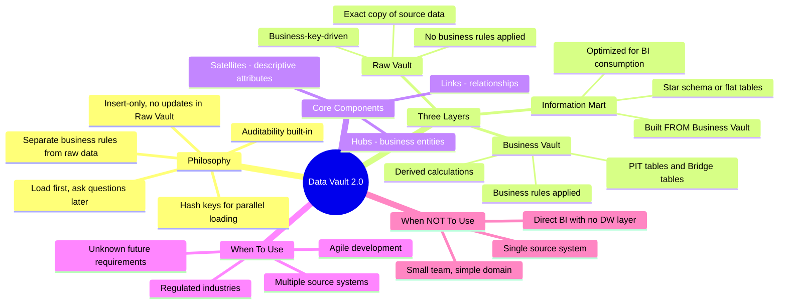
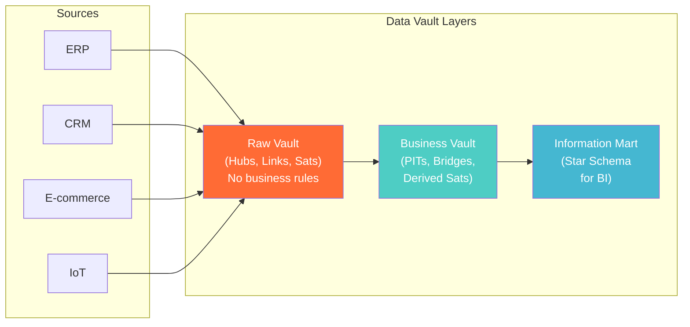

# Data Vault 2.0 Philosophy & Use Cases — Concept Overview

> What it is, why it exists, what value it provides, and when to use (or avoid) it.

---

## Why This Exists

**Origin**: Dan Linstedt invented Data Vault in 2000 (v1.0) and refined it to 2.0 in 2013. The motivation: Kimball dimensional modeling is optimized for *query* but fragile for *change*. Inmon 3NF is optimized for *consistency* but slow to *load*. Data Vault splits the difference — it's optimized for **loading speed**, **auditability**, and **agility** at the cost of query complexity.

**The problem it solves**: In a Kimball star schema, adding a new source system to `dim_customer` requires reworking the dimension table, the ETL, and all dependent reports. In Data Vault, you add a new Satellite (descriptive table) to the existing Hub. Nothing else changes. The existing ETL and reports are untouched.

**Core philosophy**: "Load data first, ask questions later." Raw Vault loads data as-is from source systems with no business rules applied. Business rules live in the Business Vault layer, which is separate and can be changed without reloading raw data.

## What Value It Provides

| Metric | Impact |
|---|---|
| **Source system agility** | Add/remove/change sources without redesigning the model |
| **Full auditability** | Every record knows its load_timestamp and record_source |
| **Parallel loading** | Hash keys enable insert-only parallel loads — no lookups needed |
| **Historical integrity** | Satellites track all changes with timestamps — full SCD Type 2 by default |
| **Compliance** | Unaltered raw data in Raw Vault satisfies audit/regulatory requirements |

## Mindmap

## Where It Fits

## When To Use / When NOT To Use

| Scenario | Data Vault? | Why |
|---|---|---|
| Enterprise DW with 10+ source systems | ✅ Yes | Data Vault's core strength — multiple sources |
| Regulated industry (banking, healthcare, insurance) | ✅ Yes | Built-in auditability satisfies compliance |
| Requirements change frequently / agile teams | ✅ Yes | Add Satellites without changing existing structure |
| Unknown future analytics requirements | ✅ Yes | Load everything raw, analyze later |
| Single-source, single-purpose analytics (one dashboard) | ❌ No | Overhead not justified — use star schema |
| Small team (< 3 data engineers) | ⚠️ Caution | Data Vault adds modeling complexity |
| Real-time / sub-second analytics | ❌ No | Extra joins in Raw Vault hurt query latency |

## Key Terminology

| Term | Precise Definition |
|---|---|
| **Hub** | Table containing unique business keys for a core business entity (e.g., Customer, Product) |
| **Link** | Table capturing relationships between two or more Hubs (e.g., Order links Customer to Product) |
| **Satellite** | Table storing descriptive/context attributes for a Hub or Link, with full history (SCD2 by default) |
| **Hash Key** | Deterministic MD5/SHA-256 hash of the business key, used as the PK for Hubs and Links |
| **Hash Diff** | Hash of all descriptive columns in a Satellite, used for efficient change detection |
| **Record Source** | Column in every DV table tracking which source system provided the data |
| **Load Timestamp** | Column in every DV table recording when the record was loaded |
| **Raw Vault** | The layer of Hubs, Links, and Satellites with NO business rules applied |
| **Business Vault** | Derived layer where business rules, calculations, and query-assist structures live |
| **PIT (Point-in-Time) Table** | Pre-joined snapshot of a Hub's Satellites at each point in time — for query performance |
| **Bridge Table** | Pre-joined paths through multiple Links — simplifies multi-hop queries |
