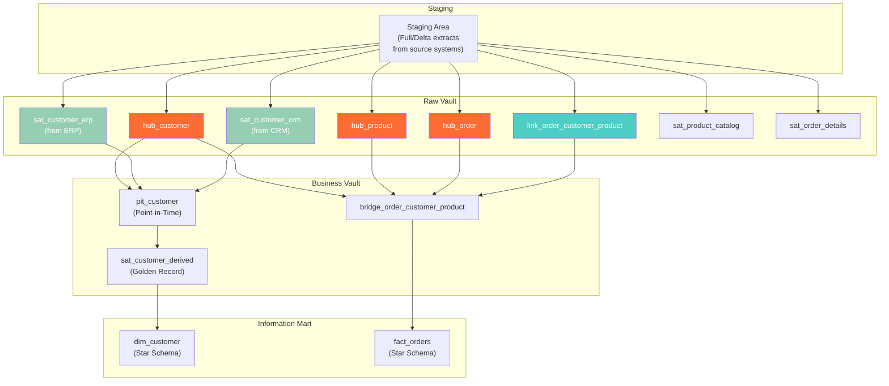

# Data Vault 2.0 Philosophy — How It Works, Examples, Wars Stories, Pitfalls, Interview, References

---

## HLD — Three-Layer Architecture



## Data Vault vs Kimball vs Inmon — Comparison

| Criteria | Kimball (Star) | Inmon (3NF) | Data Vault 2.0 |
|---|---|---|---|
| **Optimized for** | Query performance | Data consistency | Loading speed + agility |
| **Schema design** | Denormalized star | Normalized 3NF | Hub-Link-Satellite |
| **Change resilience** | ❌ Fragile (dim changes cascade) | ⚠️ Medium | ✅ Excellent (add Sat, no impact) |
| **Auditability** | ⚠️ Requires extra design | ⚠️ Possible but complex | ✅ Built-in (record_source, load_ts) |
| **Query complexity** | ✅ Simple (few joins) | ⚠️ Many joins | ❌ Complex (Hub→Link→Sat joins) |
| **Parallel loading** | ❌ Lookup-dependent | ❌ FK-dependent | ✅ Hash keys enable full parallelism |
| **Multiple sources** | ❌ Messy (one dim per entity) | ✅ Normalized | ✅ Separate Sats per source |
| **Best for** | BI/Analytics layer | Enterprise reference data | Enterprise DW raw layer |

## Hands-On: Loading Pattern

```sql
-- ============================================================
-- DATA VAULT LOADING PATTERN: Insert-only, no updates
-- ============================================================

-- 1. Load staging (full/delta extract from source)
TRUNCATE TABLE staging.stg_customer_erp;
INSERT INTO staging.stg_customer_erp 
SELECT * FROM erp.customers WHERE updated_at > :last_load;

-- 2. Load Hub (insert new business keys only)
INSERT INTO raw_vault.hub_customer (customer_hk, customer_id, load_ts, record_source)
SELECT 
    MD5(CAST(s.customer_id AS VARCHAR)) AS customer_hk,
    s.customer_id,
    CURRENT_TIMESTAMP AS load_ts,
    'ERP' AS record_source
FROM staging.stg_customer_erp s
WHERE NOT EXISTS (
    SELECT 1 FROM raw_vault.hub_customer h 
    WHERE h.customer_hk = MD5(CAST(s.customer_id AS VARCHAR))
);

-- 3. Load Satellite (insert new versions when attributes change)
INSERT INTO raw_vault.sat_customer_erp 
    (customer_hk, load_ts, record_source, hashdiff, 
     customer_name, email, city, state)
SELECT 
    MD5(CAST(s.customer_id AS VARCHAR)) AS customer_hk,
    CURRENT_TIMESTAMP AS load_ts,
    'ERP' AS record_source,
    MD5(CONCAT(s.customer_name, '||', s.email, '||', s.city, '||', s.state)) AS hashdiff,
    s.customer_name, s.email, s.city, s.state
FROM staging.stg_customer_erp s
WHERE NOT EXISTS (
    SELECT 1 FROM raw_vault.sat_customer_erp sat
    WHERE sat.customer_hk = MD5(CAST(s.customer_id AS VARCHAR))
      AND sat.hashdiff = MD5(CONCAT(s.customer_name, '||', s.email, '||', s.city, '||', s.state))
);
```

## War Story: ING Bank — Data Vault at Scale

ING Bank (Netherlands) migrated from a Kimball-based DW to Data Vault 2.0 to handle:

- 60+ source systems (core banking, payments, cards, mortgages, compliance)
- Strict regulatory requirements (Basel III, GDPR) demanding full audit trails
- Agile delivery — 2-week sprints adding new data sources

**Result**: New source onboarding dropped from 3 months to 2 weeks. Regulatory audit response time dropped from days to hours because every record has `record_source` and `load_timestamp` built in.

## Pitfalls

| Pitfall | Fix |
|---|---|
| Querying Raw Vault directly from BI tools | Build Information Marts (star schemas) on top of Business Vault. Raw Vault is not for humans. |
| Applying business rules in Raw Vault | Business rules go in Business Vault only. Raw Vault is a faithful copy of source data. |
| Over-engineering for a single-source system | If you have one source and one consumer, use a star schema. Don't pay the Data Vault complexity tax. |
| Not building PIT/Bridge tables | Without query-assist structures, joining a Hub to 5 Satellites requires 5-way joins with subqueries. Build PIT tables. |

## Interview

### Q: "When would you choose Data Vault over Kimball?"

**Strong Answer**: "Data Vault when: (1) multiple source systems feeding the DW, (2) regulatory/audit requirements, (3) requirements are volatile and I need agility, (4) I need to separate raw data ingestion from business rule application. Kimball when: (1) single or few sources, (2) priority is query simplicity, (3) small team. In practice, many enterprises use both — Data Vault as the persistence layer, Kimball star schemas as the consumption layer."

### Q: "What's the biggest tradeoff with Data Vault?"

**Strong Answer**: "Query complexity. A simple 'customer name + last order date' requires joining Hub → Satellite (latest version) → Link → another Hub → another Satellite. That's 5 JOINs vs 2 in a star schema. The solution is PIT tables and Bridge tables in the Business Vault layer, plus star schema Information Marts for BI."

## References

| Resource | Link |
|---|---|
| *Building a Scalable Data Warehouse with Data Vault 2.0* | Dan Linstedt & Michael Olschimke (2015) |
| [Data Vault Alliance](https://datavaultalliance.com/) | Official community and certification |
| [automate-dv (dbt package)](https://github.com/Datavault-UK/automate-dv) | Open-source dbt macros for Data Vault loading |
| [Data Vault Standards](https://www.datavaultalliance.com/standards) | Official DV2.0 standard definitions |
| Cross-ref: Hubs/Links/Sats | [../02_Hubs_Links_Satellites](../02_Hubs_Links_Satellites/) — detailed mechanics |
| Cross-ref: Hash Keys | [../03_Hash_Keys_vs_Natural](../03_Hash_Keys_vs_Natural/) — key design decisions |
| Cross-ref: Kimball Star Schema | [../../02_Dimensional_Modeling_Advanced](../../02_Dimensional_Modeling_Advanced/) — the alternative approach |
