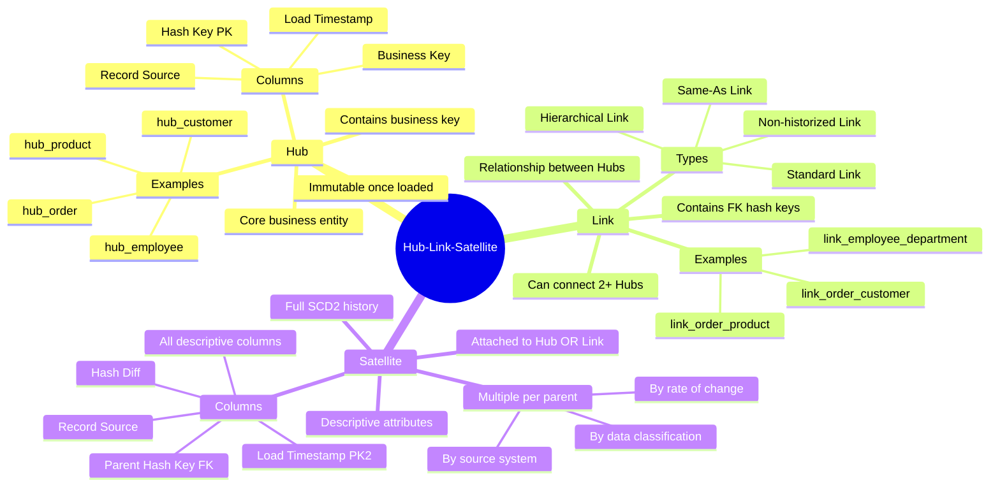

# Hubs, Links & Satellites — Concept Overview

> The three building blocks of Data Vault 2.0 modeling.

---

## Why This Exists

Hubs, Links, and Satellites are Data Vault's answer to a fundamental problem: how do you model data so that (1) business keys are stable, (2) relationships are explicit, and (3) descriptive attributes can change independently without breaking anything?

The separation is deliberate:

- **Hubs** anchor business identity (who/what) — these almost never change
- **Links** capture relationships (how entities connect) — these change when business processes change
- **Satellites** hold descriptions and context (what we know about an entity) — these change constantly

By splitting these three concerns, you can load them in parallel, evolve them independently, and audit them completely.

## Mindmap

## Key Terminology

| Term | Definition |
|---|---|
| **Hub** | Stores unique business keys for a core entity. Contains: hash_key (PK), business_key, load_ts, record_source |
| **Link** | Stores relationships between Hubs. Contains: hash_key (PK), FK hash_keys to each Hub, load_ts, record_source |
| **Satellite** | Stores descriptive attributes with history. Contains: parent_hash_key (FK), load_ts (PK), hashdiff, record_source, attribute columns |
| **Hash Diff** | MD5/SHA of all descriptive columns — used to detect whether a row has actually changed |
| **Multi-Active Satellite** | A Satellite that can have multiple active records per parent at the same point in time (e.g., multiple phone numbers) |
| **Effectivity Satellite** | A Satellite attached to a Link that tracks when a relationship was active/inactive |
| **Same-As Link** | A Link connecting two instances of the same Hub (e.g., customer_id 123 = customer_id 456 from different sources) |
