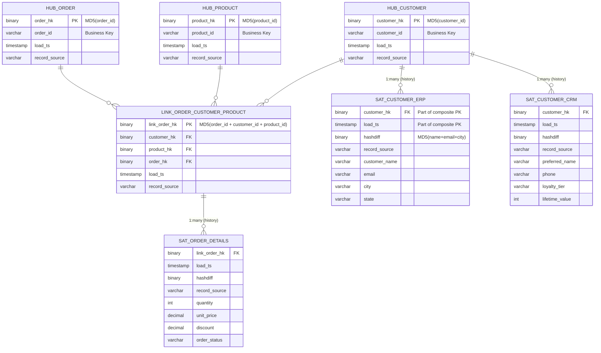
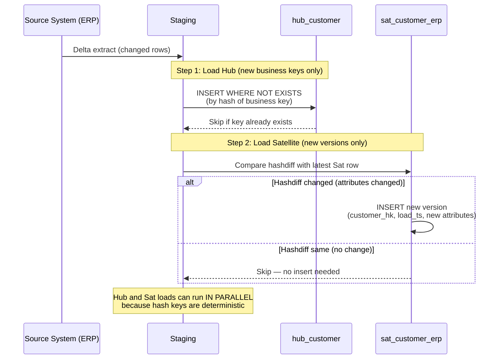
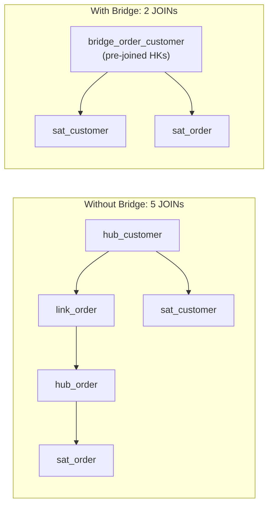

# Hubs, Links & Satellites — How It Works (Deep Internals)

> ER diagrams, DDL, sequence diagrams, and PIT/Bridge query-assist structures.

---

## ER Diagram — Complete Data Vault Model



## DDL — Complete Table Structures

```sql
-- ============================================================
-- HUBS: One per core business entity
-- ============================================================

CREATE TABLE raw_vault.hub_customer (
    customer_hk     BINARY(16)    PRIMARY KEY,  -- MD5 hash of business key
    customer_id     VARCHAR(50)   NOT NULL,       -- natural business key
    load_ts         TIMESTAMPTZ   NOT NULL DEFAULT CURRENT_TIMESTAMP,
    record_source   VARCHAR(50)   NOT NULL
);
-- UNIQUE constraint on business key prevents duplicate business entities
CREATE UNIQUE INDEX uq_hub_customer_bk ON raw_vault.hub_customer(customer_id);

CREATE TABLE raw_vault.hub_product (
    product_hk      BINARY(16)    PRIMARY KEY,
    product_id      VARCHAR(50)   NOT NULL,
    load_ts         TIMESTAMPTZ   NOT NULL DEFAULT CURRENT_TIMESTAMP,
    record_source   VARCHAR(50)   NOT NULL
);

CREATE TABLE raw_vault.hub_order (
    order_hk        BINARY(16)    PRIMARY KEY,
    order_id        VARCHAR(50)   NOT NULL,
    load_ts         TIMESTAMPTZ   NOT NULL DEFAULT CURRENT_TIMESTAMP,
    record_source   VARCHAR(50)   NOT NULL
);

-- ============================================================
-- LINKS: One per relationship
-- ============================================================

CREATE TABLE raw_vault.link_order_customer_product (
    link_order_hk   BINARY(16)    PRIMARY KEY,  -- MD5(order_id + customer_id + product_id)
    customer_hk     BINARY(16)    NOT NULL,      -- FK to hub_customer
    product_hk      BINARY(16)    NOT NULL,      -- FK to hub_product
    order_hk        BINARY(16)    NOT NULL,       -- FK to hub_order
    load_ts         TIMESTAMPTZ   NOT NULL DEFAULT CURRENT_TIMESTAMP,
    record_source   VARCHAR(50)   NOT NULL
);

-- ============================================================
-- SATELLITES: One (or more) per Hub or Link, per source system
-- ============================================================

CREATE TABLE raw_vault.sat_customer_erp (
    customer_hk     BINARY(16)    NOT NULL,      -- FK to hub_customer
    load_ts         TIMESTAMPTZ   NOT NULL,       -- part of composite PK
    hashdiff        BINARY(16)    NOT NULL,       -- MD5 of all descriptive cols
    record_source   VARCHAR(50)   NOT NULL DEFAULT 'ERP',
    
    -- Descriptive attributes (from ERP)
    customer_name   VARCHAR(300),
    email           VARCHAR(255),
    city            VARCHAR(200),
    state           VARCHAR(100),
    
    PRIMARY KEY (customer_hk, load_ts)
);

CREATE TABLE raw_vault.sat_customer_crm (
    customer_hk     BINARY(16)    NOT NULL,
    load_ts         TIMESTAMPTZ   NOT NULL,
    hashdiff        BINARY(16)    NOT NULL,
    record_source   VARCHAR(50)   NOT NULL DEFAULT 'CRM',
    
    -- Descriptive attributes (from CRM — different attributes!)
    preferred_name  VARCHAR(300),
    phone           VARCHAR(20),
    loyalty_tier    VARCHAR(20),
    lifetime_value  INT,
    
    PRIMARY KEY (customer_hk, load_ts)
);
```

## Sequence Diagram — Loading Flow



## PIT Table (Point-in-Time) — Query Assist

```sql
-- ============================================================
-- PIT table: pre-joins Hub with latest Satellite versions
-- Eliminates the "find latest row per key" subquery problem
-- ============================================================

CREATE TABLE business_vault.pit_customer AS
SELECT 
    h.customer_hk,
    h.customer_id,
    
    -- Latest ERP satellite snapshot
    erp.load_ts    AS erp_load_ts,
    erp.customer_name,
    erp.email,
    erp.city,
    
    -- Latest CRM satellite snapshot
    crm.load_ts    AS crm_load_ts,
    crm.preferred_name,
    crm.phone,
    crm.loyalty_tier,
    crm.lifetime_value
    
FROM raw_vault.hub_customer h

LEFT JOIN raw_vault.sat_customer_erp erp 
    ON h.customer_hk = erp.customer_hk
    AND erp.load_ts = (
        SELECT MAX(load_ts) 
        FROM raw_vault.sat_customer_erp 
        WHERE customer_hk = h.customer_hk
    )

LEFT JOIN raw_vault.sat_customer_crm crm 
    ON h.customer_hk = crm.customer_hk
    AND crm.load_ts = (
        SELECT MAX(load_ts) 
        FROM raw_vault.sat_customer_crm 
        WHERE customer_hk = h.customer_hk
    );
-- Without PIT: every query needs these subqueries
-- With PIT: single table scan, rebuilt daily/hourly
```

## Bridge Table — Multi-Hop Query Assist



## War Story & Pitfalls

**ABN AMRO Bank**: Uses Data Vault with 40+ Satellites per `hub_customer` (one per source system). Without PIT tables, a simple customer query required 40 subqueries. PIT tables reduced query time from 120 seconds to 2 seconds.

| Pitfall | Fix |
|---|---|
| One giant Satellite with all source attributes | Split: one Satellite per source system. Different change frequencies, different owners |
| Not using hashdiff for change detection | Without hashdiff, you compare every column individually — slow and error-prone |
| Forgetting Effectivity Satellites on Links | Without them, you can't tell if a relationship is active or historical |

## References

| Resource | Link |
|---|---|
| [automate-dv](https://github.com/Datavault-UK/automate-dv) | dbt package with Hub, Link, Satellite macros |
| [dbtvault tutorial](https://automate-dv.readthedocs.io/) | Step-by-step Data Vault loading in dbt |
| Cross-ref: Hash Keys | [../03_Hash_Keys_vs_Natural](../03_Hash_Keys_vs_Natural/) — key design decisions |
| Cross-ref: Philosophy | [../01_Philosophy_Use_Cases](../01_Philosophy_Use_Cases/) — when to use DV |
