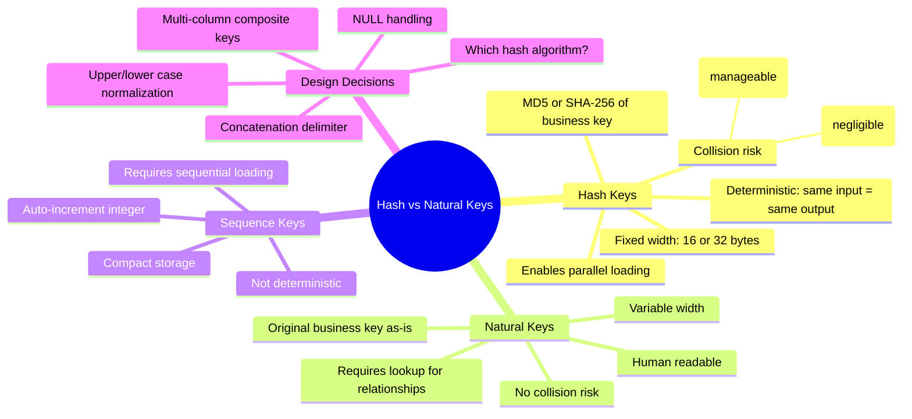

# Hash Keys vs Natural Keys — Concept Overview

> The key design decision in Data Vault 2.0 that enables parallel loading.

---

## Why This Exists

**Origin**: Data Vault 1.0 used sequence-based surrogate keys (like Kimball). This created a loading bottleneck: to load a Satellite, you first had to look up the Hub's surrogate key. This meant Hubs had to be loaded *before* Satellites, serializing the entire pipeline.

Data Vault 2.0 replaced sequences with **hash keys** — deterministic hashes of the business key. Since the hash is computed from data the source system already has, you can load Hubs, Links, and Satellites in parallel. No lookups needed.

## Mindmap

## When To Use Each

| Key Type | Use When | Avoid When |
|---|---|---|
| **Hash Key (MD5)** | Standard DV2.0 loading, moderate scale, single-column BK | Extreme collision sensitivity |
| **Hash Key (SHA-256)** | Regulatory environment requiring collision-proof keys | Storage-sensitive (32 bytes vs 16) |
| **Natural Key** | Single-source DW, human-readable requirement, no parallel loading need | Multi-source DW with key conflicts |
| **Sequence Key** | Kimball star schema, Inmon 3NF | Data Vault (breaks parallel loading) |

## Key Terminology

| Term | Definition |
|---|---|
| **Hash Key** | Deterministic hash of the business key, used as PK in Hubs and Links |
| **Hash Diff** | Hash of all descriptive columns in a Satellite, used for change detection |
| **Business Key** | The natural identifier from the source system (e.g., customer_id, order_number) |
| **Composite Business Key** | A business key formed from 2+ columns (e.g., system_code + customer_id) |
| **Collision** | Two different inputs producing the same hash output |
| **Deterministic** | Same input always produces the same output, regardless of when/where computed |
