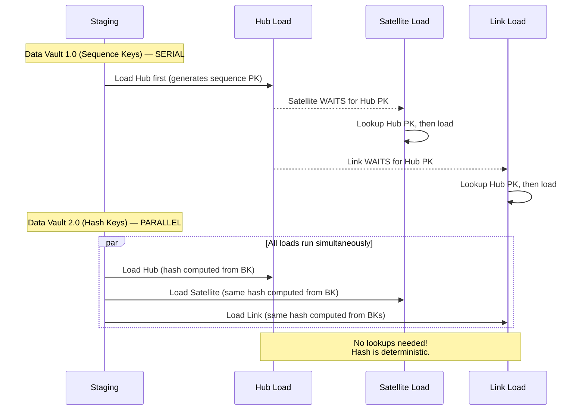

# Hash Keys vs Natural Keys — How It Works, Examples, Pitfalls, Interview, References

---

## Why Hash Keys Enable Parallel Loading



## Hash Key Computation — Best Practices

```sql
-- ============================================================
-- STANDARD: MD5 hash of business key
-- ============================================================

-- Single business key
SELECT MD5(UPPER(TRIM(CAST(customer_id AS VARCHAR)))) AS customer_hk
FROM staging.stg_customers;

-- Composite business key (multi-column)
-- CRITICAL: use a delimiter that NEVER appears in data
SELECT MD5(
    UPPER(TRIM(CAST(system_code AS VARCHAR))) 
    || '||' 
    || UPPER(TRIM(CAST(customer_id AS VARCHAR)))
) AS customer_hk
FROM staging.stg_customers;

-- RULES:
-- 1. Always UPPER() — case-insensitive matching
-- 2. Always TRIM() — remove leading/trailing whitespace
-- 3. Always CAST to VARCHAR — avoid type-dependent hash differences
-- 4. Use '||' as delimiter — prevents 'AB' + 'C' = 'A' + 'BC' collision
-- 5. Handle NULLs: COALESCE(column, '') before hashing
```

## Hash Diff for Change Detection

```sql
-- ============================================================
-- Hash diff: detect whether descriptive attributes have changed
-- ============================================================

-- In staging: compute hashdiff from all descriptive columns
SELECT 
    MD5(UPPER(TRIM(CAST(customer_id AS VARCHAR)))) AS customer_hk,
    MD5(
        COALESCE(UPPER(TRIM(customer_name)), '') || '||' ||
        COALESCE(UPPER(TRIM(email)), '') || '||' ||
        COALESCE(UPPER(TRIM(city)), '') || '||' ||
        COALESCE(UPPER(TRIM(state)), '')
    ) AS hashdiff,
    customer_name, email, city, state
FROM staging.stg_customer_erp;

-- Load satellite only when hashdiff changes
INSERT INTO raw_vault.sat_customer_erp 
    (customer_hk, load_ts, hashdiff, record_source, customer_name, email, city, state)
SELECT s.customer_hk, CURRENT_TIMESTAMP, s.hashdiff, 'ERP',
       s.customer_name, s.email, s.city, s.state
FROM staging_with_hash s
LEFT JOIN (
    -- Get latest hashdiff per customer
    SELECT customer_hk, hashdiff
    FROM raw_vault.sat_customer_erp
    WHERE (customer_hk, load_ts) IN (
        SELECT customer_hk, MAX(load_ts)
        FROM raw_vault.sat_customer_erp
        GROUP BY customer_hk
    )
) latest ON s.customer_hk = latest.customer_hk
WHERE latest.hashdiff IS NULL              -- new customer
   OR latest.hashdiff != s.hashdiff;       -- attributes changed
```

## Collision Analysis

| Algorithm | Output Size | Collision Probability at 1B keys | Recommendation |
|---|---|---|---|
| **MD5** | 128 bits (16 bytes) | ~1 in 10^19 | ✅ Standard for most DV implementations |
| **SHA-1** | 160 bits (20 bytes) | ~1 in 10^24 | ✅ Dan Linstedt's original recommendation |
| **SHA-256** | 256 bits (32 bytes) | ~1 in 10^38 | ✅ Regulated environments |
| **CRC32** | 32 bits (4 bytes) | ~1 in 4.3B | ❌ Too many collisions at scale |

**Practical reality**: At 1 billion unique customers, the probability of an MD5 collision is approximately 1 in 10^19. To put that in perspective: you're more likely to be struck by lightning while winning the lottery. MD5 is fine for Data Vault. Use SHA-256 only if compliance requires it.

## Pitfalls

| Pitfall | Fix |
|---|---|
| Different case normalization between loads | Always UPPER() or LOWER() — pick one and enforce globally |
| Missing delimiter in composite keys | `'AB' + 'CD'` = `'A' + 'BCD'` without delimiter. Always use `'||'` between columns |
| NULL handling inconsistency | COALESCE all columns to empty string before hashing |
| Using hash key as the only key (losing business key) | Hub MUST store both: hash_key (PK) AND business_key (unique). Never lose the business key |
| MD5 in Snowflake vs Spark producing different results | Ensure identical encoding (UTF-8), case normalization, and NULL handling across all engines |

## Interview

### Q: "Why does Data Vault use hash keys instead of sequences?"

**Strong Answer**: "Determinism. A sequence key requires loading the Hub first, looking up the generated key, then loading Satellites and Links. This serializes the pipeline. A hash key is deterministic — `MD5('CUST-12345')` produces the same result whether you compute it in the Hub load, the Satellite load, or the Link load. This means all three can load in parallel from staging. At scale (billions of rows, dozens of sources), this parallelism is the difference between a 2-hour ETL window and a 20-minute one."

### Q: "What about MD5 collisions?"

**Strong Answer**: "At 1 billion unique business keys, the collision probability is approximately 1 in 10^19. In practice, no production Data Vault has ever had a documented MD5 collision. If compliance requires mathematical certainty, use SHA-256 at the cost of 2x storage per hash key. The real risk is not the algorithm — it's inconsistent normalization (case, whitespace, NULL handling) between loads, which causes *false non-matches*, not collisions."

## References

| Resource | Link |
|---|---|
| *Building a Scalable Data Warehouse with Data Vault 2.0* | Ch. 7: Hash Key Computation |
| [automate-dv hash macro](https://github.com/Datavault-UK/automate-dv) | dbt macro for consistent hashing |
| [Data Vault Alliance Standards](https://datavaultalliance.com/standards) | Official hash key specifications |
| Cross-ref: Hubs/Links/Sats | [../02_Hubs_Links_Satellites](../02_Hubs_Links_Satellites/) — where hash keys are used |
| Cross-ref: Philosophy | [../01_Philosophy_Use_Cases](../01_Philosophy_Use_Cases/) — why parallel loading matters |
