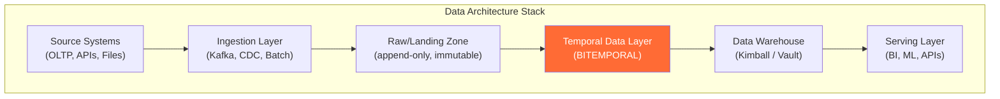
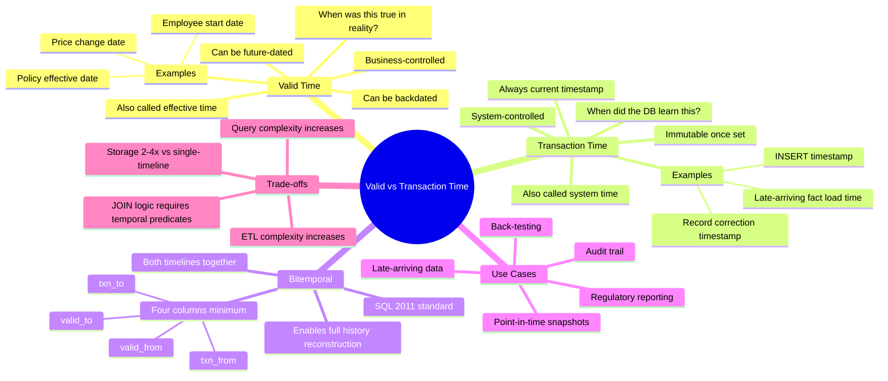

# Valid Time vs Transaction Time — Concept Overview

> What it is, why a Principal Architect must know it, and where it fits in the bigger picture.

---

## Why This Exists

**Origin**: Richard Snodgrass introduced the formal distinction between valid time and transaction time in his 1985 work on temporal databases, later codified in the SQL:2011 temporal standard (ISO/IEC 9075:2011). The distinction arose because the real world and the database don't agree on when things happen.

**The problem it solves**: Every database records facts. But facts have two independent timelines:

1. **Valid time** — when was this fact true *in the real world*? A customer moved to London on January 15, but HR processed the address change on February 3.
2. **Transaction time** — when did the database *learn about* this fact? The record was inserted on February 3.

Without this separation, you cannot answer questions like: "What address did we *believe* this customer had on January 20?" (transaction time query) vs "Where did this customer *actually* live on January 20?" (valid time query). In regulated industries — finance, healthcare, insurance — this distinction is not optional. Auditors will ask both questions.

**Who formalized it**: Richard Snodgrass, Christian Jensen, and the TSQL2 committee (1990s). SQL:2011 standardized `PERIOD FOR` and `SYSTEM_TIME` clauses.

---

## What Value It Provides

| Dimension | Value |
|---|---|
| **Regulatory compliance** | BCBS 239, MiFID II, SOX all require the ability to reproduce reports *as they appeared at a past date* — that's transaction time |
| **Audit trail** | Bitemporal models give you a complete, immutable history of every state the database has ever been in |
| **Late-arriving data** | Insurance claims, medical records, financial corrections — valid time lets you insert a fact with a past-effective date without destroying history |
| **Point-in-time reporting** | Risk engines, actuarial models, and back-testing frameworks need "as-of" snapshots that are reproducible |
| **Debugging** | "What did the system show on March 3?" is trivially answerable with transaction time; without it, you're searching audit logs |

**Quantified**: Goldman Sachs estimated their bitemporal trade ledger reduced regulatory query response time from days (manual log reconstruction) to sub-second (single SQL query).

---

## Where It Fits

Bitemporal modeling sits between raw data ingestion and the curated warehouse layer. It's the layer where you resolve the tension between "what happened in reality" and "what the system recorded."

---

## Mindmap

---

## When To Use / When NOT To Use

| Scenario | Valid Time Only | Transaction Time Only | Bitemporal (Both) |
|---|---|---|---|
| SCD Type 2 tracking in a warehouse | ✅ Sufficient | ❌ | ❌ Overkill |
| Financial trade ledger (regulatory) | ❌ | ❌ | ✅ Required |
| Insurance policy management | ❌ | ❌ | ✅ Required |
| Late-arriving healthcare records | ✅ Maybe | ❌ | ✅ Recommended |
| E-commerce product catalog | ✅ Sufficient | ❌ | ❌ Overkill |
| Audit trail for SOX compliance | ❌ | ✅ Sufficient | ✅ Ideal |
| ML feature store (point-in-time features) | ✅ | ❌ | ✅ Recommended |
| IoT sensor data | ❌ Just use event time | ❌ | ❌ |
| Regulatory "as-of" report reproduction | ❌ | ❌ | ✅ Required |

**The wrong-tool heuristic**: If your data never gets corrected retroactively and you have no regulatory requirement to reproduce past report states, bitemporal is unnecessary complexity. SCD Type 2 (valid time only) handles 80% of historical tracking needs.

---

## Key Terminology

| Term | Precise Definition |
|---|---|
| **Valid Time** | The time period during which a fact is true in the modeled reality. Controlled by the business. Also called *effective time*, *real-world time*, or *application time* |
| **Transaction Time** | The time period during which a fact is stored in the database. Controlled by the DBMS. Also called *system time*, *database time*, or *recording time* |
| **Bitemporal** | A model that tracks both valid time and transaction time independently for every fact |
| **Unitemporal** | A model that tracks only one time axis (usually valid time) |
| **SYSTEM_TIME** | SQL:2011 keyword for transaction time. `FOR SYSTEM_TIME AS OF` enables point-in-time queries |
| **PERIOD FOR** | SQL:2011 clause that defines a time period over two columns |
| **Temporal Foreign Key** | A foreign key that must be valid not just referentially but also temporally — the referenced row must be valid at the same point in time |
| **Late-Arriving Fact** | A fact that arrives after the period it describes — requires valid time backdating |
| **Correction** | A change to a previously recorded fact — creates a new transaction-time version while preserving the original |
| **As-Of Query** | A query that retrieves data as it was known at a specific point in time (transaction time) or as it was true at a specific point (valid time) |
