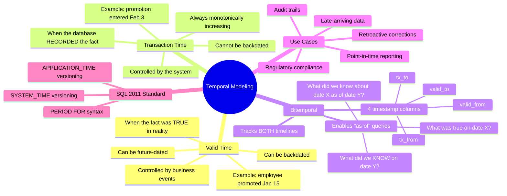
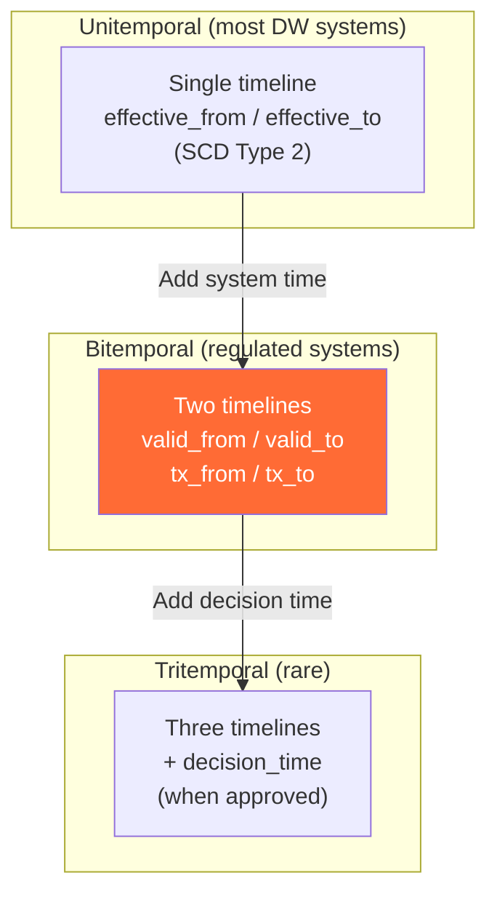

# Valid Time vs Transaction Time — Concept Overview

> The two timelines every data architect must understand. Getting this wrong corrupts every historical query.

---

## Why This Exists

**Origin**: Richard Snodgrass formalized bitemporality in *Developing Time-Oriented Database Applications in SQL* (1999). The core insight: every fact has **two** independent timelines, and conflating them produces silently wrong results.

**The problem it solves**: A customer's address changed on January 15 (real world), but the CRM update didn't arrive until February 3 (system recorded). If you query "what was the address on January 20?" and you only track system time, you'd get the OLD address — because the system didn't know about the change yet. Bitemporality tracks both timelines so you can answer both "what was the truth?" and "what did we know at the time?"

## The Two Timelines

| Timeline | Also Called | What It Tracks | Controlled By |
|---|---|---|---|
| **Valid Time** | Business Time, Effective Time | When the fact was true in the real world | Business events |
| **Transaction Time** | System Time, Knowledge Time | When the fact was recorded in the database | Database system |

## Mindmap

## Where It Fits

## When To Use / When NOT To Use

| Scenario | Unitemporal? | Bitemporal? |
|---|---|---|
| Standard SCD Type 2 dimension | ✅ Sufficient | ❌ Overkill |
| Late-arriving data (corrections arrive days later) | ❌ Loses "what we knew" | ✅ Required |
| Regulatory audit (Basel III, Solvency II, HIPAA) | ❌ Insufficient | ✅ Required |
| Financial reporting (restatements, amendments) | ❌ Overwrites history | ✅ Required |
| Simple dashboard with current state | ✅ Sufficient | ❌ Unnecessary complexity |
| Insurance/healthcare claims with retroactive adjustments | ❌ | ✅ Required |

## Key Terminology

| Term | Precise Definition |
|---|---|
| **Valid Time** | The time period during which a fact is true in the real world |
| **Transaction Time** | The time period during which a fact is stored in the database |
| **Bitemporal** | Tracking both valid time AND transaction time simultaneously |
| **As-Of Query** | A query that retrieves the state of data at a specific point in time |
| **Late-Arriving Fact** | A fact whose valid_from is earlier than its transaction time (backdated) |
| **Retroactive Correction** | Changing the valid time of a previously recorded fact |
| **Temporal Snapshot** | A frozen view of all data at a specific valid_time + transaction_time intersection |
