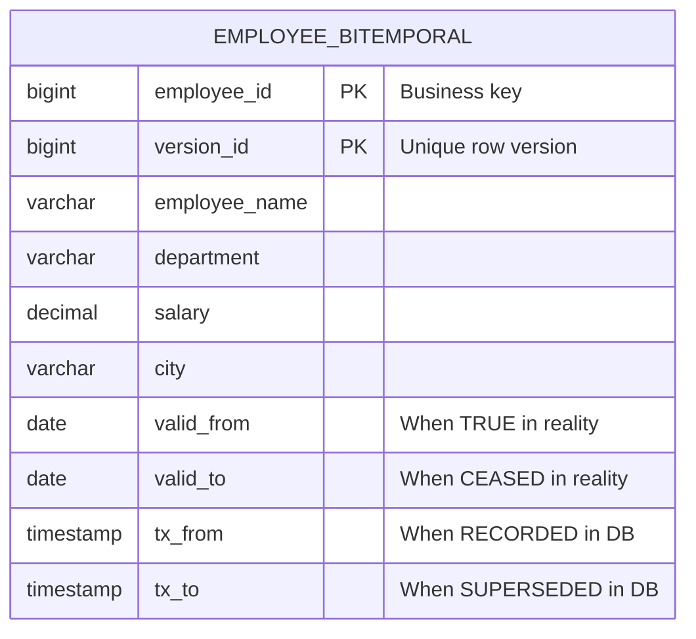
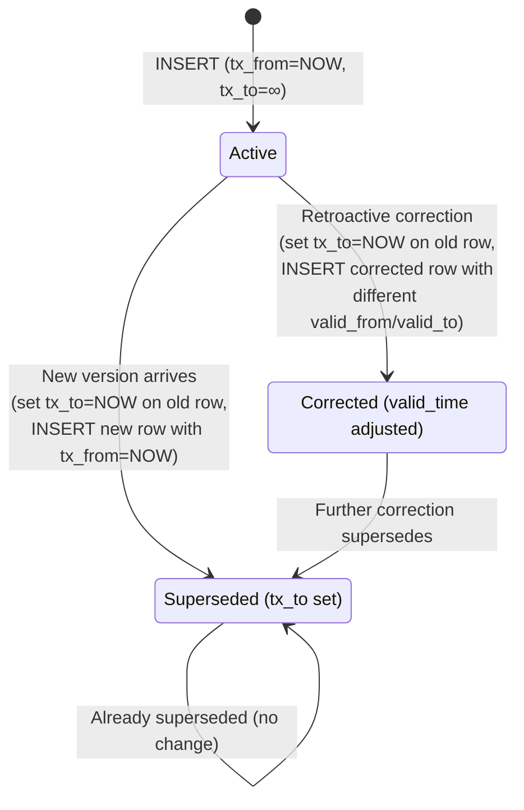
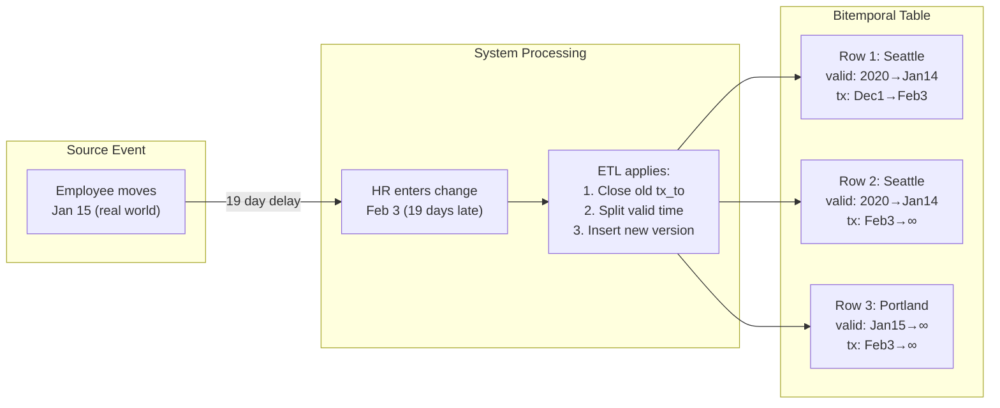

# Valid Time vs Transaction Time — How It Works (Deep Internals)

> ER diagrams, DDL, state diagrams, query patterns, and data flow.

---

## ER Diagram — Bitemporal Table



## DDL — Bitemporal Table

```sql
-- ============================================================
-- BITEMPORAL TABLE: tracks both when facts were true AND when we knew
-- ============================================================

CREATE TABLE employee_bitemporal (
    employee_id     INT           NOT NULL,
    version_id      BIGINT GENERATED ALWAYS AS IDENTITY,
    
    -- Descriptive attributes
    employee_name   VARCHAR(200)  NOT NULL,
    department      VARCHAR(100),
    salary          DECIMAL(12,2),
    city            VARCHAR(200),
    
    -- VALID TIME: when was this true in the real world?
    valid_from      DATE          NOT NULL,
    valid_to        DATE          NOT NULL DEFAULT '9999-12-31',
    
    -- TRANSACTION TIME: when was this recorded/superseded in the DB?
    tx_from         TIMESTAMPTZ   NOT NULL DEFAULT CURRENT_TIMESTAMP,
    tx_to           TIMESTAMPTZ   NOT NULL DEFAULT '9999-12-31 23:59:59+00',
    
    PRIMARY KEY (employee_id, version_id),
    
    -- Constraints
    CHECK (valid_from < valid_to),
    CHECK (tx_from < tx_to)
);

-- Index for as-of queries
CREATE INDEX idx_emp_bitemp_valid ON employee_bitemporal(employee_id, valid_from, valid_to);
CREATE INDEX idx_emp_bitemp_tx ON employee_bitemporal(employee_id, tx_from, tx_to);
```

## State Machine — Bitemporal Record Lifecycle



## Walkthrough — Late-Arriving Data Scenario

### Scenario

- **Jan 15**: Employee moves from Seattle to Portland (real world)
- **Feb 3**: HR enters the change in the system (late by 19 days)
- **Mar 10**: Auditor asks "What address did we have for this employee on Jan 20?"

### Data Evolution

```
Step 1: Initial record (loaded Dec 1, 2024)
┌─────────────┬─────────┬────────────┬────────────┬───────────┬───────────┐
│ employee_id │ city    │ valid_from │ valid_to   │ tx_from   │ tx_to     │
├─────────────┼─────────┼────────────┼────────────┼───────────┼───────────┤
│ 1001        │ Seattle │ 2020-01-01 │ 9999-12-31 │ 2024-12-01│ 9999-12-31│
└─────────────┴─────────┴────────────┴────────────┴───────────┴───────────┘

Step 2: HR enters move on Feb 3 (valid_from=Jan 15, tx_from=Feb 3)
┌─────────────┬─────────┬────────────┬────────────┬───────────┬───────────┐
│ employee_id │ city    │ valid_from │ valid_to   │ tx_from   │ tx_to     │
├─────────────┼─────────┼────────────┼────────────┼───────────┼───────────┤
│ 1001        │ Seattle │ 2020-01-01 │ 9999-12-31 │ 2024-12-01│ 2025-02-03│  ← closed
│ 1001        │ Seattle │ 2020-01-01 │ 2025-01-14 │ 2025-02-03│ 9999-12-31│  ← valid until Jan 14
│ 1001        │ Portland│ 2025-01-15 │ 9999-12-31 │ 2025-02-03│ 9999-12-31│  ← new truth
└─────────────┴─────────┴────────────┴────────────┴───────────┴───────────┘
```

### Answering the Auditor's Questions

```sql
-- Q1: "What was the ACTUAL address on Jan 20?" (valid time query)
SELECT city FROM employee_bitemporal
WHERE employee_id = 1001
  AND valid_from <= '2025-01-20' AND valid_to > '2025-01-20'
  AND tx_to = '9999-12-31 23:59:59+00';  -- latest knowledge
-- Result: Portland (the truth)

-- Q2: "What did we BELIEVE the address was on Jan 20?" (transaction time query)
SELECT city FROM employee_bitemporal
WHERE employee_id = 1001
  AND valid_from <= '2025-01-20' AND valid_to > '2025-01-20'
  AND tx_from <= '2025-01-20' AND tx_to > '2025-01-20';  -- what we knew on Jan 20
-- Result: Seattle (we hadn't recorded the move yet!)

-- Q3: "What did we know about Jan 20 as of Feb 5?" (full bitemporal)
SELECT city FROM employee_bitemporal
WHERE employee_id = 1001
  AND valid_from <= '2025-01-20' AND valid_to > '2025-01-20'
  AND tx_from <= '2025-02-05' AND tx_to > '2025-02-05';
-- Result: Portland (by Feb 5 we had recorded the move)
```

## Data Flow Diagram



## War Story: Goldman Sachs — Bitemporal Risk Reporting

Goldman Sachs uses bitemporal modeling for regulatory risk reporting. When Basel III auditors ask "What was the portfolio risk exposure on March 15, as known on March 20?" — they need the exact data state at both timestamps. Without bitemporality, late-arriving trade corrections would silently change historical risk numbers, violating regulatory immutability requirements.

**Scale**: 500M+ bitemporal rows across trade and position tables, with 4-timestamp queries executed thousands of times daily.

## Pitfalls

| Pitfall | Fix |
|---|---|
| Using only valid_time (unitemporal) in a regulated system | Add transaction_time — regulators will ask "what did you know and when?" |
| Not indexing both time ranges | Create composite indexes on (entity_id, valid_from, valid_to) AND (entity_id, tx_from, tx_to) |
| Forgetting to close old tx_to when inserting corrections | Every INSERT of a correction must UPDATE tx_to on the superseded row |
| Using DELETE instead of tx_to closure | Bitemporal NEVER deletes — it closes. Deleting destroys audit trail |
| Querying without both time predicates | Always include BOTH valid_time AND tx_time predicates, otherwise results are ambiguous |

## Interview

### Q: "Explain the difference between valid time and transaction time."

**Strong Answer**: "Valid time is when a fact was true in the real world — controlled by business events. Transaction time is when the database recorded the fact — controlled by the system. They're independent. An employee may move on January 15 (valid_time), but HR records it on February 3 (transaction_time). Bitemporality tracks both, enabling three distinct queries: what was the truth on date X, what did we believe on date Y, and what did we believe about date X as of date Y."

### Q: "When would you NOT use bitemporal modeling?"

**Strong Answer**: "When (1) late-arriving data doesn't happen or doesn't matter, (2) there's no regulatory/audit requirement, (3) the query complexity and storage overhead aren't justified. Standard SCD Type 2 with effective_from/effective_to covers most analytical use cases. Bitemporality is for regulated industries, financial reporting, and anywhere 'what did we know at the time' matters."

## References

| Resource | Link |
|---|---|
| *Developing Time-Oriented Database Applications in SQL* | Richard Snodgrass (1999) |
| *Temporal Data & The Relational Model* | C.J. Date, Hugh Darwen, Nikos Lorentzos |
| SQL:2011 Standard | Temporal extensions (SYSTEM_TIME, APPLICATION_TIME) |
| [PostgreSQL temporal_tables extension](https://github.com/arkhipov/temporal_tables) | Open-source bitemporal support for Postgres |
| Cross-ref: SCD Extreme Cases | [../../02_Dimensional_Modeling_Advanced/02_SCD_Extreme_Cases](../../02_Dimensional_Modeling_Advanced/02_SCD_Extreme_Cases/) |
| Cross-ref: As-Of Queries | [../02_As_Of_Queries](../02_As_Of_Queries/) — query patterns for temporal data |
