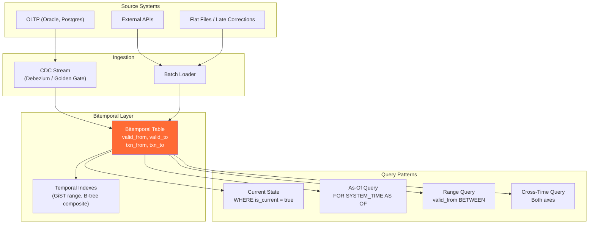
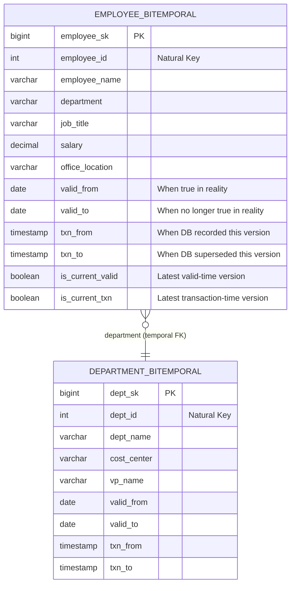
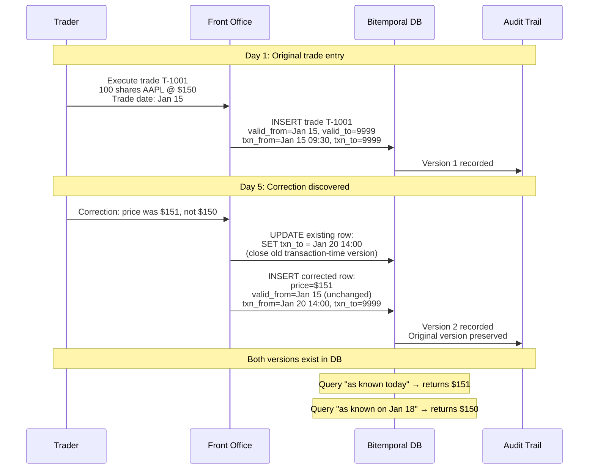
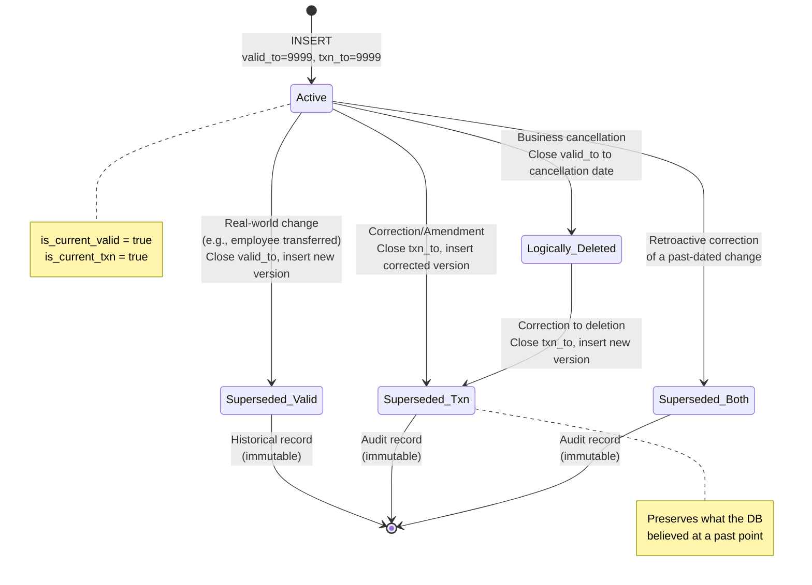
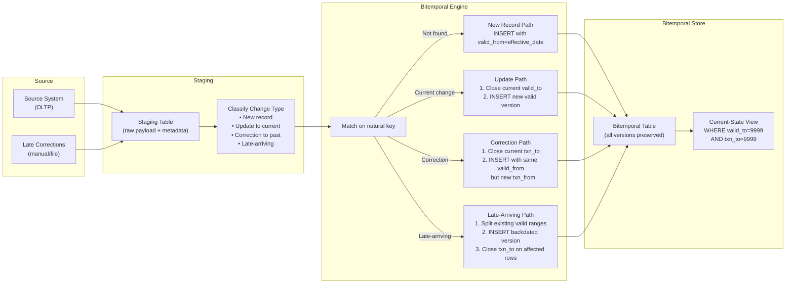

# Valid Time vs Transaction Time — How It Works (Deep Internals)

> HLD, ER diagrams, DDL table structures, sequence diagrams, state machines, and data flow.

---

## High-Level Design — Temporal Architecture



---

## ER Diagram — Bitemporal Employee Record



---

## Table Structures

### Bitemporal Fact Table — Trade Ledger

```sql
-- ============================================================
-- Bitemporal trade ledger
-- Two independent time axes: valid time (when the trade occurred)
-- and transaction time (when the system recorded it)
-- ============================================================

CREATE TABLE trade_ledger_bitemporal (
    trade_version_sk    BIGINT GENERATED ALWAYS AS IDENTITY PRIMARY KEY,
    
    -- Natural key
    trade_id            VARCHAR(50)    NOT NULL,
    
    -- Business attributes
    instrument_id       VARCHAR(20)    NOT NULL,
    counterparty_id     INT            NOT NULL,
    trade_type          VARCHAR(10)    NOT NULL,  -- BUY, SELL, SHORT
    quantity            DECIMAL(18,4)  NOT NULL,
    price               DECIMAL(18,6)  NOT NULL,
    notional_value      DECIMAL(20,2)  NOT NULL,
    currency            CHAR(3)        NOT NULL,
    trader_id           INT            NOT NULL,
    desk_id             INT            NOT NULL,
    
    -- VALID TIME: when was this trade effective in reality?
    valid_from          DATE           NOT NULL,
    valid_to            DATE           NOT NULL DEFAULT '9999-12-31',
    
    -- TRANSACTION TIME: when did the system learn about this version?
    txn_from            TIMESTAMP      NOT NULL DEFAULT CURRENT_TIMESTAMP,
    txn_to              TIMESTAMP      NOT NULL DEFAULT '9999-12-31 23:59:59',
    
    -- Convenience flags
    is_current_valid    BOOLEAN GENERATED ALWAYS AS (valid_to = '9999-12-31') STORED,
    is_current_txn      BOOLEAN GENERATED ALWAYS AS (txn_to = '9999-12-31 23:59:59') STORED,
    
    -- Metadata
    change_reason       VARCHAR(100),  -- INITIAL, CORRECTION, AMENDMENT, CANCELLATION
    source_system       VARCHAR(50),
    loaded_by           VARCHAR(100)
);

-- Composite index for bitemporal lookups
CREATE INDEX idx_trade_bt_lookup 
    ON trade_ledger_bitemporal(trade_id, valid_from, valid_to, txn_from, txn_to);

-- Current state fast path
CREATE INDEX idx_trade_current 
    ON trade_ledger_bitemporal(trade_id) 
    WHERE is_current_valid = TRUE AND is_current_txn = TRUE;

-- Temporal range queries (PostgreSQL GiST)
-- CREATE INDEX idx_trade_valid_range 
--     ON trade_ledger_bitemporal USING GIST (daterange(valid_from, valid_to));
```

### Bitemporal Dimension — Employee

```sql
-- ============================================================
-- Bitemporal employee dimension
-- Tracks both real-world changes and database corrections
-- ============================================================

CREATE TABLE dim_employee_bitemporal (
    employee_sk         BIGINT GENERATED ALWAYS AS IDENTITY PRIMARY KEY,
    
    -- Natural key
    employee_id         INT            NOT NULL,
    
    -- Attributes
    employee_name       VARCHAR(300)   NOT NULL,
    department          VARCHAR(100),
    job_title           VARCHAR(200),
    salary              DECIMAL(12,2),
    office_location     VARCHAR(100),
    manager_id          INT,
    cost_center         VARCHAR(20),
    
    -- VALID TIME
    valid_from          DATE           NOT NULL,
    valid_to            DATE           NOT NULL DEFAULT '9999-12-31',
    
    -- TRANSACTION TIME
    txn_from            TIMESTAMP      NOT NULL DEFAULT CURRENT_TIMESTAMP,
    txn_to              TIMESTAMP      NOT NULL DEFAULT '9999-12-31 23:59:59',
    
    -- Change tracking
    change_type         VARCHAR(20),  -- HIRE, TRANSFER, PROMOTION, CORRECTION, TERMINATION
    change_source       VARCHAR(50)   -- HR_SYSTEM, MANUAL, PAYROLL_FEED
);

CREATE INDEX idx_emp_bt_nk ON dim_employee_bitemporal(employee_id, valid_from, txn_from);
CREATE INDEX idx_emp_bt_current ON dim_employee_bitemporal(employee_id) 
    WHERE valid_to = '9999-12-31' AND txn_to = '9999-12-31 23:59:59';
```

---

## Sequence Diagram — Correction Flow (Bitemporal)

This shows what happens when a trade is corrected after initial recording:



---

## State Machine — Bitemporal Record Lifecycle



---

## Data Flow Diagram — Bitemporal ETL Pipeline



---

## The Four Quadrants of Bitemporal Query

Every bitemporal query falls into one of four quadrants:

```mermaid
quadrantChart
    title Bitemporal Query Quadrants
    x-axis "Transaction Time (DB Knowledge)" --> "Past" "Current"
    y-axis "Valid Time (Reality)" --> "Past" "Current"
    "Current-Current": [0.85, 0.85]
    "Historical-Current": [0.85, 0.25]
    "Current-Past Knowledge": [0.25, 0.85]
    "Full Historical": [0.25, 0.25]
```

| Quadrant | Query Pattern | Use Case |
|---|---|---|
| **Current-Current** | `WHERE valid_to = '9999-12-31' AND txn_to = '9999-12-31'` | Normal operational queries |
| **Historical valid, Current txn** | `WHERE valid_from <= @date AND valid_to > @date AND txn_to = '9999-12-31'` | "What was true on date X, as we know it now?" |
| **Current valid, Past txn** | `WHERE valid_to = '9999-12-31' AND txn_from <= @ts AND txn_to > @ts` | "What did we believe was current on timestamp T?" |
| **Full historical** | `WHERE valid_from <= @date AND valid_to > @date AND txn_from <= @ts AND txn_to > @ts` | "What did we believe was true on date X, as of timestamp T?" |
