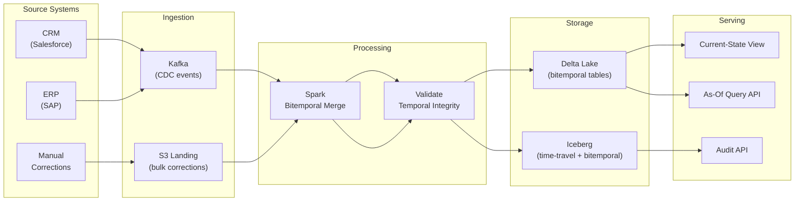

# Valid Time vs Transaction Time — Hands-On Examples

> Production-grade SQL, PySpark, and configuration examples for bitemporal modeling.

---

## Table Structures — Physical DDL

### PostgreSQL with Temporal Extensions

```sql
-- ============================================================
-- Bitemporal customer dimension — production schema
-- Uses PostgreSQL range types for efficient temporal queries
-- ============================================================

CREATE TABLE dim_customer_bitemporal (
    customer_sk         BIGSERIAL PRIMARY KEY,
    customer_id         INT            NOT NULL,
    
    -- Attributes
    customer_name       VARCHAR(300)   NOT NULL,
    email               VARCHAR(255),
    phone               VARCHAR(50),
    address_line1       VARCHAR(500),
    city                VARCHAR(200),
    state_province      VARCHAR(200),
    country             VARCHAR(100),
    postal_code         VARCHAR(20),
    segment             VARCHAR(50),    -- ENTERPRISE, SMB, CONSUMER
    credit_score        INT,
    
    -- VALID TIME (daterange for efficient overlap queries)
    valid_range         DATERANGE      NOT NULL,
    
    -- TRANSACTION TIME (tstzrange for DB-level tracking)
    txn_range           TSTZRANGE      NOT NULL DEFAULT tstzrange(CURRENT_TIMESTAMP, 'infinity'),
    
    -- Change metadata
    change_type         VARCHAR(20)    NOT NULL,  -- INSERT, UPDATE, CORRECTION, DELETE
    change_reason       TEXT,
    source_system       VARCHAR(50)    DEFAULT 'CRM',
    
    -- Exclude constraint: no two versions of the same customer
    -- can overlap on BOTH time axes simultaneously
    EXCLUDE USING GIST (
        customer_id WITH =,
        valid_range WITH &&,
        txn_range WITH &&
    )
);

-- GiST indexes for range queries
CREATE INDEX idx_cust_bt_valid ON dim_customer_bitemporal USING GIST (valid_range);
CREATE INDEX idx_cust_bt_txn ON dim_customer_bitemporal USING GIST (txn_range);
CREATE INDEX idx_cust_bt_nk ON dim_customer_bitemporal(customer_id);

-- Current-state partial index (the fast path)
CREATE INDEX idx_cust_current ON dim_customer_bitemporal(customer_id)
    WHERE upper(valid_range) = 'infinity' AND upper(txn_range) = 'infinity';
```

### SQL Server with System-Versioned Temporal Tables (SQL:2011)

```sql
-- ============================================================
-- SQL Server system-versioned temporal table
-- Handles transaction time automatically via SYSTEM_TIME
-- Valid time must be managed manually
-- ============================================================

CREATE TABLE dbo.Policy (
    policy_id           INT            NOT NULL,
    policyholder_id     INT            NOT NULL,
    policy_type         VARCHAR(50)    NOT NULL,
    premium_amount      DECIMAL(12,2)  NOT NULL,
    coverage_limit      DECIMAL(15,2)  NOT NULL,
    deductible          DECIMAL(10,2),
    
    -- VALID TIME (application-managed)
    valid_from          DATE           NOT NULL,
    valid_to            DATE           NOT NULL DEFAULT '9999-12-31',
    
    -- TRANSACTION TIME (system-managed)
    sys_start           DATETIME2 GENERATED ALWAYS AS ROW START NOT NULL,
    sys_end             DATETIME2 GENERATED ALWAYS AS ROW END NOT NULL,
    PERIOD FOR SYSTEM_TIME (sys_start, sys_end),
    
    PRIMARY KEY (policy_id, valid_from, sys_start)
)
WITH (SYSTEM_VERSIONING = ON (
    HISTORY_TABLE = dbo.PolicyHistory,
    DATA_CONSISTENCY_CHECK = ON
));
```

---

## Code Examples — Bitemporal Operations

### Insert a New Record

```sql
-- New customer enrolled on 2024-03-15, loaded today
INSERT INTO dim_customer_bitemporal (
    customer_id, customer_name, email, city, country, segment,
    valid_range, txn_range, change_type
) VALUES (
    1001, 'Acme Corp', 'billing@acme.com', 'San Francisco', 'US', 'ENTERPRISE',
    daterange('2024-03-15', 'infinity'),
    tstzrange(CURRENT_TIMESTAMP, 'infinity'),
    'INSERT'
);
```

### Correct a Past Error (Bitemporal Correction)

```sql
-- Customer 1001's city was recorded as San Francisco
-- but was actually San Jose from the start
-- This is a CORRECTION: valid time unchanged, transaction time tracks the fix

BEGIN;

-- Step 1: Close the transaction-time on the incorrect version
UPDATE dim_customer_bitemporal
SET txn_range = tstzrange(lower(txn_range), CURRENT_TIMESTAMP)
WHERE customer_id = 1001
  AND upper(txn_range) = 'infinity'
  AND city = 'San Francisco';

-- Step 2: Insert the corrected version with same valid time
INSERT INTO dim_customer_bitemporal (
    customer_id, customer_name, email, city, country, segment,
    valid_range, txn_range, change_type, change_reason
) VALUES (
    1001, 'Acme Corp', 'billing@acme.com', 'San Jose', 'US', 'ENTERPRISE',
    daterange('2024-03-15', 'infinity'),           -- valid time UNCHANGED
    tstzrange(CURRENT_TIMESTAMP, 'infinity'),       -- new txn time starts now
    'CORRECTION', 'City was incorrectly recorded as San Francisco'
);

COMMIT;
```

### Record a Real-World Change (Valid Time Update)

```sql
-- Customer 1001 moved from San Jose to Austin on 2024-09-01
-- This is a REAL CHANGE: valid time splits, transaction time tracks when we learned it

BEGIN;

-- Step 1: Close the valid_to on current version
UPDATE dim_customer_bitemporal
SET valid_range = daterange(lower(valid_range), '2024-09-01'),
    txn_range = tstzrange(lower(txn_range), CURRENT_TIMESTAMP)
WHERE customer_id = 1001
  AND upper(valid_range) = 'infinity'
  AND upper(txn_range) = 'infinity';

-- Step 2: Re-insert old version with closed valid range but fresh txn time
INSERT INTO dim_customer_bitemporal (
    customer_id, customer_name, email, city, country, segment,
    valid_range, txn_range, change_type
) VALUES (
    1001, 'Acme Corp', 'billing@acme.com', 'San Jose', 'US', 'ENTERPRISE',
    daterange('2024-03-15', '2024-09-01'),
    tstzrange(CURRENT_TIMESTAMP, 'infinity'),
    'UPDATE'
);

-- Step 3: Insert new version starting from move date
INSERT INTO dim_customer_bitemporal (
    customer_id, customer_name, email, city, country, segment,
    valid_range, txn_range, change_type
) VALUES (
    1001, 'Acme Corp', 'billing@acme.com', 'Austin', 'US', 'ENTERPRISE',
    daterange('2024-09-01', 'infinity'),
    tstzrange(CURRENT_TIMESTAMP, 'infinity'),
    'UPDATE'
);

COMMIT;
```

---

## PySpark — Bitemporal Merge Logic

```python
from pyspark.sql import SparkSession, Window
from pyspark.sql import functions as F
from pyspark.sql.types import *

spark = SparkSession.builder \
    .appName("bitemporal_merge") \
    .config("spark.sql.shuffle.partitions", 200) \
    .getOrCreate()

INFINITY_DATE = "9999-12-31"
INFINITY_TS = "9999-12-31 23:59:59"

def bitemporal_merge(existing_df, incoming_df, natural_key_cols, now_ts):
    """
    Merge incoming changes into a bitemporal table.
    
    existing_df: current bitemporal table
    incoming_df: new records with valid_from, change_type
    natural_key_cols: list of columns forming the natural key
    now_ts: current processing timestamp (transaction time)
    """
    
    # 1. Identify records that need updating (current versions of matching NKs)
    current_versions = existing_df.filter(
        (F.col("valid_to") == INFINITY_DATE) & 
        (F.col("txn_to") == INFINITY_TS)
    )
    
    join_cond = [existing_df[c] == incoming_df[c] for c in natural_key_cols]
    
    # 2. Matched records: close txn_to on existing, insert new version
    matched = current_versions.join(incoming_df, natural_key_cols, "inner")
    
    # Close existing records (set txn_to to now)
    closed_existing = matched.select(
        *[current_versions[c] for c in existing_df.columns]
    ).withColumn("txn_to", F.lit(now_ts))
    
    # New versions from incoming
    new_versions = incoming_df.withColumn("txn_from", F.lit(now_ts)) \
                              .withColumn("txn_to", F.lit(INFINITY_TS)) \
                              .withColumn("valid_to", F.lit(INFINITY_DATE))
    
    # 3. Unmatched incoming = net new inserts
    new_inserts = incoming_df.join(
        current_versions, natural_key_cols, "left_anti"
    ).withColumn("txn_from", F.lit(now_ts)) \
     .withColumn("txn_to", F.lit(INFINITY_TS)) \
     .withColumn("valid_to", F.lit(INFINITY_DATE))
    
    # 4. Unchanged existing records
    unchanged = existing_df.join(incoming_df, natural_key_cols, "left_anti")
    
    # 5. Union all
    result = unchanged.unionByName(closed_existing) \
                      .unionByName(new_versions) \
                      .unionByName(new_inserts)
    
    return result
```

---

## Before vs After — Unitemporal vs Bitemporal

### ❌ Unitemporal (Valid Time Only) — Loses Correction History

```sql
-- BAD: SCD Type 2 (valid time only)
-- Customer 1001 was in San Francisco, corrected to San Jose
-- After correction, we cannot tell what the DB previously believed

SELECT * FROM dim_customer WHERE customer_id = 1001;

-- customer_id | city        | valid_from | valid_to   | is_current
-- 1001        | San Jose    | 2024-03-15 | 9999-12-31 | true

-- WHERE IS THE RECORD OF THE ERROR?
-- It was overwritten. Auditor asks: "What did your March report show?"
-- Answer: "We don't know."
```

### ✅ Bitemporal — Preserves Everything

```sql
-- GOOD: Bitemporal query for all versions of customer 1001
SELECT * FROM dim_customer_bitemporal 
WHERE customer_id = 1001
ORDER BY txn_from, valid_from;

-- customer_id | city           | valid_from | valid_to   | txn_from            | txn_to
-- 1001        | San Francisco  | 2024-03-15 | infinity   | 2024-03-15 10:00:00 | 2024-04-10 14:30:00  ← original (superseded)
-- 1001        | San Jose       | 2024-03-15 | infinity   | 2024-04-10 14:30:00 | infinity              ← correction

-- Auditor asks: "What did your March report show?"
-- Answer: SELECT WHERE txn_from <= '2024-03-31' AND txn_to > '2024-03-31'
-- Returns: San Francisco. That's what the system believed in March.
```

---

## Integration Diagram — Bitemporal in a Modern Data Platform



---

## Runnable Exercise — Build a Bitemporal Table (PostgreSQL)

```bash
# 1. Start PostgreSQL (Docker)
docker run -d --name pg-temporal -p 5432:5432 \
  -e POSTGRES_PASSWORD=temporal123 \
  postgres:16

# 2. Connect
psql -h localhost -U postgres -d postgres

# 3. Run the DDL from this file
# 4. Insert a customer, make a correction, then run these queries:

# Current state
SELECT * FROM dim_customer_bitemporal 
WHERE customer_id = 1001 
  AND upper(valid_range) = 'infinity' 
  AND upper(txn_range) = 'infinity';

# What did we believe on March 31?
SELECT * FROM dim_customer_bitemporal 
WHERE customer_id = 1001 
  AND txn_range @> '2024-03-31'::timestamptz
  AND valid_range @> '2024-03-31'::date;

# Full version history
SELECT customer_id, city, valid_range, txn_range, change_type
FROM dim_customer_bitemporal 
WHERE customer_id = 1001 
ORDER BY lower(txn_range), lower(valid_range);
```
