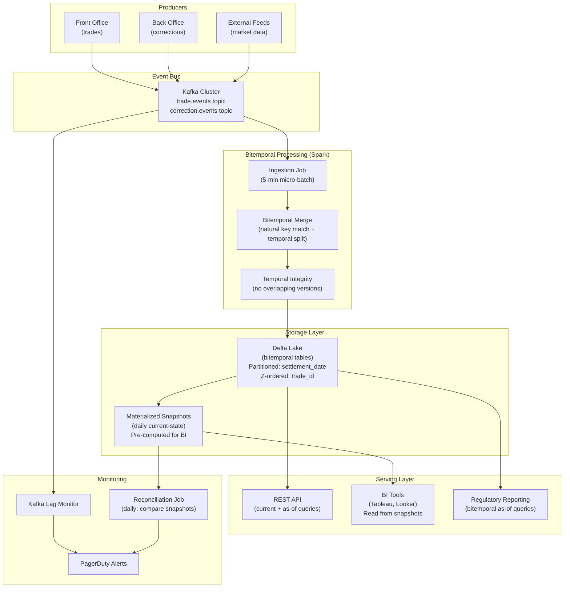

# Valid Time vs Transaction Time — Real-World Scenarios

> FAANG case studies, production numbers, post-mortems, and deployment topologies.

---

## Case Study 1: Goldman Sachs — Bitemporal Trade Ledger (SecDB)

**Context**: Goldman's proprietary SecDB platform manages the firm's entire trading book. Every trade must be reproducible at any past point in time for regulatory reporting (BCBS 239, Dodd-Frank).

**Architecture**: Bitemporal model with valid time (trade date) and transaction time (system recording date). Every amendment, correction, or cancellation produces a new version — the original is never mutated.

**Scale**:

- ~50M active trade records
- ~500M total versions (bitemporal history)
- 200TB+ temporal data
- Sub-second as-of query response via pre-materialized snapshots

**Key decision**: Chose bitemporal over SCD Type 2 because regulators ask two distinct questions:

1. "What was your risk exposure on March 15?" (valid time)
2. "What did your risk report show on March 15?" (transaction time)

SCD Type 2 can answer #1 but not #2.

**Result**: Reduced regulatory response time from 3-5 days (manual audit log reconstruction) to <1 second (single bitemporal query). Estimated compliance savings: $10M+/year in audit labor.

---

## Case Study 2: Netflix — Content Licensing Windows (Bitemporal Catalog)

**Context**: Netflix's content catalog has complex temporal semantics. A movie's licensing window (valid time) determines when it's available in each region. The deal terms can be amended after the fact (transaction time) — a studio might retroactively extend or shorten a window.

**Architecture**:

- Valid time = licensing period (`available_from`, `available_to`)
- Transaction time = when the deal was recorded/amended in the system
- Partitioned by region → ~190 country variants per title

**Scale**:

- 17,000+ titles × 190 regions = 3M+ active licensing records
- Amendments generate ~15M versions/year
- Queries: "What was available in Germany on Dec 25, as known at contract close" — classic bitemporal

**What went wrong**: Early catalog system used SCD Type 2 only. When a studio retroactively changed a license start date, the old rows were updated in place. This broke month-end revenue reporting because the revenue allocation changed retroactively without an audit trail.

**Fix**: Migrated to bitemporal. Now revenue reports for any past month can be reproduced exactly as they were filed, regardless of subsequent license amendments.

---

## Case Study 3: Epic Systems — Bitemporal Electronic Health Records

**Context**: Healthcare records are legally required to be immutable — you cannot delete a past diagnosis, only add a correction. HIPAA and Meaningful Use regulations require full temporal auditability.

**Architecture**: Bitemporal patient records where:

- Valid time = when the clinical fact was true (symptom onset, medication start date)
- Transaction time = when the record was entered into the EHR

**Scale**:

- 300M+ patient records across Epic installations
- Clinical documents average 20 versions each over a patient's lifetime
- Must support "what was the patient's medication list as of their ER visit on June 3, as recorded at that time?"

**Key design**: Medications that were prescribed but later discovered to be incorrect are not deleted. They get a transaction-time closure and a new record with `change_type = 'CORRECTION'`. The original prescription is permanently visible in the audit trail.

---

## Case Study 4: JPMorgan Chase — Bitemporal Position Keeping

**Context**: JPMC's position-keeping system tracks the firm's holdings across every asset class. Positions change due to trades (valid time events) and also due to corrections, late settlements, and corporate actions (transaction time events).

**Architecture**: Dual-timeline position ledger:

- Valid time: settlement date (when ownership transferred)
- Transaction time: booking date (when the system recorded it)
- Partitioned by desk and settlement date
- Aggregated to daily snapshots for risk reporting

**Production numbers**:

- 2B+ position versions
- 50M new versions/day
- 99.9% of queries hit the current-state materialized view
- 0.1% are as-of queries (regulatory, audit, back-testing)
- Query latency: current state <5ms, as-of <200ms

---

## What Went Wrong — Post-Mortem: Data Reconciliation Failure

**Incident**: A major bank's risk reporting system showed a $200M discrepancy between the end-of-day risk report and the re-calculated risk from the next morning.

**Root cause**: The system used SCD Type 2 (valid time only). Between 6 PM and 6 AM, 1,200 trade corrections flowed in from the back office. The SCD Type 2 model overwrote the historical versions. When risk was re-calculated in the morning, it used the corrected trades — but the end-of-day report had been calculated with the original (incorrect) trades.

**Why bitemporal would have prevented this**:

1. The original trade versions would be preserved (txn_to closed, not deleted)
2. Re-running the end-of-day query with `FOR SYSTEM_TIME AS OF '2024-03-15 18:00:00'` would return exactly what was known at 6 PM
3. The morning calculation uses `FOR SYSTEM_TIME AS OF CURRENT_TIMESTAMP` — returning corrected data
4. The $200M delta is fully explainable: "these 1,200 corrections account for the difference"

**Prevention**: Migrate critical reporting systems from SCD Type 2 to bitemporal. Cost: 6-month engineering effort. Benefit: eliminates an entire class of reconciliation failures.

---

## Deployment Topology — Bitemporal Platform at Scale

**Infrastructure at scale**:

| Component | Specification |
|---|---|
| Kafka | 12 brokers, 3-way replication, 7-day retention |
| Spark | 200 executors (r5.2xlarge), 5-min micro-batch |
| Delta Lake | 50TB bitemporal tables, 30-day time travel |
| Snapshots | Daily materialized views, 2 years retention |
| API | 12 pods, auto-scaled, <200ms P99 for as-of queries |
