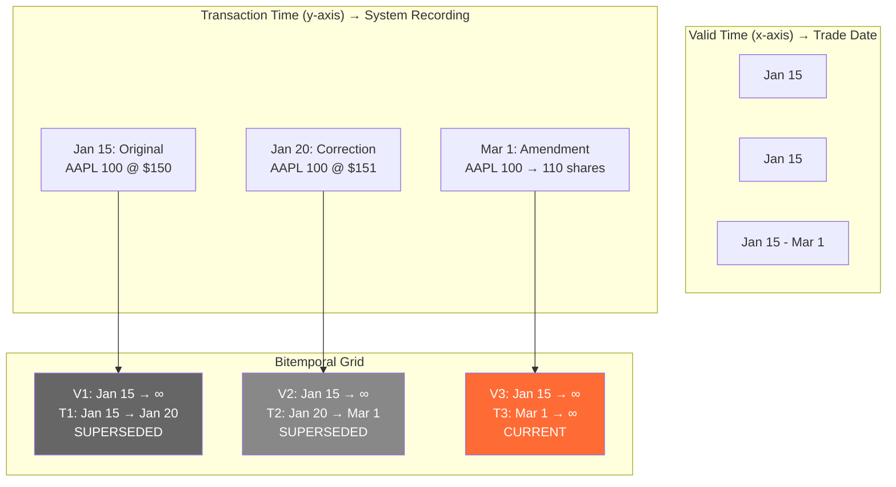

# Valid Time vs Transaction Time — Interview Angle

> How this appears in Principal-level interviews, sample questions, and what they're really testing.

---

## How This Appears

Bitemporal modeling appears in **system design** interviews, not coding rounds. It typically surfaces when the interviewer describes a financial, healthcare, or regulatory system. The interviewer will not say "design a bitemporal system" — they'll describe requirements that imply it:

- "The system must support regulatory report reproduction"
- "Corrections can arrive days or weeks after the original event"
- "Auditors need to see what the system showed on any past date"

If you hear these requirements and jump straight to SCD Type 2, you'll cap out at Senior. A Principal candidate identifies the two independent time axes unprompted.

---

## Sample Questions

### Question 1: "Design the data model for a trade correction system"

**Weak answer (Senior)**:
> "I'd use SCD Type 2 with effective_from and effective_to columns. When a trade is corrected, I close the current row and insert a new one with the updated values."

**Strong answer (Principal)**:
> "Trade corrections create a fundamental problem that SCD Type 2 doesn't solve. SCD Type 2 tracks valid time — when something was true. But corrections require us to also track *when we learned* about a change — transaction time. Without both axes, we can't reproduce past reports.
>
> I'd design a bitemporal model with four temporal columns: `valid_from`, `valid_to` for when the trade was effective, and `txn_from`, `txn_to` for when the system recorded each version. Corrections close `txn_to` on the old version and insert a new version with the same `valid_from` but new `txn_from`.
>
> For performance, I'd create a materialized current-state view that BI tools query, and expose the full bitemporal table only for as-of and audit queries. I'd use PostgreSQL EXCLUDE constraints to prevent temporal overlaps."

**What they're really testing**: Do you understand the two independent timelines? Can you articulate why SCD Type 2 is insufficient for corrections? Do you think about query performance for the 99% case (current state) vs the 1% case (as-of)?

---

### Question 2: "A regulator asks: what did your risk report show on March 15? How do you answer that?"

**Weak answer (Senior)**:
> "I'd look at the audit logs or check if we have a backup from March 15."

**Strong answer (Principal)**:
> "This is a transaction-time query. If we have a bitemporal model, the answer is a single SQL query:
>
> ```sql
> SELECT * FROM positions_bitemporal
> WHERE txn_from <= '2024-03-15 18:00:00'
>   AND txn_to > '2024-03-15 18:00:00'
>   AND valid_to = '9999-12-31';
> ```
>
> This returns exactly the data that existed in the system at 6 PM on March 15. No backup restoration needed. No log parsing. This is the primary reason financial systems invest in bitemporal modeling — BCBS 239 essentially mandates this capability.
>
> If we don't have bitemporal, we're looking at reconstructing from audit logs, CDC history, or backup restoration — all of which are slow, error-prone, and expensive."

**What they're really testing**: Do you know why transaction time exists? Can you write the query from memory? Do you understand the regulatory context?

---

### Question 3: "How would you handle late-arriving data in a data warehouse?"

**Weak answer (Senior)**:
> "I'd use a staging table to hold late data and process it in the next batch run."

**Strong answer (Principal)**:
> "Late-arriving data is a valid-time problem. The data describes a past period but arrives after that period has closed. There are three approaches depending on requirements:
>
> 1. **SCD Type 2 with backdating**: Insert a new dimension version with `valid_from` set to the actual effective date. This works if you only need valid time tracking. But it rewrites history — past reports change retroactively.
>
> 2. **Bitemporal**: Insert with `valid_from` = past effective date and `txn_from` = now. This preserves what the system previously believed (old versions remain visible via as-of queries) while also recording the correct valid time.
>
> 3. **Fact table approach**: For late-arriving facts, you may need to re-aggregate downstream tables. This is where a bitemporal accumulating snapshot becomes powerful — each measurement in the row can arrive independently.
>
> The key trade-off: SCD Type 2 is simpler but loses 'as-known-then' state. Bitemporal is more complex but preserves full auditability. I'd choose based on whether there's a regulatory or business need to reproduce past states."

**What they're really testing**: Do you see the connection between late-arriving data and temporal modeling? Can you articulate trade-offs between approaches?

---

### Question 4: "Your bitemporal table has 500M rows and as-of queries take 30 seconds. How do you fix it?"

**Weak answer (Senior)**:
> "Add more indexes."

**Strong answer (Principal)**:
> "Performance optimization for bitemporal tables follows a hierarchy:
>
> 1. **Materialized current-state view**: 99% of queries need current state. Serve those from a materialized view that's refreshed on commit or schedule. This takes the load off the bitemporal base table entirely.
>
> 2. **Temporal indexing**: For as-of queries, use GiST indexes on range columns (PostgreSQL) or composite B-tree indexes on `(natural_key, valid_from, valid_to, txn_from, txn_to)`. Partial indexes for current state: `WHERE valid_to = 'infinity' AND txn_to = 'infinity'`.
>
> 3. **Partitioning**: Partition by `txn_from` (monthly or quarterly). As-of queries for recent dates only scan recent partitions. Old partitions can be compressed or moved to cold storage.
>
> 4. **Pre-computed snapshots**: For frequently requested as-of dates (month-end, quarter-end), pre-materialize the snapshot. Most regulatory reports request these specific dates.
>
> 5. **Query rewrite**: Many as-of queries can be expressed as `WHERE natural_key = X AND txn_from <= @ts AND txn_to > @ts` — this is a simple range scan on the composite index, not a full table scan."

**What they're really testing**: Do you understand bitemporal-specific performance challenges? Can you think in layers (materialization → indexing → partitioning)?

---

## Follow-Up Questions

| After Question... | Follow-Up | What They're Probing |
|---|---|---|
| Q1 (Trade correction) | "What happens when corrections arrive out of order?" | Understanding of txn_from ordering and idempotency |
| Q2 (Regulatory query) | "What if the report was generated from an aggregate table, not the base table?" | Understanding that aggregates must also be bitemporal or regenerated from bitemporal source |
| Q3 (Late-arriving) | "How do you handle a late-arriving fact that affects a dimension that has also changed?" | Temporal foreign key resolution — must join on the version of the dimension that was valid at the time of the fact |
| Q4 (Performance) | "How would you handle this in a distributed system like Spark/Databricks?" | Partitioning strategy, Z-ordering on natural key, Delta Lake time travel vs bitemporal |

---

## Whiteboard Exercise — Draw in 5 Minutes

**Draw**: A bitemporal timeline visualization showing 3 versions of a trade:



**Key points to call out while drawing**:

- Valid time stays `Jan 15 → ∞` across corrections (the trade date didn't change)
- Transaction time advances with each system event
- Old versions are never deleted — `txn_to` is closed
- Any past system state is recoverable via a transaction-time predicate
