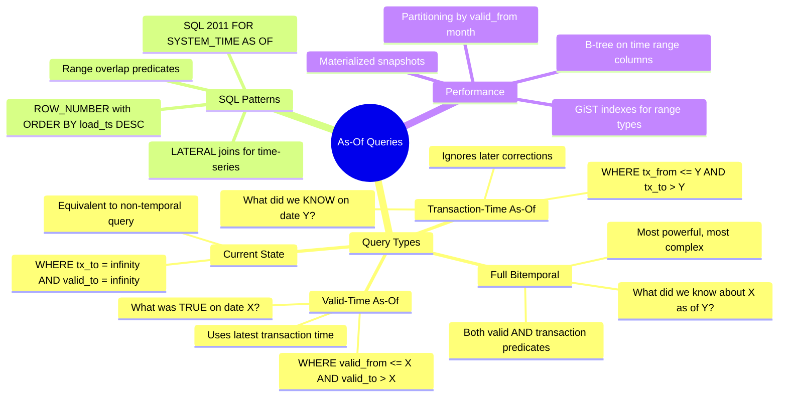

# As-Of Queries — Concept Overview

> How to query temporal data at a specific point in time.

---

## Why This Exists

As-of queries are the *reason* you build temporal tables. Without a proper query pattern, a bitemporal table is just a confusing mess of timestamps. As-of queries give you three superpower questions:

1. **Current truth**: What is the latest known state? (`tx_to = ∞ AND valid_to = ∞`)
2. **Point-in-time truth**: What was true on date X? (valid time query)
3. **Point-in-time knowledge**: What did we know about date X as of date Y? (full bitemporal)

## Mindmap

## Key Terminology

| Term | Definition |
|---|---|
| **As-Of Query** | A query parameterized by a point in time to retrieve the state of data at that moment |
| **Range Overlap** | The predicate pattern `start <= X AND end > X` for finding active records |
| **Temporal Join** | Joining two temporal tables where the time ranges must overlap |
| **Time Travel** | Database feature (Snowflake, BigQuery) that enables automatic as-of queries on system-versioned tables |
