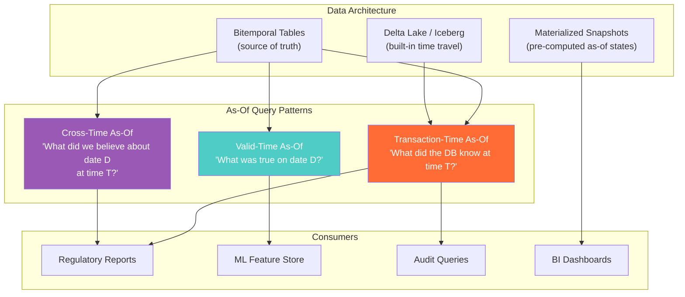
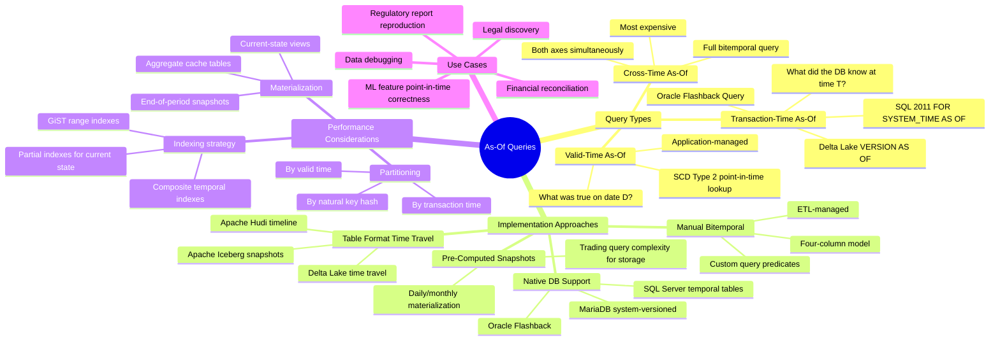

# As-Of Queries — Concept Overview

> What they are, why a Principal Architect must know them, and where they fit in the bigger picture.

---

## Why This Exists

**Origin**: As-of queries emerged from temporal database research in the 1990s (Snodgrass, Jensen) and were formalized in SQL:2011 with the `FOR SYSTEM_TIME AS OF` clause. The concept predates the standard — Oracle's Flashback Query (2001) was one of the first commercial implementations.

**The problem it solves**: Standard SQL returns the current state of the database. But in any system where data changes over time, stakeholders need to ask: "What did this data look like at a specific point in the past?" Without as-of query capability, answering this requires restoring backups, parsing audit logs, or maintaining manual snapshots — all expensive, slow, and error-prone.

**Why it matters at Principal level**: As-of queries are the primary consumption pattern for temporal and bitemporal data models. You can build the most elegant bitemporal schema in the world, but if you can't query it efficiently, it's useless. Principal architects must understand as-of query semantics, optimization, and the infrastructure required to support them at scale.

---

## What Value It Provides

| Dimension | Value |
|---|---|
| **Regulatory compliance** | Reproduce any past report exactly as generated — BCBS 239, MiFID II, SOX |
| **Audit trail** | Answer "what did the system show on date X?" without backup restoration |
| **Debugging** | Trace data lineage issues by querying intermediate states |
| **ML back-testing** | Build point-in-time correct training data — no data leakage |
| **Financial reconciliation** | Compare end-of-day snapshots to next-morning calculations |
| **Legal discovery** | Produce records "as known at the time" for litigation |

**Quantified**: A major bank reported that as-of query capability reduced regulatory response time from 72 hours (backup restore + manual reconstruction) to <5 seconds (single query). Annual savings: $2M+ in audit labor alone.

---

## Where It Fits

---

## Mindmap

---

## When To Use / When NOT To Use

| Scenario | Transaction-Time As-Of | Valid-Time As-Of | Cross-Time As-Of |
|---|---|---|---|
| Reproduce last month's regulatory report | ✅ Required | ❌ | ❌ |
| Find a customer's address on a past date | ❌ | ✅ Required | ❌ |
| Reproduce what the system *believed* a customer's address was on a past date | ❌ | ❌ | ✅ Required |
| ML training data (avoid data leakage) | ❌ | ✅ Sufficient | ✅ Ideal |
| Real-time dashboard (current state) | ❌ Overkill | ❌ Overkill | ❌ Overkill |
| IoT sensor data analysis | ❌ | ✅ (event time) | ❌ |
| Debugging "what changed between yesterday and today" | ✅ Compare two as-of snapshots | ❌ | ❌ |

**Wrong-tool heuristic**: If you only need current state and never look backward, as-of queries add complexity with no benefit. Use a simple current-state table.

---

## Key Terminology

| Term | Precise Definition |
|---|---|
| **As-Of Query** | A query that retrieves data as it existed at a specific point on one or both time axes |
| **FOR SYSTEM_TIME AS OF** | SQL:2011 clause that retrieves rows from a system-versioned temporal table at a specific transaction time |
| **FOR SYSTEM_TIME BETWEEN..AND** | SQL:2011 clause that retrieves all row versions that existed during a transaction-time interval |
| **Flashback Query** | Oracle's proprietary as-of query mechanism using undo logs and SCN (System Change Number) |
| **Time Travel** | Delta Lake/Iceberg feature that queries a table at a specific version or timestamp |
| **VERSION AS OF** | Delta Lake syntax for querying a table at a specific version number |
| **TIMESTAMP AS OF** | Delta Lake syntax for querying a table at a specific timestamp |
| **Snapshot Isolation** | Database isolation level that gives each transaction a consistent point-in-time view — related concept but not the same as as-of queries |
| **Point-in-Time Correctness** | ML term: ensuring training features reflect only information available at prediction time — as-of queries enforce this |
