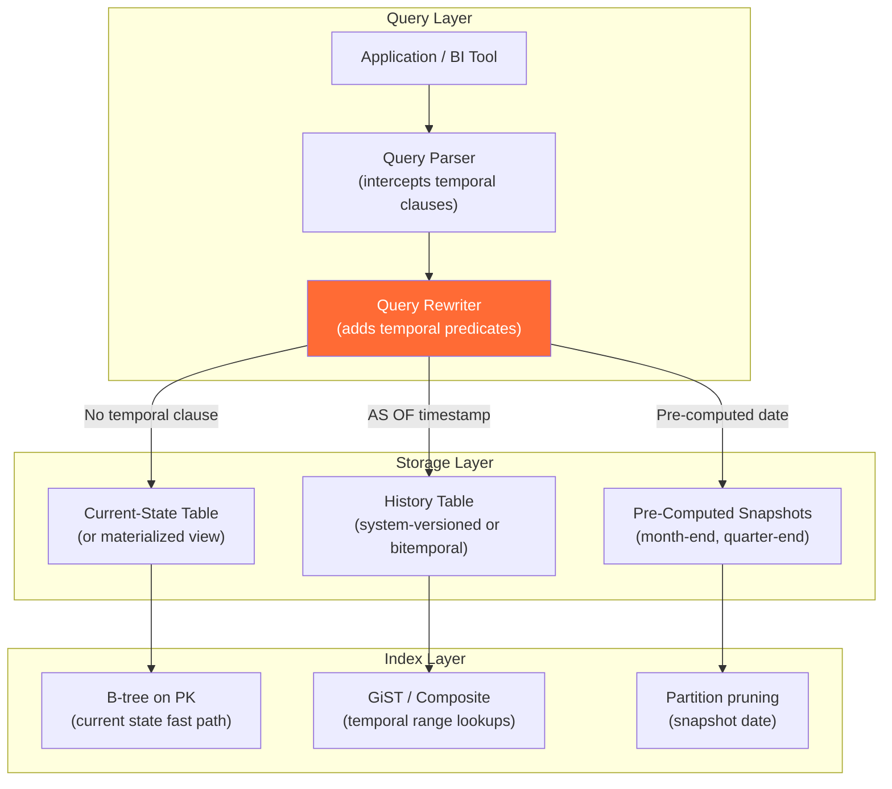
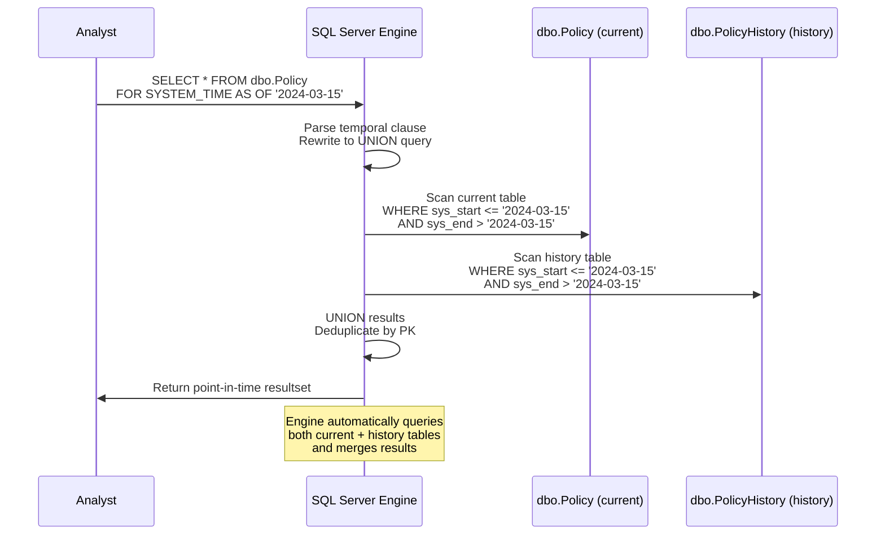
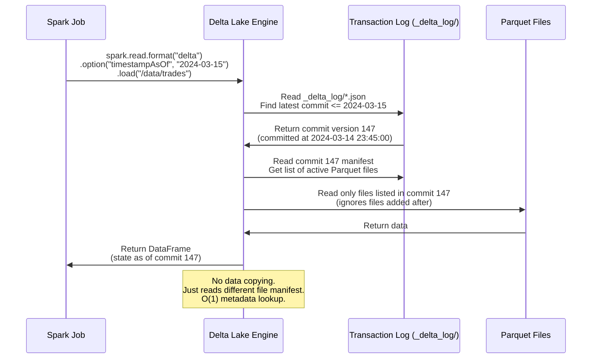
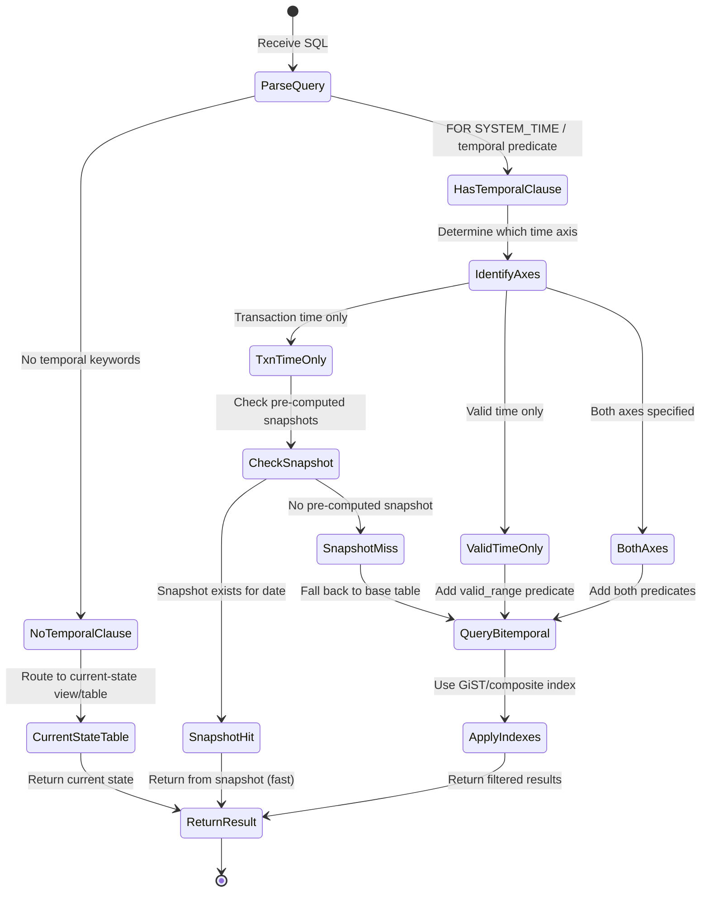
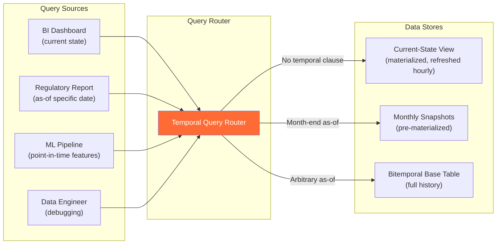

# As-Of Queries — How It Works (Deep Internals)

> HLD, sequence diagrams, DDL, query patterns, and execution mechanics.

---

## High-Level Design — As-Of Query Infrastructure



---

## Sequence Diagram — SQL Server SYSTEM_TIME As-Of Query



---

## Sequence Diagram — Delta Lake Time Travel



---

## Table Structures

### System-Versioned Temporal Table (SQL Server)

```sql
-- ============================================================
-- SQL Server system-versioned temporal table
-- Transaction time is managed automatically by the engine
-- ============================================================

CREATE TABLE dbo.Portfolio (
    portfolio_id        INT            NOT NULL PRIMARY KEY,
    portfolio_name      VARCHAR(200)   NOT NULL,
    manager_id          INT            NOT NULL,
    strategy            VARCHAR(100),
    aum                 DECIMAL(18,2), -- assets under management
    risk_rating         VARCHAR(10),
    benchmark           VARCHAR(50),
    
    -- System-managed temporal columns
    sys_start           DATETIME2 GENERATED ALWAYS AS ROW START HIDDEN NOT NULL,
    sys_end             DATETIME2 GENERATED ALWAYS AS ROW END HIDDEN NOT NULL,
    PERIOD FOR SYSTEM_TIME (sys_start, sys_end)
)
WITH (SYSTEM_VERSIONING = ON (
    HISTORY_TABLE = dbo.PortfolioHistory,
    DATA_CONSISTENCY_CHECK = ON
));

-- Clustered columnstore index on history table for fast as-of scans
CREATE CLUSTERED COLUMNSTORE INDEX cci_portfolio_history
    ON dbo.PortfolioHistory;
```

### Manual Bitemporal As-Of Support (PostgreSQL)

```sql
-- ============================================================
-- PostgreSQL: manual bitemporal table with range types
-- As-of queries use range containment operators
-- ============================================================

CREATE TABLE position_bitemporal (
    position_sk         BIGSERIAL PRIMARY KEY,
    account_id          INT            NOT NULL,
    instrument_id       VARCHAR(20)    NOT NULL,
    quantity            DECIMAL(18,4)  NOT NULL,
    market_value        DECIMAL(20,2),
    
    -- Valid time: when was this position state true?
    valid_range         DATERANGE      NOT NULL,
    
    -- Transaction time: when did the system record this?
    txn_range           TSTZRANGE      NOT NULL 
                        DEFAULT tstzrange(CURRENT_TIMESTAMP, 'infinity'),
    
    -- Prevent overlapping versions
    EXCLUDE USING GIST (
        account_id WITH =,
        instrument_id WITH =,
        valid_range WITH &&,
        txn_range WITH &&
    )
);

-- Indexes for as-of query performance
CREATE INDEX idx_pos_bt_valid ON position_bitemporal USING GIST (valid_range);
CREATE INDEX idx_pos_bt_txn ON position_bitemporal USING GIST (txn_range);
CREATE INDEX idx_pos_bt_nk ON position_bitemporal(account_id, instrument_id);
```

---

## As-Of Query Patterns — All Three Types

### 1. Transaction-Time As-Of: "What did the DB know at time T?"

```sql
-- SQL Server (native)
SELECT portfolio_id, portfolio_name, aum, risk_rating
FROM dbo.Portfolio
FOR SYSTEM_TIME AS OF '2024-03-15 18:00:00';

-- PostgreSQL (manual bitemporal)
SELECT account_id, instrument_id, quantity, market_value
FROM position_bitemporal
WHERE txn_range @> '2024-03-15 18:00:00'::timestamptz
  AND upper(valid_range) = 'infinity';  -- current valid state at that txn time

-- Delta Lake (Spark)
-- SELECT * FROM delta.`/data/positions` TIMESTAMP AS OF '2024-03-15';
```

### 2. Valid-Time As-Of: "What was true on date D?"

```sql
-- PostgreSQL (manual bitemporal)
SELECT account_id, instrument_id, quantity, market_value
FROM position_bitemporal
WHERE valid_range @> '2024-06-30'::date
  AND upper(txn_range) = 'infinity';  -- latest system knowledge

-- Equivalent with standard columns (non-range)
SELECT account_id, instrument_id, quantity, market_value
FROM position_standard
WHERE valid_from <= '2024-06-30'
  AND valid_to > '2024-06-30'
  AND txn_to = '9999-12-31 23:59:59';
```

### 3. Cross-Time As-Of: "What did we believe about date D at time T?"

```sql
-- The full bitemporal query: both axes
SELECT account_id, instrument_id, quantity, market_value
FROM position_bitemporal
WHERE valid_range @> '2024-06-30'::date           -- valid on June 30
  AND txn_range @> '2024-07-15 09:00:00'::timestamptz;  -- as known on July 15

-- This returns what the system believed the June 30 position was,
-- based on information available by July 15.
-- If a correction arrived on July 20, this query will NOT see it.
```

---

## State Machine — As-Of Query Resolution



---

## Data Flow Diagram — As-Of Query in a Data Platform



---

## ER Diagram — Temporal Query Infrastructure

```mermaid
erDiagram
    BITEMPORAL_TABLE {
        bigint pk
        int natural_key
        text attributes
        daterange valid_range
        tstzrange txn_range
    }
    
    CURRENT_STATE_VIEW {
        int natural_key
        text attributes
        text note "WHERE valid/txn = infinity"
    }
    
    MONTHLY_SNAPSHOT {
        int natural_key
        text attributes
        date snapshot_date
        text note "Pre-materialized EOM state"
    }
    
    QUERY_LOG {
        bigint query_id PK
        timestamp query_time
        varchar query_type "current/txn_asof/valid_asof/cross"
        varchar target_table
        timestamp as_of_timestamp
        int result_rows
        decimal query_ms
    }
    
    BITEMPORAL_TABLE ||--o{ CURRENT_STATE_VIEW : "materialized from"
    BITEMPORAL_TABLE ||--o{ MONTHLY_SNAPSHOT : "pre-computed from"
    BITEMPORAL_TABLE ||--o{ QUERY_LOG : "logged"
```
