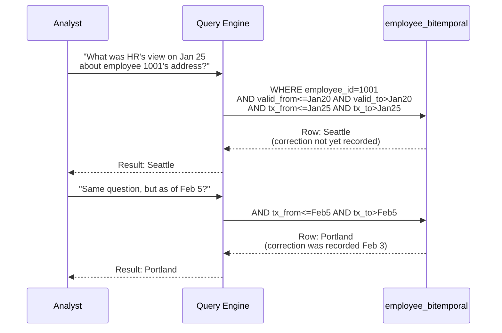

# As-Of Queries — How It Works, Examples, Pitfalls, Interview, References

---

## The Four Query Patterns

### Pattern 1: Current State (non-temporal equivalent)

```sql
-- What is the employee's CURRENT city?
SELECT employee_id, city
FROM employee_bitemporal
WHERE employee_id = 1001
  AND tx_to = '9999-12-31 23:59:59+00'    -- latest knowledge
  AND valid_to = '9999-12-31';              -- currently valid
```

### Pattern 2: Valid-Time As-Of

```sql
-- What was the employee's city on January 20, 2025?
-- (using latest knowledge — corrections applied)
SELECT employee_id, city, valid_from, valid_to
FROM employee_bitemporal
WHERE employee_id = 1001
  AND valid_from <= '2025-01-20'
  AND valid_to   >  '2025-01-20'
  AND tx_to = '9999-12-31 23:59:59+00';  -- latest transaction version
```

### Pattern 3: Transaction-Time As-Of

```sql
-- What did we BELIEVE the employee's city was on January 25?
-- (before the Feb 3 correction arrived)
SELECT employee_id, city, tx_from, tx_to
FROM employee_bitemporal
WHERE employee_id = 1001
  AND tx_from <= '2025-01-25'
  AND tx_to   >  '2025-01-25'
  AND valid_from <= '2025-01-25'
  AND valid_to   >  '2025-01-25';
-- Result: Seattle (the correction hadn't been entered yet)
```

### Pattern 4: Full Bitemporal As-Of

```sql
-- What did we know about Jan 20 as of Feb 5?
SELECT employee_id, city
FROM employee_bitemporal
WHERE employee_id = 1001
  AND valid_from <= '2025-01-20'   -- valid time target
  AND valid_to   >  '2025-01-20'
  AND tx_from    <= '2025-02-05'   -- knowledge time target
  AND tx_to      >  '2025-02-05';
-- Result: Portland (by Feb 5 the correction was recorded)
```

## Sequence Diagram — Query Execution



## Temporal Join — Two Bitemporal Tables

```sql
-- Join employee to department WHERE valid times overlap
SELECT 
    e.employee_name,
    d.department_name,
    GREATEST(e.valid_from, d.valid_from) AS overlap_start,
    LEAST(e.valid_to, d.valid_to)        AS overlap_end
FROM employee_bitemporal e
JOIN department_bitemporal d 
    ON e.department_id = d.department_id
    AND e.valid_from < d.valid_to       -- overlap condition
    AND e.valid_to   > d.valid_from     -- overlap condition
WHERE e.tx_to = '9999-12-31 23:59:59+00'
  AND d.tx_to = '9999-12-31 23:59:59+00';
```

## Snowflake Time Travel (Built-in As-Of)

```sql
-- Snowflake: automatic transaction-time as-of
SELECT * FROM employee 
AT(TIMESTAMP => '2025-01-25 10:00:00'::TIMESTAMP);

-- BigQuery: similar feature
SELECT * FROM `project.dataset.employee`
FOR SYSTEM_TIME AS OF '2025-01-25 10:00:00+00:00';
```

## War Story: JPMorgan — Regulatory As-Of Reporting

JPMorgan uses as-of queries for Basel III regulatory reporting. Regulators require: "What was the portfolio composition on December 31, as known on January 15 (submission deadline)?" This is a full bitemporal query. Late-arriving trade corrections after January 15 must NOT change the December 31 report. The transaction_time filter ensures immutability of submitted reports.

## Pitfalls

| Pitfall | Fix |
|---|---|
| Forgetting tx_to predicate (returning all versions) | Always include `AND tx_to > :as_of_date` — otherwise you get superseded rows |
| Using `=` instead of range overlap | Use `start <= X AND end > X`, never `start = X` — time ranges are intervals |
| Not indexing time columns | Create composite indexes: (entity_id, valid_from, valid_to) and (entity_id, tx_from, tx_to) |
| Performance on large temporal tables | Partition by valid_from month; consider materialized PIT snapshots |

## Interview

### Q: "How do you handle late-arriving data in a DW?"

**Strong Answer**: "Bitemporal modeling. The valid_time captures when the fact was true in reality (potentially in the past), and the transaction_time captures when we learned about it. A late-arriving correction inserts a new row with backdated valid_from but current tx_from. This preserves both the corrected truth AND the historical knowledge state. As-of queries with both time filters let me answer 'what did we know at the time' vs 'what do we know now.'"

## References

| Resource | Link |
|---|---|
| SQL:2011 Standard | Temporal query syntax (FOR SYSTEM_TIME AS OF) |
| [Snowflake Time Travel](https://docs.snowflake.com/en/user-guide/data-time-travel) | Built-in transaction-time as-of |
| [BigQuery Time Travel](https://cloud.google.com/bigquery/docs/time-travel) | FOR SYSTEM_TIME AS OF syntax |
| Cross-ref: Valid vs Tx Time | [../01_Valid_vs_Transaction_Time](../01_Valid_vs_Transaction_Time/) |
| Cross-ref: Snapshot Fact Tables | [../03_Snapshot_Fact_Tables](../03_Snapshot_Fact_Tables/) |
