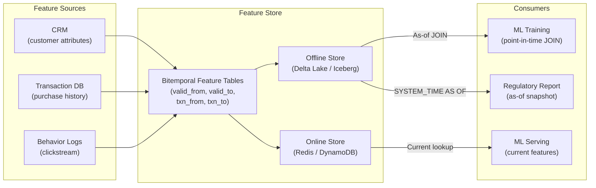

# As-Of Queries — Hands-On Examples

> Production-grade SQL, PySpark, and configuration examples for as-of query patterns.

---

## Code Examples — All Major Platforms

### SQL Server: System-Versioned Temporal Queries

```sql
-- ============================================================
-- Setup: System-versioned temporal table for portfolio positions
-- ============================================================

CREATE TABLE dbo.Position (
    account_id          INT            NOT NULL,
    instrument_id       VARCHAR(20)    NOT NULL,
    quantity            DECIMAL(18,4)  NOT NULL,
    avg_cost            DECIMAL(18,6),
    market_value        DECIMAL(20,2),
    
    sys_start           DATETIME2 GENERATED ALWAYS AS ROW START HIDDEN NOT NULL,
    sys_end             DATETIME2 GENERATED ALWAYS AS ROW END HIDDEN NOT NULL,
    PERIOD FOR SYSTEM_TIME (sys_start, sys_end),
    
    PRIMARY KEY (account_id, instrument_id)
)
WITH (SYSTEM_VERSIONING = ON (HISTORY_TABLE = dbo.PositionHistory));

-- ============================================================
-- As-Of Queries
-- ============================================================

-- 1. Point-in-time snapshot: what did positions look like at month-end?
SELECT account_id, instrument_id, quantity, market_value
FROM dbo.Position
FOR SYSTEM_TIME AS OF '2024-03-31 23:59:59'
WHERE account_id = 12345;

-- 2. Range query: all versions of a position during Q1
SELECT account_id, instrument_id, quantity, market_value,
       sys_start, sys_end
FROM dbo.Position
FOR SYSTEM_TIME BETWEEN '2024-01-01' AND '2024-03-31'
WHERE account_id = 12345 AND instrument_id = 'AAPL';

-- 3. All versions ever (full history)
SELECT account_id, instrument_id, quantity, market_value,
       sys_start, sys_end
FROM dbo.Position
FOR SYSTEM_TIME ALL
WHERE account_id = 12345 AND instrument_id = 'AAPL'
ORDER BY sys_start;

-- 4. What changed between two points in time?
WITH state_mar AS (
    SELECT * FROM dbo.Position
    FOR SYSTEM_TIME AS OF '2024-03-31 23:59:59'
),
state_feb AS (
    SELECT * FROM dbo.Position
    FOR SYSTEM_TIME AS OF '2024-02-29 23:59:59'
)
SELECT 
    COALESCE(m.account_id, f.account_id) AS account_id,
    COALESCE(m.instrument_id, f.instrument_id) AS instrument_id,
    f.quantity AS feb_qty,
    m.quantity AS mar_qty,
    m.quantity - COALESCE(f.quantity, 0) AS qty_change
FROM state_mar m
FULL OUTER JOIN state_feb f 
    ON m.account_id = f.account_id 
    AND m.instrument_id = f.instrument_id
WHERE m.quantity IS DISTINCT FROM f.quantity;
```

### PostgreSQL: Manual Bitemporal As-Of

```sql
-- ============================================================
-- As-of queries using PostgreSQL range types
-- ============================================================

-- Transaction-time as-of: what did the DB know at 6 PM March 15?
SELECT account_id, instrument_id, quantity, market_value
FROM position_bitemporal
WHERE txn_range @> '2024-03-15 18:00:00'::timestamptz
  AND upper(valid_range) = 'infinity';

-- Valid-time as-of: what positions were active on June 30?
SELECT account_id, instrument_id, quantity, market_value
FROM position_bitemporal
WHERE valid_range @> '2024-06-30'::date
  AND upper(txn_range) = 'infinity';

-- Cross-time as-of: what did we believe about June 30 positions
-- based on data available by July 15?
SELECT account_id, instrument_id, quantity, market_value
FROM position_bitemporal
WHERE valid_range @> '2024-06-30'::date
  AND txn_range @> '2024-07-15 09:00:00'::timestamptz;

-- ============================================================
-- Create a reusable function for as-of queries
-- ============================================================

CREATE OR REPLACE FUNCTION position_as_of(
    p_valid_date DATE DEFAULT CURRENT_DATE,
    p_txn_time TIMESTAMPTZ DEFAULT CURRENT_TIMESTAMP
)
RETURNS TABLE (
    account_id INT,
    instrument_id VARCHAR(20),
    quantity DECIMAL(18,4),
    market_value DECIMAL(20,2)
) AS $$
BEGIN
    RETURN QUERY
    SELECT pb.account_id, pb.instrument_id, pb.quantity, pb.market_value
    FROM position_bitemporal pb
    WHERE pb.valid_range @> p_valid_date
      AND pb.txn_range @> p_txn_time;
END;
$$ LANGUAGE plpgsql STABLE;

-- Usage
SELECT * FROM position_as_of('2024-06-30', '2024-07-15 09:00:00');
SELECT * FROM position_as_of('2024-06-30');  -- uses current txn time
```

### Oracle: Flashback Query

```sql
-- ============================================================
-- Oracle Flashback Query — as-of using SCN or timestamp
-- ============================================================

-- As-of a specific timestamp (transaction time)
SELECT account_id, instrument_id, quantity, market_value
FROM positions AS OF TIMESTAMP TO_TIMESTAMP('2024-03-15 18:00:00', 'YYYY-MM-DD HH24:MI:SS')
WHERE account_id = 12345;

-- As-of a specific SCN (System Change Number)
SELECT account_id, instrument_id, quantity, market_value
FROM positions AS OF SCN 123456789
WHERE account_id = 12345;

-- Flashback Version Query: all versions between two timestamps
SELECT account_id, instrument_id, quantity,
       VERSIONS_STARTTIME, VERSIONS_ENDTIME, VERSIONS_OPERATION
FROM positions 
VERSIONS BETWEEN TIMESTAMP 
    TO_TIMESTAMP('2024-03-01', 'YYYY-MM-DD') AND 
    TO_TIMESTAMP('2024-03-31', 'YYYY-MM-DD')
WHERE account_id = 12345;
```

---

## PySpark — Point-in-Time Feature Engineering

```python
from pyspark.sql import SparkSession, Window
from pyspark.sql import functions as F

spark = SparkSession.builder \
    .appName("point_in_time_features") \
    .getOrCreate()

def point_in_time_join(
    events_df,           # DataFrame with entity_id, event_timestamp
    features_df,         # DataFrame with entity_id, valid_from, valid_to, features...
    entity_key: str,     # join key column name
    event_time_col: str = "event_timestamp",
    valid_from_col: str = "valid_from",
    valid_to_col: str = "valid_to"
):
    """
    Point-in-time correct join: for each event, get the feature values
    that were valid AT THE TIME of the event. Prevents data leakage.
    
    This is the core operation for ML feature stores.
    """
    
    joined = events_df.join(
        features_df,
        on=[
            events_df[entity_key] == features_df[entity_key],
            events_df[event_time_col] >= features_df[valid_from_col],
            events_df[event_time_col] < features_df[valid_to_col]
        ],
        how="left"
    ).drop(features_df[entity_key])
    
    return joined

# Example usage: ML training data with point-in-time correct features
events = spark.createDataFrame([
    (1001, "2024-03-15"),
    (1001, "2024-06-20"),
    (1001, "2024-09-01"),
], ["customer_id", "event_timestamp"])

features = spark.createDataFrame([
    (1001, "Seattle",  "SMB",        "2024-01-01", "2024-07-01"),
    (1001, "Portland", "ENTERPRISE", "2024-07-01", "9999-12-31"),
], ["customer_id", "city", "segment", "valid_from", "valid_to"])

# Result: each event gets the feature values that were valid AT THAT TIME
# event on March 15 → Seattle/SMB
# event on June 20 → Seattle/SMB (still valid)
# event on Sep 1 → Portland/ENTERPRISE (changed on July 1)
pit_correct = point_in_time_join(events, features, "customer_id")
pit_correct.show()
```

---

## Delta Lake Time Travel

```python
# ============================================================
# Delta Lake time travel — built-in transaction-time as-of
# ============================================================

# Read current state
current_df = spark.read.format("delta").load("/data/positions")

# Read as of a specific timestamp
march_df = spark.read.format("delta") \
    .option("timestampAsOf", "2024-03-31") \
    .load("/data/positions")

# Read as of a specific version
version_df = spark.read.format("delta") \
    .option("versionAsOf", 147) \
    .load("/data/positions")

# SQL syntax
spark.sql("""
    SELECT * FROM delta.`/data/positions` 
    TIMESTAMP AS OF '2024-03-31'
""")

spark.sql("""
    SELECT * FROM delta.`/data/positions` 
    VERSION AS OF 147
""")

# Compare two versions (diff)
spark.sql("""
    SELECT * FROM (
        SELECT *, 'current' as version FROM delta.`/data/positions`
        EXCEPT
        SELECT *, 'current' as version FROM delta.`/data/positions` 
        TIMESTAMP AS OF '2024-03-31'
    )
""")
```

---

## Before vs After — Naive Lookup vs Point-in-Time Correct

### ❌ Naive Join (Causes Data Leakage in ML)

```python
# BAD: Join on current state regardless of event time
training_data = events_df.join(
    current_features_df,  # only current values!
    on="customer_id",
    how="left"
)
# Problem: An event from March 2024 gets July 2024 features.
# The model "sees the future" during training → inflated metrics,
# poor production performance.
```

### ✅ Point-in-Time Correct As-Of Join

```python
# GOOD: Each event gets features valid AT THAT TIME
training_data = point_in_time_join(
    events_df, 
    features_bitemporal_df, 
    entity_key="customer_id"
)
# March event → March features. July event → July features.
# No data leakage. Production metrics match training metrics.
```

---

## Integration Diagram — As-Of Queries in a Feature Store



---

## Runnable Exercise — Delta Lake Time Travel

```bash
# 1. Start Spark with Delta Lake (Docker)
docker run -it --rm \
  -p 8888:8888 \
  deltaio/delta-docker:latest \
  jupyter lab --ip=0.0.0.0

# 2. In a notebook, create a Delta table and make changes:

# Write initial data
spark.createDataFrame([
    (1, "AAPL", 100, 150.00),
    (2, "GOOGL", 50, 2800.00),
], ["id", "symbol", "qty", "price"]) \
.write.format("delta").mode("overwrite").save("/tmp/positions")

# Make a change
spark.sql("UPDATE delta.`/tmp/positions` SET qty = 120 WHERE id = 1")

# 3. Query as of different versions:
# Current state
spark.read.format("delta").load("/tmp/positions").show()

# Version 0 (before update)
spark.read.format("delta").option("versionAsOf", 0).load("/tmp/positions").show()

# Check history
spark.sql("DESCRIBE HISTORY delta.`/tmp/positions`").show()
```
