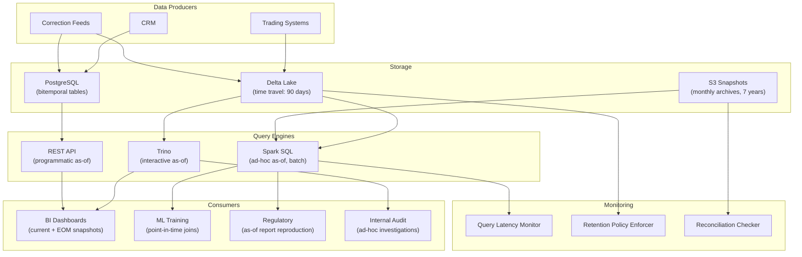

# As-Of Queries — Real-World Scenarios

> FAANG case studies, production numbers, post-mortems, and deployment topologies.

---

## Case Study 1: Stripe — As-Of Queries for Financial Reconciliation

**Context**: Stripe processes billions of dollars in payments. End-of-day financial reconciliation requires comparing the ledger state at close of business with the state at the start of the next business day. Any discrepancy must be explainable.

**Architecture**: Stripe uses an append-only ledger with transaction timestamps. As-of queries against the ledger reproduce the exact balance at any historical cut-off time.

**Scale**:

- 100M+ ledger entries/day
- End-of-day reconciliation queries across 50+ currencies
- As-of query latency: <500ms for single-account, <30s for full portfolio
- Zero tolerance for data loss — append-only, no mutations

**Key design decision**: Rather than maintaining periodic snapshots (which can miss intra-day corrections), Stripe queries the append-only ledger with `WHERE timestamp <= cut_off_time`. The immutable ledger is the single source of truth.

**Result**: Reconciliation discrepancies that previously took 4-6 hours to investigate (downloading exports, comparing spreadsheets) now take <5 minutes (run two as-of queries, diff the results).

---

## Case Study 2: Netflix — Point-in-Time Feature Engineering for ML

**Context**: Netflix's recommendation models train on historical user behavior. A critical requirement: features must reflect what was known *at the time of each event*, not current values. Using current features to train on past events creates data leakage.

**Architecture**: Netflix's feature store (Cosmos) uses point-in-time correct as-of joins:

- Features are stored with `valid_from` / `valid_to` ranges
- Training pipeline performs temporal joins: for each training event, retrieve features that were valid at the event timestamp
- This eliminates data leakage and ensures offline training metrics match online serving performance

**Scale**:

- 500M+ feature rows per entity type
- Training datasets: 10B+ point-in-time joined rows
- Feature freshness: near-real-time (minutes) for online, daily for offline
- Point-in-time join adds ~20% overhead vs naive join

**What went wrong (before as-of joins)**: An early recommendation model showed 15% higher AUC in offline evaluation than in A/B testing. Root cause: training features included future data — user segment labels were updated daily, but the naive join used the *latest* segment for all past events. Users who churned were labeled as "churn risk" in their historical events, making the model appear to predict churn perfectly.

**Fix**: Switched all training pipelines to point-in-time as-of joins. Offline and online metrics converged to within 2%.

---

## Case Study 3: Bloomberg — As-Of Queries for Market Data History

**Context**: Bloomberg Terminal serves historical market data to financial professionals. Prices are corrected retroactively (exchange corrections, corporate action adjustments), but clients need both the original and corrected values.

**Architecture**: Dual-timeline market data store:

- Valid time: the trading date/time
- Transaction time: when Bloomberg received/corrected the data
- As-of queries let clients choose: "Give me the price as it was reported at the time" vs "Give me the corrected price as we know it today"

**Scale**:

- 300M+ instruments tracked globally
- 5B+ price ticks/day
- Historical depth: 30+ years
- As-of query latency: <100ms for single instrument, <5s for portfolio

**Key decision**: Corporate actions (stock splits, dividends) require retroactive price adjustment. Bloomberg stores both the raw price and the adjusted price, linked via transaction time. An as-of query for "AAPL on 2020-06-15 as known on 2020-06-15" returns the pre-split price. The same query "as known today" returns the split-adjusted price.

---

## Case Study 4: Airbnb — Regulatory Compliance As-Of Reporting

**Context**: Airbnb must report host income to tax authorities. Tax reports must reflect the data *as it was at the reporting date*, not retroactively corrected data. A host's reported income for 2023 must match what Airbnb's system showed on December 31, 2023.

**Architecture**: Airbnb's financial reporting pipeline uses transaction-time as-of queries against Delta Lake:

- All financial tables are stored in Delta Lake with time travel enabled
- Tax reports query `TIMESTAMP AS OF '2023-12-31 23:59:59'`
- If a correction arrives in January 2024, it goes into the current table but doesn't affect the 2023 snapshot

**Scale**:

- 100M+ financial transactions/year
- Delta Lake time travel retention: 365 days (covers tax year + audit period)
- Report generation: <2 hours for all jurisdictions
- Previously: 2-3 weeks of manual reconciliation before as-of queries existed

---

## What Went Wrong — Post-Mortem: ML Model Regression

**Incident**: A fintech company's credit scoring model showed a sudden 8% drop in precision after a quarterly retrain.

**Root cause**: The feature engineering pipeline performed a naive join between training events and a customer attribute table. Three weeks before the retrain, the data engineering team ran a one-time correction job that updated 200K customer records — changing `income_band` values retroactively. The model trained on these corrected values, but the original scoring decisions used the pre-correction values.

**Timeline**:

1. **Jan 1-Mar 15**: Model scores customers using `income_band` from the feature store
2. **Mar 16**: Data correction job updates 200K `income_band` values retroactively
3. **Apr 1**: Quarterly retrain — naive join picks up corrected `income_band` for all historical events
4. **Apr 2**: Model shows 8% precision drop because it was trained on corrected data but validated against decisions made with original data

**Why as-of queries would have prevented this**:

- Point-in-time as-of join: each training event gets the `income_band` that was valid *at the time of scoring*
- The correction is visible in current-state queries but doesn't contaminate historical training data
- Offline and online metrics remain consistent

**Prevention**: Require all ML training pipelines to use point-in-time as-of joins. Treat naive joins on temporal data as a code review blocker.

---

## Deployment Topology — As-Of Query Platform

**Infrastructure sizing**:

| Component | Specification |
|---|---|
| Delta Lake | 200TB, 90-day time travel, Z-ordered on entity keys |
| PostgreSQL | 2TB bitemporal tables, GiST indexes, 24-core server |
| S3 Snapshots | 500TB archive, Parquet format, monthly partitions, 7-year retention |
| Spark | 100 executors for batch as-of, 20 for interactive |
| Trino | 8-worker cluster, 256GB memory per worker |
| REST API | 6 pods, <200ms P99 for single-entity as-of |
