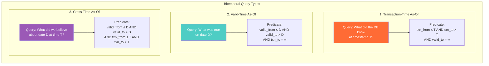

# As-Of Queries — Interview Angle

> How this appears in Principal-level interviews, sample questions, and what they're really testing.

---

## How This Appears

As-of queries appear in **system design** and **data modeling** interviews, particularly for financial services, ML platforms, and regulated industries. The interviewer won't say "implement as-of queries" — they'll describe a scenario where temporal querying is the correct solution:

- "How would you ensure ML training data doesn't leak future information?"
- "How would you reproduce last month's regulatory report?"
- "How would you debug a data quality issue from two weeks ago?"

If you reach for "restore a backup" or "check the audit log," you're thinking like a DBA, not a data architect. A Principal candidate identifies the need for temporal query infrastructure.

---

## Sample Questions

### Question 1: "Design a feature store that prevents data leakage in ML training pipelines"

**Weak answer (Senior)**:
> "I'd join the training events to the feature table on the entity key. If features change, I'd use the latest version."

**Strong answer (Principal)**:
> "Data leakage in ML occurs when training features contain information that wouldn't have been available at prediction time. The solution is a point-in-time correct feature store.
>
> Each feature is stored with `valid_from` and `valid_to` timestamps. When constructing training data, I perform an as-of join: for each training event at time T, retrieve the feature values that were valid at T.
>
> ```sql
> SELECT e.*, f.feature_value
> FROM events e
> LEFT JOIN features f
>   ON e.entity_id = f.entity_id
>   AND e.event_timestamp >= f.valid_from
>   AND e.event_timestamp < f.valid_to
> ```
>
> At scale, this as-of join is expensive because it's a range join, not an equi-join. I'd optimize it by:
>
> 1. Partitioning features by `valid_from` month to enable partition pruning
> 2. Pre-computing daily feature snapshots for the most common as-of dates
> 3. Using broadcast join for small dimension features
>
> I'd also add a reconciliation test: compare `as_of(yesterday)` to the known daily snapshot."

**What they're really testing**: Do you understand data leakage? Can you implement the temporal join correctly? Do you think about performance at scale?

---

### Question 2: "A regulator asks you to reproduce a report from 6 months ago. Your system uses SCD Type 2. Can you do it?"

**Weak answer (Senior)**:
> "Yes, SCD Type 2 tracks history with effective dates. I'd query where the effective date was valid 6 months ago."

**Strong answer (Principal)**:
> "SCD Type 2 gives me valid-time history — I can tell what was *true* 6 months ago. But the regulator isn't asking what was true — they're asking what the *report showed*. If any corrections were applied between then and now, the SCD Type 2 data has already been updated. The report I generate today from SCD Type 2 will reflect corrections that hadn't happened when the original report was filed.
>
> To reproduce the report *exactly as it appeared*, I need transaction-time capability — an as-of query that says 'give me the data as the system knew it at that timestamp.'
>
> Three options:
>
> 1. **If using Delta Lake**: `SELECT * FROM table TIMESTAMP AS OF '6_months_ago'` — assumes Delta retention covers 6 months (default is 30 days)
> 2. **If using SQL Server temporal tables**: `SELECT * FROM table FOR SYSTEM_TIME AS OF '6_months_ago'` — automatic
> 3. **If neither**: Hope you have a backup or a pre-materialized snapshot from that date
>
> The architectural lesson: any system subject to regulatory report reproduction should have either system-versioned temporal tables, Delta/Iceberg time travel with adequate retention, or pre-materialized periodic snapshots. SCD Type 2 alone is insufficient."

**What they're really testing**: Do you understand the difference between valid time and transaction time? Can you identify when SCD Type 2 is insufficient?

---

### Question 3: "Your as-of query takes 45 seconds on a 500M-row bitemporal table. How do you fix it?"

**Weak answer (Senior)**:
> "Add an index on the temporal columns."

**Strong answer (Principal)**:
> "45 seconds suggests a full table scan. I'd approach this in layers:
>
> **Layer 1 — Eliminate the query entirely for the 99% case.** Most as-of queries are for current state or month-end dates. Create a materialized current-state view and pre-compute EOM snapshots. These serve 99% of queries from pre-computed data with <5ms latency.
>
> **Layer 2 — Index the bitemporal table for the 1% case.** For arbitrary as-of dates, add:
>
> - GiST range indexes on valid_range and txn_range (PostgreSQL)
> - A composite B-tree on (natural_key, valid_from, valid_to, txn_from, txn_to)
> - A partial index for current state: `WHERE valid_to = 'infinity' AND txn_to = 'infinity'`
>
> **Layer 3 — Partition by transaction time.** Partition the bitemporal table by `txn_from` (monthly). As-of queries for recent dates only scan recent partitions. Archive old partitions to columnar format.
>
> **Layer 4 — Query rewrite.** Many as-of queries can be rewritten from range predicates to point predicates if you know the query will only return one version per natural key. Pre-filter with the natural key index, then apply the temporal predicate.
>
> I'd instrument each layer with latency metrics and track what percentage of queries each layer serves."

**What they're really testing**: Can you think in optimization layers? Do you understand the difference between materialization, indexing, and partitioning?

---

### Question 4: "How does Delta Lake time travel actually work under the hood?"

**Weak answer (Senior)**:
> "Delta Lake stores historical versions of the data and lets you query them."

**Strong answer (Principal)**:
> "Delta Lake doesn't store multiple copies of data. It uses the transaction log (`_delta_log/`) — a series of JSON/checkpoint files that record which Parquet files were added or removed at each commit.
>
> When you query `TIMESTAMP AS OF '2024-03-15'`, Delta:
>
> 1. Scans the transaction log to find the latest commit with timestamp ≤ March 15
> 2. Reads that commit's manifest to get the list of active Parquet files at that point
> 3. Reads only those files — ignoring files added or removed after that commit
>
> It's a metadata-only operation. The actual data files might even be the same ones you'd read for the current state — only the file manifest changes.
>
> **Limitations**:
>
> - Default retention is 30 days (`delta.logRetentionDuration`). VACUUM removes old files.
> - Time travel is transaction-time only. It can't answer valid-time questions.
> - Each time travel query resolves to a snapshot — no concept of individual row versions within a snapshot.
> - Concurrent writes during time travel resolution use optimistic concurrency — the commit closest to but not exceeding the requested timestamp wins."

**What they're really testing**: Do you understand the storage-compute decoupling? Can you explain the mechanism without hand-waving?

---

## Follow-Up Questions

| After Question... | Follow-Up | What They're Probing |
|---|---|---|
| Q1 (Feature store) | "What happens when a feature's valid_from changes retroactively?" | Understanding of correction tracking — need transaction time too |
| Q2 (Regulatory report) | "What if you need to reproduce reports from 5 years ago?" | Archival strategy — pre-materialized snapshots for long retention |
| Q3 (Performance) | "What if the 500M rows are distributed across 200 Spark executors?" | Z-ordering on natural key, predicate pushdown, partition pruning |
| Q4 (Delta internals) | "What happens if VACUUM runs while a long-running as-of query is executing?" | Concurrent access semantics — VACUUM respects active readers |

---

## Whiteboard Exercise — Draw in 5 Minutes

**Draw**: The three types of as-of queries on a bitemporal timeline:



**Key points to call out while drawing**:

- Transaction-time as-of freezes the DB knowledge axis
- Valid-time as-of freezes the real-world truth axis
- Cross-time freezes both — the most expensive but most precise
- 99% of queries are current-current (no temporal filter) — optimize for this first
