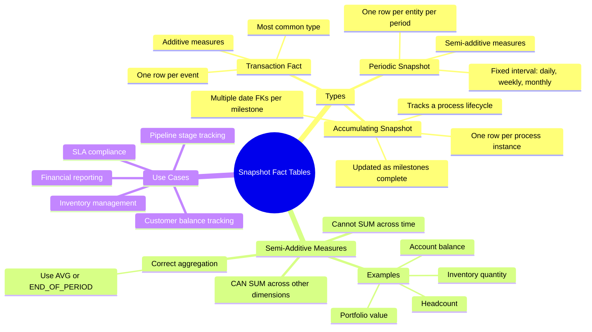

# Snapshot Fact Tables — Concept Overview

> Periodic snapshots of state at a point in time — the bridge between temporal and dimensional modeling.

---

## Why This Exists

**Origin**: Kimball defined three fact table types: transaction, periodic snapshot, and accumulating snapshot. The periodic snapshot captures the state of a measurable process at regular intervals (daily, weekly, monthly).

**The problem it solves**: Transaction facts tell you what happened. But questions like "What was our inventory level at the end of each day?" or "What was each customer's account balance at month-end?" require a *snapshot* of state — not a sum of transactions.

## Mindmap

## Key Terminology

| Term | Definition |
|---|---|
| **Periodic Snapshot** | A fact table that captures the state of measures at regular intervals |
| **Accumulating Snapshot** | A fact table tracking a process across milestones with multiple date FKs |
| **Semi-Additive Measure** | A measure that can be summed across some dimensions but NOT across time |
| **Snapshot Grain** | The combination of entity + time period that defines one row (e.g., account + month) |
