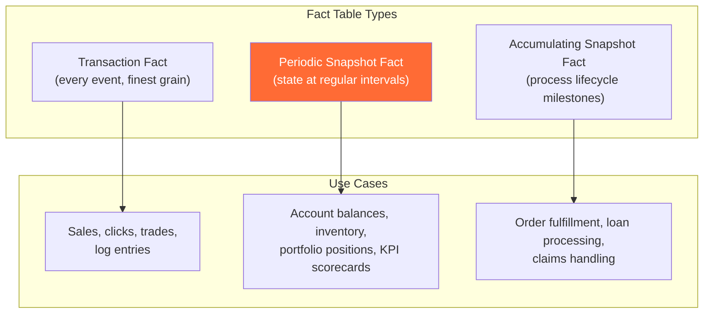
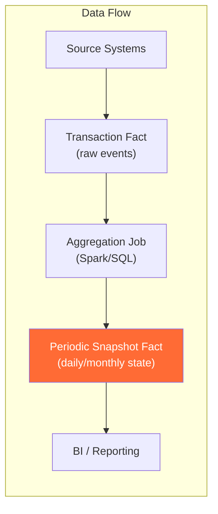
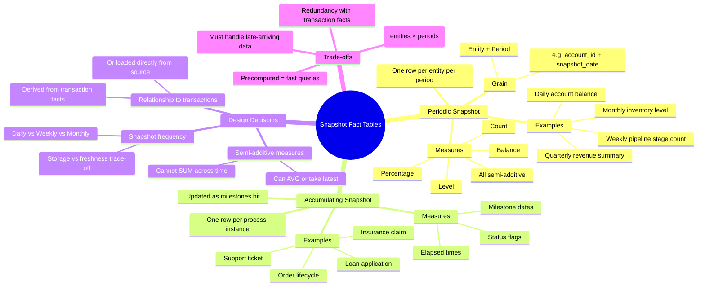

# Snapshot Fact Tables — Concept Overview

> What they are, why a Principal Architect must know them, and where they fit in the bigger picture.

---

## Why This Exists

**Origin**: Ralph Kimball identified three grain types for fact tables in *The Data Warehouse Toolkit*: transaction, periodic snapshot, and accumulating snapshot. Snapshot fact tables emerged because transaction facts alone cannot efficiently answer "what is the current state?" questions.

**The problem it solves**: A transaction fact table records every event (every sale, every click, every trade). To answer "what was the account balance on March 31?", you'd need to sum all transactions from account inception to March 31 — potentially millions of rows. A periodic snapshot fact table pre-computes this state at regular intervals (daily, weekly, monthly), giving you a single row per entity per period.

**Who formalized it**: Ralph Kimball. The periodic snapshot is one of his three fundamental fact table types. The accumulating snapshot is the third, designed for processes with a defined lifecycle (order → ship → deliver → return).

---

## What Value It Provides

| Dimension | Value |
|---|---|
| **Query performance** | "What was the balance on date X?" becomes a single row lookup instead of a SUM over millions of transactions |
| **Trend analysis** | Side-by-side comparison of entity state over time without windowed aggregation |
| **Reporting simplicity** | Month-end reports query one row per account per month — no complex aggregation logic |
| **Storage vs compute trade-off** | Uses more storage (one row per entity per period) but eliminates expensive runtime aggregation |
| **Point-in-time correctness** | Pre-materialized snapshots serve as "known good" baselines for reconciliation |

**Quantified**: A major bank reported that switching monthly P&L reporting from transaction-grain aggregation to periodic snapshots reduced query time from 45 minutes to 3 seconds and eliminated month-end compute spikes that cost $50K+/month in Snowflake credits.

---

## Where It Fits

---

## Mindmap

---

## When To Use / When NOT To Use

| Scenario | Periodic Snapshot | Accumulating Snapshot | Transaction Fact |
|---|---|---|---|
| Account balance over time | ✅ Best choice | ❌ | ❌ Would require SUM of all txns |
| Daily inventory levels | ✅ Best choice | ❌ | ❌ |
| Individual sale events | ❌ | ❌ | ✅ Best choice |
| Order lifecycle (order → ship → deliver) | ❌ | ✅ Best choice | ❌ Would need complex status tracking |
| Monthly KPI scorecard | ✅ Best choice | ❌ | ❌ |
| Click-stream events | ❌ Overkill | ❌ | ✅ Best choice |
| Loan application progress | ❌ | ✅ Best choice | ❌ |
| Portfolio positions with daily mark-to-market | ✅ Best choice | ❌ | ❌ |

**Wrong-tool heuristic**: If the question is "what happened?" → transaction fact. If the question is "what is the state at time T?" → periodic snapshot. If the question is "how far along is this process?" → accumulating snapshot.

---

## Key Terminology

| Term | Precise Definition |
|---|---|
| **Periodic Snapshot Fact** | A fact table that captures the state of a measurable process at regular, predictable intervals (daily, weekly, monthly) |
| **Accumulating Snapshot Fact** | A fact table with one row per process instance, updated as milestones are reached |
| **Snapshot Grain** | The combination of entity key + snapshot period that defines one row (e.g., account_id + snapshot_date) |
| **Semi-Additive Measure** | A measure that can be summed across some dimensions (e.g., across accounts) but not across time (e.g., daily balances cannot be summed across days — use AVG or latest) |
| **Fully Additive Measure** | A measure that can be summed across all dimensions (e.g., transaction amounts) — found in transaction facts, not snapshot facts |
| **Snapshot Frequency** | How often the snapshot is taken — daily, weekly, monthly. Dictates storage volume and data freshness |
| **Point-in-Time Snapshot** | A snapshot at a specific moment (not a period aggregate) — captures the exact state at that instant |
| **Dense Snapshot** | A snapshot that creates a row for every entity in every period, even if the entity had no activity |
| **Sparse Snapshot** | A snapshot that only creates rows for entities that changed or had activity — saves storage but complicates queries |
