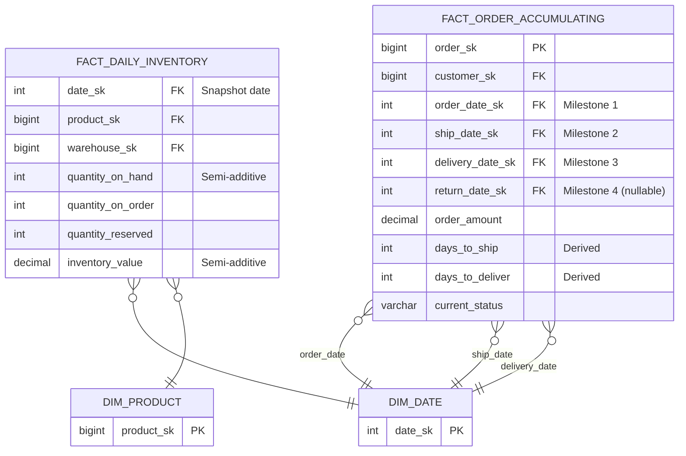
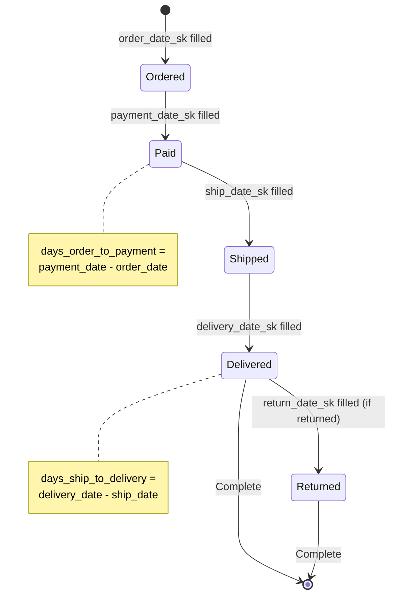

# Snapshot Fact Tables — How It Works, Examples, Pitfalls, Interview, References

---

## ER Diagram — Periodic vs Accumulating Snapshot



## DDL — Periodic Snapshot

```sql
-- ============================================================
-- PERIODIC SNAPSHOT: one row per product per warehouse per day
-- Grain: product × warehouse × day
-- ============================================================

CREATE TABLE fact_daily_inventory (
    date_sk             INT         NOT NULL REFERENCES dim_date(date_sk),
    product_sk          BIGINT      NOT NULL REFERENCES dim_product(product_sk),
    warehouse_sk        BIGINT      NOT NULL REFERENCES dim_warehouse(warehouse_sk),
    
    -- Semi-additive measures (DO NOT SUM across time!)
    quantity_on_hand    INT         NOT NULL,
    quantity_on_order   INT         DEFAULT 0,
    quantity_reserved   INT         DEFAULT 0,
    inventory_value     DECIMAL(15,2) NOT NULL,
    
    -- Row count for correct averaging
    row_count           INT         DEFAULT 1,
    
    PRIMARY KEY (date_sk, product_sk, warehouse_sk)
) PARTITION BY RANGE (date_sk);

-- ============================================================
-- ACCUMULATING SNAPSHOT: one row per order, updated at milestones
-- ============================================================

CREATE TABLE fact_order_pipeline (
    order_sk            BIGINT      PRIMARY KEY,
    customer_sk         BIGINT      NOT NULL,
    product_sk          BIGINT      NOT NULL,
    
    -- Multiple date FKs — one per milestone
    order_date_sk       INT         NOT NULL,  -- always filled
    payment_date_sk     INT,                    -- filled when paid
    ship_date_sk        INT,                    -- filled when shipped
    delivery_date_sk    INT,                    -- filled when delivered
    return_date_sk      INT,                    -- filled if returned
    
    -- Derived lag measures
    days_order_to_payment   INT,
    days_payment_to_ship    INT,
    days_ship_to_delivery   INT,
    
    order_amount        DECIMAL(12,2),
    current_status      VARCHAR(20),   -- ORDERED, PAID, SHIPPED, DELIVERED, RETURNED
    
    last_updated        TIMESTAMPTZ DEFAULT CURRENT_TIMESTAMP
);
```

## Semi-Additive Aggregation — The Critical Rule

```sql
-- ============================================================
-- WRONG: SUM of balances across time = nonsensical number
-- ============================================================
SELECT SUM(inventory_value)  -- WRONG!
FROM fact_daily_inventory
WHERE date_sk BETWEEN 20250101 AND 20250131;
-- This sums 31 days of inventory = 31x the actual value

-- ============================================================
-- RIGHT: Use the LAST day of the period, or AVERAGE
-- ============================================================

-- Option 1: End-of-period snapshot
SELECT warehouse_sk, SUM(inventory_value) AS total_inventory
FROM fact_daily_inventory
WHERE date_sk = 20250131  -- last day of January
GROUP BY warehouse_sk;

-- Option 2: Average daily inventory
SELECT warehouse_sk, AVG(inventory_value) AS avg_inventory
FROM fact_daily_inventory
WHERE date_sk BETWEEN 20250101 AND 20250131
GROUP BY warehouse_sk;

-- Option 3: SUM across non-time dimensions (this IS correct)
SELECT date_sk, SUM(inventory_value) AS total_across_warehouses
FROM fact_daily_inventory
WHERE date_sk = 20250131
GROUP BY date_sk;  -- SUM across warehouses on a single day = correct
```

## Accumulating Snapshot — State Machine



## War Story: Amazon — Daily Inventory Snapshots

Amazon's `fact_daily_inventory` captures inventory state for every product × fulfillment center × day. At 500M products × 200 fulfillment centers, this generates **100B rows per year**. Key design decisions:

- Partitioned by `date_sk` (daily partitions for efficient pruning)
- Compressed with columnar encoding (Redshift AZ64)
- Semi-additive measures clearly documented — SUM is ONLY correct across product/warehouse, NEVER across time
- Retention: 3 years of daily, then aggregated to weekly for older data

## Pitfalls

| Pitfall | Fix |
|---|---|
| Summing semi-additive measures across time | Use AVG or end-of-period value. Document which measures are semi-additive |
| Not building the snapshot daily | Missing days create gaps in trend analysis. Build even on weekends/holidays |
| Accumulating snapshot never updated | Set up milestone-triggered ETL. Don't rely on batch — use CDC for milestones |
| Snapshot table growing unbounded | Partition and implement retention policy: daily→weekly→monthly rollup |

## Interview

### Q: "How would you track inventory levels in a DW?"

**Strong Answer**: "Periodic snapshot fact table. Grain is product × warehouse × day. Every night, ETL captures the current inventory state and inserts one row per product-warehouse. The measures (quantity_on_hand, inventory_value) are semi-additive — they can be summed across products and warehouses but NOT across time. For monthly reports, I'd use the last-day-of-month snapshot or an average."

### Q: "What's the difference between a transaction fact and a snapshot fact?"

**Strong Answer**: "A transaction fact records events (one row per sale, one row per click). Measures are fully additive — SUM revenue across any dimension is correct. A snapshot fact records state at a point in time (one row per account per day). Measures are semi-additive — you can SUM across accounts but not across dates. You'd use AVG(balance) for a time-range aggregate."

## References

| Resource | Link |
|---|---|
| *The Data Warehouse Toolkit* 3rd Ed. | Ch. 4: Inventory — periodic snapshots |
| *The Data Warehouse Toolkit* 3rd Ed. | Ch. 7: Accumulating Snapshots |
| [dbt snapshots](https://docs.getdbt.com/docs/build/snapshots) | SCD2 snapshot strategy in dbt |
| Cross-ref: Valid vs Tx Time | [../01_Valid_vs_Transaction_Time](../01_Valid_vs_Transaction_Time/) — temporal foundation |
| Cross-ref: Aggregate Tables | [../../02_Dimensional_Modeling_Advanced/05_Aggregate_Tables](../../02_Dimensional_Modeling_Advanced/05_Aggregate_Tables/) — rollup strategies |
